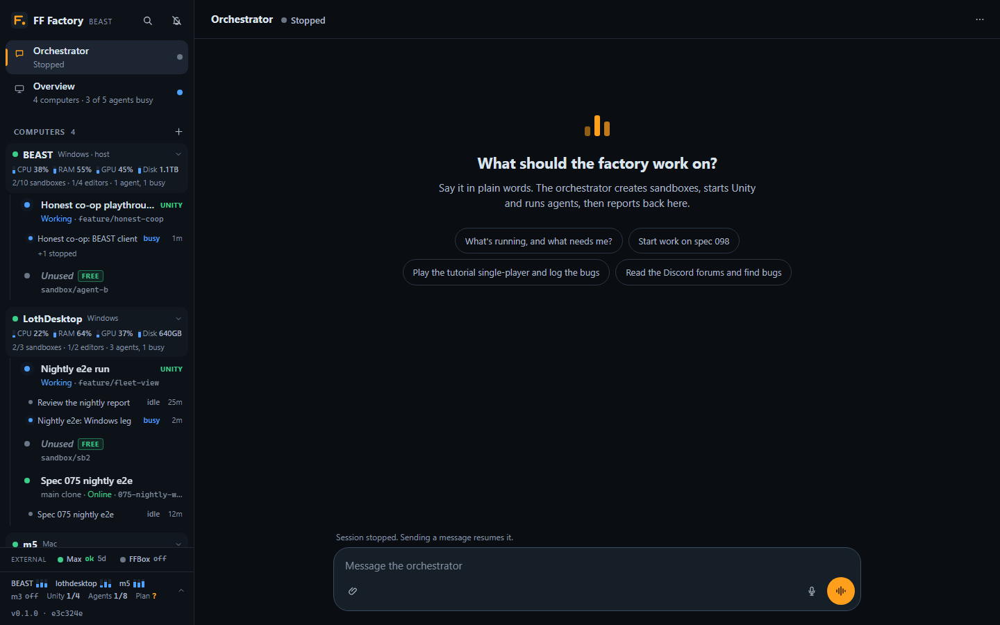
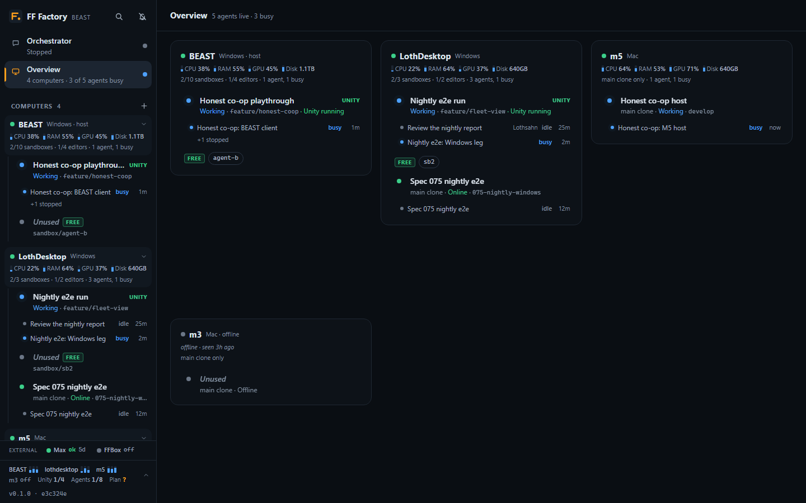

# Machines: agents on the user's Macs and Windows PCs

A machine is a whole computer the portal can run agents on. The portal itself runs only the orchestrators and the
dispatcher (w510, 2026-10-06): every worker, sandbox, Unity editor and standing agent runs under a machine's daemon,
and the portal's own computer can be one too ([beast-machine.md](beast-machine.md)). Every worker runs in one of
a machine's sandboxes, worktrees of its main game clone in its `sandbox_root` ([Machine sandboxes](#machine-sandboxes));
no agent works in the main clone, the one the user uses (w536). Machines are Macs (the daemon is a LaunchAgent), Windows PCs (the
daemon is a scheduled task at the user's logon, [below](#windows-machines)) or Linux PCs (a systemd user service, installed on
the PC with its worker installer only: [worker-install.md](worker-install.md#linux)), with ids such as `m5` or
`lothdesktop`. Ids are lower-case letters, digits and dashes; one given with capitals (`LothDesktop`) is
stored lower-case and shown as typed, and either spelling works in every tool.

The rest of this page describes the Macs; [Windows machines](#windows-machines) says what differs.

## Requirements

| | on each Mac |
|---|---|
| Reachable | `ssh <host alias>` from the portal host with an existing key, no password prompt |
| Game clone | a clone of the game repo (the one in config `repo.url`) under the home folder, found by its `origin` URL, or pass its path to `add_machine` |
| Claude Code | installed and logged in for the user (the keychain login works: the daemon runs in the GUI session) |
| node | 22.6 or newer (versions without native TypeScript support run with `--experimental-strip-types`); the newest node on the PATH the user's own zsh sets up, or in common install locations, is used |
| Portal URL | a public URL for the portal, e.g. the Tailscale Funnel URL `https://<host>.<tailnet>.ts.net` (config `publicUrl`, or given to `add_machine`) |
| Sleep | set to never, or agents stop when the Mac sleeps (the daemon holds `caffeinate -i` only while agents run) |

A Windows PC needs the same (reachable over ssh with a key, a clone, Claude Code, node 22.6+) plus git and
OpenSSH Server: its owner's checklist is in [Setting up a Windows PC](#setting-up-a-windows-pc-for-its-owner).

The portal can listen on `127.0.0.1` only. The Macs reach it through its public URL, not a tailnet IP.

Files people attach to messages reach a machine's agents through its daemon, which fetches each one from the portal
with its machine token into `Inbox/` of the agent's working folder before the message goes on (protocol 7,
[attachments.md](attachments.md#machines)).

## Design: a daemon that connects out

Each Mac runs `machine/daemon.ts` as a **LaunchAgent** (`com.fffactory.daemon`, in the user's GUI
session). It opens a WebSocket to `wss://<portal>/machine` with a per-machine token, and runs Agent
SDK sessions locally with the same `AgentSession` code the portal uses, streaming every transcript
event and session update back. The portal keeps the record (state.json, transcripts) exactly as for
sandbox workers, so the UI, the orchestrator's tools and transcripts do not care where an agent runs.

Why not drive sessions over ssh: an ssh session cannot read the login keychain, so Claude Code on
a Mac often looks logged out there, and an ssh connection dies with every sleep or network change. A
LaunchAgent runs in the logged-in session (keychain, the user's `claude` and plugins), starts at
login, restarts if it dies, and reconnects by itself: every ~2 s for the first two minutes after a drop
(a portal restart takes 20-60 s; a refused attempt, such as the proxy's 502 while the portal is down,
ends at once), then backing off to 30 s; a ping every 20 s, and a dead connection is dropped after 45 s
without a pong. If a daemon still has not come back 2 minutes after the portal started or after it
dropped, and its Mac answers ssh, the portal redeploys it by itself (as `add_machine` does), at most
every 30 minutes and never while its agents are running. So after a restart, give daemons a minute
before redeploying by hand.

- **Auth.** A 256-bit token per machine; the portal keeps only its SHA-256 (state.json) and compares
  in constant time. `/machine` is on the public Funnel URL, so a bad token is logged and throttled.
- **Sessions.** The portal creates the session record and tells the daemon what to launch (a
  serialisable launch spec: cwd, model, brief, tools, guard settings, budget). Transcript sequence
  numbers are assigned by the daemon, starting from the portal's last one, so a session resumes
  across daemon restarts. An agent whose machine is offline shows `stopped`; messaging it fails with
  "machine m5 is offline". **Cut off mid-turn:** when a machine's link drops, the portal notes the workers that
  were mid-turn; when the daemon is back without them (it was redeployed with `add_machine` `force`, restarted
  with `machine_daemon restart`, or crashed), each gets a resume message (check git status, re-pin Unity,
  continue), as after a portal restart, and the orchestrator hears which. After a network blip they are still
  running, so nothing is sent; `machine_daemon stop` is on purpose and resumes nobody; after more than 6 hours
  the orchestrator is told instead. A daemon going down stops its agents keeping their mid-turn mark
  (`stop(false)`), which is how the portal knows. Only workers the daemon reported live on the link that dropped
  (its hello or a session report, `seenLive`), mid-turn and active within those 6 hours count (`cutOffMidTurn`):
  the portal's own marks and activity times never suffice on their own, whatever the daemon's version. A report
  without `turnOpenSince` clears the portal's copy (JSON drops cleared fields), a drop clears every mark it has
  noted, and a refused start (`failed`) does not move `lastActivityAt`. An agent stopped or interrupted on purpose
  (`stop_agent`, the UI) is marked `stoppedOnPurpose` (saved, and taken off any cut-off list already noted) and is
  never resumed, by a dropped link or a portal restart, until it is sent a message again.
- **Tools.** Workers get the machine's tools (`wake_me`, `unity`, `read_work`, …) via a `machine` MCP server
  whose calls go back to the portal. They set no label: their title says what they are doing, and the dispatcher sets it
  ([orchestrators.md](orchestrators.md#worker-titles-and-sandbox-labels), w575).
- **The main clone is the owner's** (w536): the daemon runs no editor, hang/crash watch, Unity MCP place, Unity slot
  place or git status report for it. A `unity` or `switch` message without a sandbox (from an older portal) is answered
  "a machine's main clone takes no agents (w536): give a sandbox", and `status_now` with nothing. A person's own editor
  there still counts against `max_unity`, as started outside the gate. The machine record's `git` is only what a daemon
  from before w536 last sent; `list_machines` and the machine page leave it out when there is none.
- **Guard.** The workers' guard runs in the daemon (the sandbox rules, [below](#machine-sandboxes)). The
  backup-before-discard rule for the user's own clone (2026-09-25: copy local changes to `ff-local-backups/` beside
  the clone before setting any aside) went with main-clone workers (w536): no agent works there now, and the main
  clone is a protected path for sandbox workers. Existing `ff-local-backups` folders stay, and the clean-up never
  deletes them. Force pushes and pushes to the game repo's master/main stay refused. The daemon's own folder
  (`~/.ff-factory`, or the machine's `app_dir`; it holds the token) is protected.
- **Claude account.** With the token vault on for a machine (config `machines.claudeFromVault`), its runs get a vault
  token from the run person's pool (soonest weekly reset first, within the pool's caps), and the other secrets granted to that machine, in the same launch spec
  ([vault.md](vault.md)). Otherwise: portal-run agents on a Mac (workers and standing agents) use this host's
  `claudeEnv`, so with `CLAUDE_CODE_OAUTH_TOKEN` set (`set_app_config`, write-only) they run on the same
  Claude account as the agents here, not on the Mac's own login. The portal puts it in the launch spec,
  sent over the authenticated daemon connection with each start; the daemon passes it to that agent's
  Agent SDK process only (it overrides the Mac's keychain login for that process). It is never written
  to disk on the Mac, the daemon log redacts tokens, and transcripts are redacted (server/secrets.ts).
  The user's own interactive Claude Code sessions on the Mac are unaffected: they keep the Mac's login.
  `list_machines` and a sandbox worker's brief show the source: "host token …abcd" or "Mac login". Config
  `machines.useHostClaudeEnv` (default `true`) turns it off everywhere (`false`) or per machine
  (`{ "m3": false }`, with `"*"` for the machines not named); `set_app_config machines.useHostClaudeEnv`
  sets it, with `machine: "<id>"` for one machine. A Mac on its own login gets no token, and the daemon
  drops any credential in its own environment for that agent (`LaunchSpec.login`). An agent already
  running keeps its account until its process restarts; after an update the daemons are redeployed
  anyway. An agent working for someone with their own token (config `userClaudeEnv`,
  [identity.md](identity.md)) runs on that token instead, on any Mac. Every account switch, including the
  orchestrator's and the dispatcher's: [accounts.md](accounts.md).
- **Limits.** **Workers run in sandboxes only** (w536, Lothsahn on 2026-10-06: "Can't we get rid of this code so the
  settings doesn't matter?"): `start_agent` with a machine alone is refused, naming its sandboxes, the Capacity block
  lists sandbox computers only, and the daemon refuses any agent whose folder is the main clone (`mainCloneRefusal` in
  `server/machines.ts`, `startRefusal` in `machine/daemon.ts`). A machine without sandboxes (the m3, the m5) takes no
  workers: it gets a sandbox root through its worker-root install ([worker-root.md](worker-root.md), w513). Each
  machine has **one agent cap** (`agentCap`): its sandboxes' agents and its standing agents mid-turn together, at most
  `max_sandbox_agents`, else every sandbox full (`max_sandboxes` × `max_agents_per_sandbox`); a machine without
  sandboxes runs up to 2 standing agents (`STANDING_CAP_NO_POOL`). Each sandbox has its own limit too
  (`max_agents_per_sandbox`, below). `max_agents` is gone: the portal drops it from an old record at start and says so
  once, and a daemon whose `daemon.json` still has `maxSessions` logs that it is obsolete (the portal's `welcome` sends
  the cap in that field, so an older daemon keeps working). The portal has no worker limit of its own: it runs none
  (`limits.maxSessions` and `limits.maxIdleAgents` are retired). The limits count agents
  mid-turn only, and a message that finds them full waits in the portal's queue instead of being refused; the daemon's
  own start check counts the same way, and idle finished workers are stopped by the portal's reaper
  ([orchestrators.md](orchestrators.md#agent-limits-and-idle-workers), w384).
- **Awake.** While any agent process is live the daemon holds `caffeinate -i`.
- **Clean-up.** The daemon cleans its machine's disk by itself (the continuous clean-up,
  [self-recovery.md](self-recovery.md#5-continuous-clean-up)): a pass every hour, every 15 minutes while
  free space is below its soft threshold (80 GB by default), with the rules for its platform; below it, it also removes
  FF Factory's own leftovers by itself (player slots nobody holds, pushed agent worktrees, unused Unity editors:
  [self-recovery.md](self-recovery.md#ff-factorys-own-leftovers-w626), w626). Each agent
  gets its own temp folder (`ffa-<session>` under `temp_dir` or the system's temp), removed when the
  session is removed or two hours after it stopped. The portal sends the settings at connect and when they
  change (`cleanup_config`; config `machines.cleanup.everyMinutes` / `.softFreeGB`, per machine with
  `set_app_config ... machine: "<id>"`); the daemon keeps them in `cleanup.json` in its folder, so it goes on
  while the portal is down. After each pass it reports a summary (`cleanup`), shown by `list_machines` and
  the dashboard's meters; one that cannot get back above the soft threshold also tells the orchestrator,
  with the biggest remaining consumers. Every pass is logged to `cleanup-log.jsonl` in the daemon's folder.
  `machine_cleanup` runs a pass now.
- **Standing agents** run on a machine and need one ([standing-agents.md](standing-agents.md)): their folder is `agents/<id>` in the daemon's folder
  (`~/.ff-factory/agents/<id>` by default) on that Mac, runs wait (like a full slot) while the machine is offline, and budgets work unchanged.

## Setup and updates, from this host

`add_machine` (orchestrator tool, and a button in the UI) does everything over ssh with this host's
existing keys: finds node (≥ 22.6) and the FF clone, copies the portal's own code
(`git archive` of `server/ shared/ machine/ package*.json`) to `~/.ff-factory/app`, runs
`npm ci --omit=dev`, captures the user's own zsh PATH (login + interactive, so the LaunchAgent sees what their
terminal sees, e.g. `~/bin/gh`), writes `~/.ff-factory/daemon.json` (portal URL, name, token, repo path,
`claude` path) and the LaunchAgent plist, and (re)loads it: `launchctl bootout`, a wait of up to 30 s until the
old daemon has gone (`launchctl print` fails), then `launchctl bootstrap gui/<uid>`, retried up to 5 times
(`macReloadLines`; a bootstrap into a service still loaded fails with "5: Input/output error" and left m3 with no
daemon, 2026-09-29).
Running `add_machine` again for the same id (or Redeploy in the UI) updates the code and issues a fresh
token; it refuses while agents are running there unless forced. The user does nothing on the Macs.
The deploy counts the new daemon as connected from the start of its install step (launchd starts it before the
ssh session returns) or by its hello naming the version installed. A daemon's hello clears any install or
connection error on its machine (a connected machine never shows "error"); a redeploy that fails while a
daemon is still connected leaves the machine ready, with "the last redeploy failed, …" as its detail; a deploy
cut short by a portal restart shows as an error at boot rather than staying "deploying".

**A machine's own folders.** `add_machine` (and the Add machine form) takes four optional absolute paths (and
`sandbox_root`, [below](#machine-sandboxes)),
kept on the machine's record (shown by `list_machines` and on the machine page) and in its `daemon.json` (every path a
worker machine uses today, and the plan to put them all under one root folder: [worker-root.md](worker-root.md), w511):

| Option | What it sets | Default |
|---|---|---|
| `app_dir` | The daemon's folder: `app/` (the code), `logs/`, `agents/` (standing agents), `daemon.json`, `outside-watch.json`, the public-repo identity | `~/.ff-factory` (`%USERPROFILE%\.ff-factory`) |
| `unity_editor_root` | A folder of Unity versions, searched first: `<root>/<version>/Unity.app` on a Mac, `<root>\<version>\Editor\Unity.exe` on Windows | Unity Hub's folders |
| `unity_path` | The Unity editor executable itself, used whatever the project's version | the lookup |
| `temp_dir` | `TMP`, `TEMP` and `TMPDIR` of its agents' processes (made if missing) | the system's |

On a redeploy an option left out keeps its value and `""` clears it. A path for the other OS is refused
(`checkDirs`). On a Mac with an `app_dir` the deploy writes there and the LaunchAgent runs
`<app_dir>/app/machine/daemon.ts <app_dir>/daemon.json`, logging to `<app_dir>/logs/daemon.log`. The guard
protects the `app_dir` as it protects `~/.ff-factory`. Moving it leaves the old folder's files in place (delete
them by hand); the old LaunchAgent is replaced as on any redeploy.

**Finding Unity** (`editorBinary` in `machine/unity.ts`, both OSes): `unity_path`; else the project's version
(`ProjectSettings/ProjectVersion.txt`) in `unity_editor_root`; then the editors Unity Hub lists in its settings
folder (`editors-v2.json`, or the older `editors.json`: editors the Hub was pointed at, anywhere); then the
install location chosen in the Hub (`secondaryInstallPath.json`); then the Hub's defaults
(`/Applications/Unity/Hub/Editor`, `~/Applications/Unity/Hub/Editor`; `Program Files\Unity\Hub\Editor`). The
Hub's settings folder is `~/Library/Application Support/UnityHub` on a Mac and `%APPDATA%\UnityHub` on Windows,
so a Hub whose install location is, say, `C:\Program Files\Unity\Editor` needs no option.

**Load and usage (protocol 4).** Every 15 s the daemon reports its Mac's CPU, RAM, GPU and disk
(`stats`, measured by `server/system.ts` as the portal measures its own host: RAM from `vm_stat` and
memory pressure, the GPU from `ioreg`), and every config `usagePollMinutes` (default 15; [accounts.md](accounts.md#how-often)) the plan
usage of the Mac's own Claude login (`usage`, the same promptless usage request the portal makes, with
no token in its environment). The portal keeps the load in memory only (not in state.json) and drops
it when the machine goes offline; the sidebar footer and `system_status` show every machine. The usage
becomes one of the accounts in the usage meters, merged by email with the same login elsewhere. A
daemon from before protocol 4 sends neither; the machine shows "no numbers yet" until the usual
redeploy of outdated daemons updates it.

**Worker root installs** (w513, [worker-install.md](worker-install.md)): a machine installed on the computer itself with
`scripts/worker/install.ps1` or `install.sh` keeps everything under one root, reports it in its hello (`layout`), and is
never redeployed over ssh: when it is outdated, or has an update available, the portal says once to re-run its installer
there.

**Versions** (w605). A daemon is versioned by the protocol it speaks (`PROTOCOL_VERSION` in
`server/machineProtocol.ts`), not by the commit it was installed from. Its hello reports the protocol, the oldest portal
protocol it still serves (`oldestPortal`), the commit (`machine/VERSION`, stamped by a deploy or the installer) and the
tools it can serve.

- **Update available** (`MachineManager.updateAvailable`, `daemonBehind`): another commit, a protocol in range. This is
  every machine right after a portal update. The machine shows "update available: it runs <commit>, this portal
  <commit>" and works exactly like a current one: it takes new agents, starts them, and resumes paused and cut-off ones
  (a restart's resume and `resumeCutOff`). Before w605 it counted as outdated, and after the update of 2026-10-07
  (portal 280ce85 to 9ea8476, every daemon on f3f19c0) the portal would not resume five paused agents until each
  installer was re-run. A worker root install is told once to re-run its installer when convenient. A daemon the portal
  deployed over ssh is redeployed by the portal once nothing runs there: no live process, no agent mid-turn by its
  record, none waiting to be resumed (checked on its hello and every 30 s, at most every 10 minutes per machine).
- **Outdated** (`MachineManager.outdated`, `protocolProblem`): a protocol out of range. The portal drives daemons from
  `OLDEST_DAEMON_PROTOCOL` (7) up, gating each newer feature on the daemon's own protocol (`SANDBOX_PROTOCOL`,
  `ATTACHMENT_PROTOCOL`, `RELOCATE_PROTOCOL`), and a daemon says in `oldestPortal` how old a portal it serves (7), so
  either side may be one protocol ahead. Only an outdated daemon refuses new agents and resumes. The portal redeploys
  one by itself as soon as no agent runs there and tells the orchestrator. Meanwhile a plain message that would start a
  new agent there is refused with "<id>'s daemon is outdated (...); redeploying it now. Try again in a few minutes.",
  but a worker's first prompt from `start_agent` (its brief) waits in the send queue and goes as soon as the daemon can
  take it (w496, [orchestrators.md](orchestrators.md#agent-limits-and-idle-workers)). Agents already running carry on.
  After an app update, agents on a machine with an outdated daemon are resumed only once it is redeployed
  (`whenCurrent`, up to 12 minutes); the orchestrator gets a `[machines]` line saying which ones resumed.

**Changing the protocol.** `server/machineProtocol.test.ts` fingerprints what the two sides send each other (the
messages in `machineProtocol.ts` and `LaunchSpec` in `launch.ts`, comments and spacing left out) and fails on any
change until someone decides: a change both sides ignore safely (a new optional field, a message the other side drops)
records the new fingerprint; one an older side would misread bumps `PROTOCOL_VERSION` and is gated on the daemon's
protocol in the portal. Measured with it: between f3f19c0 and 9ea8476 the surface changed once, w536 dropping the
optional `guard.ownCheckout`, which an older daemon reads as absent, so no bump. The daemon also leaves out any MCP tool
its own code does not know, so a newer portal cannot crash an older daemon's launch.

### Agents outlive their daemon

(w605, lothsahn: "can we make it so that the install doesn't require shutting down running jobs, and it can just attach
back to them?") Each agent process runs in an **agent host** (`machine/agentHost.ts`): a node process of its own that
the daemon starts detached, which runs the AgentSession (the Agent SDK's query, its permission prompts, the guard hooks)
and so the `claude` process and everything it starts. A daemon restart, an update, a reinstall or a daemon crash leaves
it running, mid-turn or idle. The next daemon takes it back.

- **Why detached** (measured on BEAST, 2026-10-07, with a throwaway scheduled task): the daemon's whole tree runs
  inside Task Scheduler's job object, whose limits are none (no kill on close), and `Stop-ScheduledTask` ends only the
  task's own process. What ended the agents was node itself: a plain child of node is in node's own kill-on-close job and
  dies with it, while a `detached` child lives on. On a Mac a detached child gets a session and process group of its
  own (setsid), so launchd's stop of the daemon's process group does not reach it (`launchd.plist(5)`,
  `AbandonProcessGroup`; the same way the Unity editor outlives a daemon restart there).
- **Files, not pipes.** The two talk only through append-only files in `<appDir>/hosts/<session id>/`, one writer
  each: `in.jsonl` (the daemon's numbered commands: send, interrupt, stop, mode, decide, tool answers, the editor's
  state), `out.jsonl` (everything the session records, in order: its record, transcript events with their seq set in
  the host, images, deltas, signals, tool calls), `daemon.offset` (how far the daemon forwarded `out.jsonl` to the
  portal), `host.json` (pid, host protocol) with `beat` (its heartbeat every 3 s), `state.json` (its last record),
  `place.json` (its folder and sandbox) and `host.log`. A new daemon forwards exactly what the last one had not, so the
  portal's transcript has no gap and no event twice.
- **No secrets on disk.** The launch spec holds the run's tokens (vault), so it reaches the host on its stdin at
  start and is never written down. A host therefore lives exactly as long as its agent process: through idle time
  between turns, until the process ends (a stop, the portal's idle reap, the agent's own end). The next message then
  starts a new host that resumes the conversation. Everything a host writes passes `redactValue` first.
- **Tools** (`wake_me`, `unity`, attachments...) are asked of the daemon through the files and answered by the portal
  as before. A tool call the old daemon took but never answered is asked again of the next one (`attach`).
- **Adoption.** At its start, before its hello, the daemon reads `hosts/`: a host whose pid exists and whose heartbeat
  is fresh is taken back and listed live in the hello (so the portal's `resumeCutOff` leaves it alone). One that is
  gone has what it recorded forwarded, and its session is not live: the portal resumes it with its conversation if it was
  mid-turn (as for any agent cut off), and its next message starts a new host otherwise. A host of another host protocol
  (`HOST_PROTOCOL`) is left running and not adopted.
- **Stops.** `Stop-FFDaemon` (Windows) spares the agent hosts and what they run, as it spares Unity, unless `-Agents`:
  a reinstall and a restart (`installScript`, `machine_daemon restart`) keep them, and a stop and the uninstall end them.
  On a Mac `launchctl bootout` stops only the daemon; a stop and the uninstall then `pkill` this daemon's hosts. The
  portal lets a daemon that says `agentHosts` in its hello restart while agents run (`controlDaemon`).
- `agentHosts: false` in daemon.json runs agents inside the daemon as before (they end with it).
- Tests: `server/agentHost.test.ts` runs a real daemon process and real hosts with the scripted fake agent, kills the
  daemon mid-turn and starts another (Linux and Windows in the checks job; CI has no macOS runner yet), and kills a host to
  see its agent resumed. `machineDeployWin.test.ts` runs the real `Stop-FFDaemon` against stand-in processes.

## Windows machines

A Windows PC is a machine like a Mac: same daemon, same protocol, same guard, same tools. `add_machine`
finds out over ssh which OS it is talking to (`detectPlatform` in `server/machineDeploy.ts`: `uname -s`
answers on a Mac; on Windows, PowerShell does) and records it (`platform`, also reported in the daemon's
hello). `list_machines`, the sidebar and the machine page show it.

**How the portal talks to it.** Windows OpenSSH Server hands a command to its default shell, cmd.exe or
PowerShell, and the two quote differently. So the command line is only
`powershell.exe -NoProfile -NonInteractive -ExecutionPolicy Bypass -EncodedCommand <base64>` (the same under
either shell), a small bootstrap that reads the real script from stdin as UTF-8 up to a `#FFEND` line and runs
it (`server/machineDeployWin.ts`). It never waits for EOF on stdin: on some PCs (Windows 11, cmd.exe as the default
shell) that read never returns once a few KB came in, and stdin through sshd stalls altogether after ~200 KB. So
the code bundle goes by `scp` into the user's home, and the upload script unpacks and deletes it. Nothing
depends on which default shell is set.

**What a deploy does** (all in `%USERPROFILE%\.ff-factory`, the same folder as on a Mac, or in the machine's
`app_dir`, e.g. `D:\work\.ff-factory` on a PC with several drives; see "A machine's own folders" above):

1. Probe: the user's SID and home, the newest node (the PATH, then nodejs.org, nvm-windows, Volta, fnm and
   Scoop installs), Claude Code's native `claude.exe` (an npm `claude.cmd` shim cannot be started by the Agent
   SDK, which then uses its own bundled Claude Code), git, System32's `tar.exe`, whether the user is logged on,
   and the game clone: a clone of config `repo.url` under the home folder (3 levels deep, not AppData) or
   near the top of any fixed drive (2 levels, e.g. `D:\FinalFactory` or `D:\dev\FinalFactory`).
2. Copy the portal's code (the same `git archive` of `server/ shared/ machine/ package*.json`, as a .tar.gz)
   into `app.new`, unpacked with System32's tar; `npm ci --omit=dev` with that node's own npm.
3. Stop the old daemon, `app` → `app.old`, `app.new` → `app`, write `daemon.json` (portal URL, id, token,
   repo path, claude path, the folder options) and `run-daemon.ps1`, register the **`FFFactoryDaemon`**
   scheduled task (its action and working folder in the daemon's folder) and start it. The stop looks for a
   daemon running from the daemon's folder, the default one and the previous deploy's `app_dir`, so moving the
   folder does not leave the old daemon running.

**What runs it.** The task starts at logon of that user (trigger and principal by SID), in their interactive
session (the Claude login, the GPU and the desktop Unity needs), not elevated (`LeastPrivilege`), at normal
priority (a task's default 7 would give every agent and Unity below-normal CPU, I/O and memory priority), with
no time limit and no battery or idle conditions. Its action is `conhost.exe --headless powershell.exe -WindowStyle
Hidden -File run-daemon.ps1` (headless since w603: with Windows Terminal as the default terminal, `-WindowStyle
Hidden` alone left a Terminal window open on the desktop for as long as the daemon ran), a supervisor like the portal's own `scripts/supervise.ps1`: it starts
`node machine/daemon.ts <daemon.json>` hidden, and again whenever it exits (10 s, doubling up to 5 minutes
while it keeps dying within 5 minutes). Its output is in `logs\daemon.log` and `daemon.err.log` in its folder
(the previous run's in `*.prev`), the supervisor's own lines in `supervisor.log`. Task Scheduler restarts the
supervisor itself if it fails.

**Start, stop, restart.** `machine_daemon` (orchestrator tool, and Restart/Start on the machine page) runs
over ssh: stop disables the task, ends it, kills the supervisor and the daemon with everything they started
(agents and their shells, but never a Unity editor or Unity Hub, which outlive a daemon restart as on a Mac),
and enables the task again, so it starts at the next logon; start runs the task. Stop and restart are refused
while agents run there unless forced, as is a redeploy; a daemon stopped this way is left alone by the
offline redeploy until it is started or redeployed. On a Mac the same tool unloads, loads or kickstarts the
LaunchAgent. `remove_machine` stops the daemon and deletes the task; the files stay.

**Only while someone is logged on.** The daemon lives in the user's session: it starts when they log on
(a locked screen is fine) and stops when they log off. After a reboot (Windows Update) it is back once they
log on again. A deploy while nobody is logged on installs everything and says so: the machine shows
"installed, but nobody is logged on".

**On the machine.** The daemon is the same code as on a Mac, with these differences:

- **Awake**: while any agent runs it holds `SetThreadExecutionState(ES_CONTINUOUS | ES_SYSTEM_REQUIRED)`
  from a hidden PowerShell that waits on the daemon's pid (so a crashed daemon cannot keep the PC awake).
  The display may still turn off; set sleep to never anyway (below).
- **Load**: `server/system.ts` as on the BEAST host: CPU, RAM, disk, and the GPU: through `nvidia-smi` when it is
  there, else (an Intel or AMD card) from Windows' own performance counters, `\GPU Engine(*)\Utilization Percentage`
  (the busiest engine, summed over the processes using it, as Task Manager shows it) and `\GPU Adapter
  Memory(*)\Dedicated Usage`, read with Get-Counter (their CIM classes on a Windows whose counter names are
  localized), with the adapter's name and memory from the registry (`WIN_GPU_SCRIPT`, `parseWinGpu`).
- **Unity**: a sandbox's `unity` tool and hang/crash watch work as on a Mac (`machine/unity.ts` with platform
  win32): the editor is `Unity.exe` with `-projectPath` of the sandbox, found as above ("Finding Unity":
  `unity_path`, `unity_editor_root`, the editors the Hub lists, its chosen install location, Program Files); its
  log is
  `%LOCALAPPDATA%\Unity\Editor\Editor.log`. The editor is launched through `Start-Process` so that it is
  nobody's child and outlives a daemon restart. The dialog watch reads and presses Unity's windows with
  `scripts/unity-windows.ps1` ([unity-dialogs.md](unity-dialogs.md#macs)). No App Nap.
- **Guard**: the same rules. Killing `node.exe` or `claude.exe`, and ending, changing or deleting the
  `FFFactoryDaemon` task (`schtasks /End|/Change|/Delete`, `Stop-/Disable-/Unregister-/Set-ScheduledTask`) are
  refused, and killing Unity by hand is refused as in every sandbox (the `unity` tool restarts an editor). The daemon's folder (`.ff-factory`, or the
  `app_dir`) is protected in every spelling (`C:\Users\x\.ff-factory`, `~/.ff-factory`, `%USERPROFILE%`,
  `$env:USERPROFILE`, Git Bash's `/c/Users/...`; `D:\work\.ff-factory`, `D:/work/...`, `/d/work/...`).

### Setting up a Windows PC (for its owner)

Once, on the PC, as the user whose desktop the agents should run in. Commands are for an **administrator**
PowerShell unless it says otherwise.

1. **Tailscale.** Install it from tailscale.com and sign in. The portal host (BEAST) must reach the PC over
   the tailnet: either join Ben's tailnet (Ben sends an invite), or keep your own tailnet and share the
   machine with Ben (admin console → the machine → Share). Nothing is needed the other way: the daemon reaches
   the portal at its public URL.
2. **OpenSSH Server**, started now and at every boot:

   ```powershell
   Add-WindowsCapability -Online -Name OpenSSH.Server~~~~0.0.1.0
   Set-Service -Name sshd -StartupType Automatic
   Start-Service sshd
   # Recommended: PowerShell as the ssh shell (cmd.exe, the default, works too).
   New-ItemProperty -Path 'HKLM:\SOFTWARE\OpenSSH' -Name DefaultShell -Value 'C:\Windows\System32\WindowsPowerShell\v1.0\powershell.exe' -PropertyType String -Force
   ```

   The installer adds a firewall rule for port 22 (`Get-NetFirewallRule -Name OpenSSH-Server-In-TCP`).
3. **BEAST's public key.** Ben sends the one-line public key of the portal host (its `id_ed25519.pub`).
   Where it goes depends on your account, which is the quirk to watch for: **for a member of the
   Administrators group, OpenSSH ignores `~\.ssh\authorized_keys`** and reads only
   `C:\ProgramData\ssh\administrators_authorized_keys`, which must be writable by Administrators and SYSTEM
   only:

   ```powershell
   # An administrator account:
   Add-Content -Path C:\ProgramData\ssh\administrators_authorized_keys -Value '<the key Ben sent>'
   icacls.exe C:\ProgramData\ssh\administrators_authorized_keys /inheritance:r /grant 'Administrators:F' /grant 'SYSTEM:F'
   # A standard account instead (in that user's own, non-admin PowerShell):
   New-Item -ItemType Directory -Force $env:USERPROFILE\.ssh | Out-Null
   Add-Content -Path $env:USERPROFILE\.ssh\authorized_keys -Value '<the key Ben sent>'
   ```

   Your ssh user name is what `whoami` prints after the backslash (with a Microsoft account, the local
   account name, usually your folder under `C:\Users`).
4. **Tools**, then log in to Claude Code and clone the game, in a normal (not administrator) terminal:

   ```powershell
   winget install OpenJS.NodeJS.LTS      # node 22.6 or newer
   winget install Git.Git                # git and Git Bash (Claude Code needs it); includes git-lfs
   irm https://claude.ai/install.ps1 | iex   # Claude Code, the native claude.exe
   # A new terminal, then:
   claude                                 # log in once, then /exit
   git lfs install
   git clone https://github.com/Final-Factory/FinalFactory.git D:\FinalFactory   # or under your home folder
   ```

   Clone from a normal terminal: a clone made from an administrator one is owned by Administrators, and git
   in the (non-elevated) daemon then refuses it as "dubious ownership". For Unity work, install Unity Hub and
   the project's Unity version (ProjectSettings\ProjectVersion.txt) in the Hub's default or chosen folder
   (the daemon reads the Hub's choice). Unity installed elsewhere, or files on another drive: give `add_machine`
   `unity_editor_root` or `unity_path`, `app_dir` and `temp_dir` (above).
5. **Never sleep** while plugged in, and stay logged on (locking the screen is fine):

   ```powershell
   powercfg /change standby-timeout-ac 0
   powercfg /change hibernate-timeout-ac 0
   ```

6. **Tell Ben** the PC's Tailscale name as it appears in his tailnet (the MagicDNS name, or its 100.x
   address), your ssh user name, and a short machine id (letters, digits and dashes; it is stored lower-case
   and shown as you wrote it, e.g. `LothDesktop`).

Then Ben, on the portal host, adds an ssh alias and checks it answers without a password:

```text
# ~/.ssh/config on BEAST
Host lothdesktop
  HostName <the Tailscale name or 100.x address>
  User <the ssh user name>
```

`ssh lothdesktop exit 0` must return at once. Then `add_machine` with `id: LothDesktop` and
`ssh_host: lothdesktop` (or the Add button in the sidebar) does the rest; `list_machines` shows the progress.

## Machine sandboxes

A machine with a `sandbox_root` holds a pool of sandboxes (the portal's own computer included, through its own daemon): each a **git worktree of the
machine's main clone** (`repo_path`) at `<sandbox_root>/<name>`, on its own branch, with its own `Library` and at
most one Unity editor. The folder name is also the Unity project name, so the editor's MCP instance is
`<name>@<hash>`, which the guard pins its agents to. They are addressed as `<machine>/<name>`, e.g.
`lothdesktop/sb1`. The daemon does the work (`machine/sandboxes.ts`, `SandboxPool`); the portal keeps the labels
and agents and shows what the daemon reports.

**Settings** (`add_machine`, kept on the record and in `daemon.json`, and sent to the daemon in every `welcome`, so a
change applies on the next reconnect; omitted on a redeploy: kept):

| Option | What | Default |
|---|---|---|
| `sandbox_root` | Absolute folder for the sandboxes, e.g. `D:\work\ffsb`; unset: no sandboxes. Moving it is refused while sandboxes exist. | none |
| `max_sandboxes` | Sandboxes that may exist at once | 3 |
| `max_agents_per_sandbox` | Agents that may be mid-turn at once in one sandbox; idle ones take no slot, and a message past it is queued | 2 |
| `max_sandbox_agents` | The machine's agent cap: agents mid-turn at once on it, its sandboxes' and its standing agents together (w536) | `max_sandboxes` × `max_agents_per_sandbox` |
| `max_unity` | Unity editors that may run at once on the machine: every top-level Unity process there counts, sandbox editors, the main clone's or its owner's own, `-batchmode` builds and test runs, peer-run editors, editors scripts start (w469, [unity-lifecycle.md](unity-lifecycle.md#unity-slots-every-editor-counts)); launches other than `unity start` wait in a queue for their slot (`unity-slot run`) | 2 |
| `disk_warn_gb` | Below this many GB free on the sandbox volume: no new sandboxes, no new sandbox editors | 20 |
| `disk_critical_gb` | Below this: idle sandbox editors stop, and agents mid-turn in sandboxes are asked to commit, push and end their turn | 10 |

**Why 20 / 10 GB** (w628, measured on BEAST 2026-10-07 in a sandbox with a warm Library): opening the editor and
force-reimporting all 4,169 scripts grew the Library by under 10 MB; a development player build wrote 2.1 GB of output
and 0.25 GB of Library, a release build 2.0 GB of output and 2.5 GB of Temp (deleted when the editor closes); the
sandbox's earlier day-long session (a develop merge, Burst recompiles, one build) wrote at most 7.6 GB. An editor
needs about 10 GB, so `disk_warn_gb` is that above the 10 GB floor where idle editors stop. A machine whose agents
build several players before the 7-day clean-up removes them, or runs `max_unity` editors that all build, wants
2.5 GB more per extra build in flight.

LothDesktop, for example: `sandbox_root: "D:\work\ffsb"`, `max_sandboxes: 3`, `max_agents_per_sandbox: 2` (six
sandbox agents in all), `max_unity: 2`.

**Tools.** The host's sandbox tools take a machine:

- `create_sandbox {name, purpose, machine: "lothdesktop", branch?, base?, start_unity?, seed_library?}`: returns once
  the daemon has recorded it; the fetch, `git worktree add --no-checkout`, checkout and Library copy go on in the
  background (`list_sandboxes` shows the step), and `start_agent` can be called at once: the prompt waits until
  the sandbox is ready. The branch defaults to `sandbox/<name>` (`ffbox-f/<name>` when the dispatcher passes the `work_id` of a request that came from FFBox, docs/ffbox.md "How work leaves"); an existing local or remote branch is checked out
  (tracking origin); never master, main or develop.
- A sandbox's label is its name (slot1..N on a worker root) and never changes (w575): there is no `set_sandbox_label`,
  and `create_sandbox` takes no label.
- `delete_sandbox {sandbox: "lothdesktop/sb1", user_asked}`
  (stops its agents and editor, removes the Library, the worktree and the folder; the branch stays),
  `unity {sandbox: "lothdesktop/sb1", action}` (status, start, stop, restart, log), `start_agent {sandbox:
  "lothdesktop/sb1", prompt, ...}`, `switch_branch {sandbox: "lothdesktop/sb1", branch}` (refused while its editor
  runs: stop it first, or Unity stops on "The open scene(s) have been modified externally"; and while another agent
  in it is mid-turn, named by title. The portal checks, then the daemon again with what it runs (`othersMidTurn` in
  `server/sessions.ts`); neither counts the worker calling it, nor a "running" left by an agent whose process is gone,
  which the portal clears, w422).
- `list_sandboxes` starts with the **Capacity** block (below, "Placing work"), then shows each machine's sandboxes,
  grouped (this host's own daemon's among them; the portal holds none), with each group's limits and free count, one line per sandbox (a **FREE** flag when it is ready and has no live agent) and only
  its live agents, with their titles: what the sandbox is doing. An offline machine's sandboxes show as last reported.

**Agents in a machine sandbox** get their own brief (the worktree, their editor's instance name) and the `machine`
tools `wake_me`, `cancel_wake` and `blocked_on` (w754: a request that waits only on other requests or PRs is Blocked and its worker stops polling, [orchestrators.md](orchestrators.md#waiting-queued-blocked)), `waiting_on_person` (w691: only a person can move them on; the ledger shows Waiting on input), `unity` (their sandbox's editor), `switch_branch`, `fetch_attachment`, `publish_attachment` (a file of theirs as an attachment id another worker
gets, [attachments.md](attachments.md#agents-files)), `publish_review` (review media to the
portal's computer over the daemon's link, [review.md](review.md)), `fetch_ffbox_report` ([ffbox.md](ffbox.md)) and
`read_work` (the ledger, read-only: their own requests and the ones they name, the open and stalled ones with a grant;
[orchestrators.md](orchestrators.md#workers-read-the-ledger)). Their guard
is the sandbox one: their worktree is theirs, the main clone and the daemon's
folder are protected, killing Unity by hand is refused (other sandboxes' editors share the machine), and a raw
`git switch` is refused while their editor runs.

**Warm Library.** A new sandbox's `Library` is copied from the main clone's, or, when that is empty (a clone that never
opened Unity), from a ready sandbox's, preferring one whose editor is stopped: robocopy on Windows, an APFS clone
(`cp -c`) on a Mac. It needs `disk_warn_gb` + 30 GB free first, or `disk_warn_gb` + the Library's own size for a full
copy (robocopy on Windows without `library_seed_copy: "clone"`, w628: BEAST's seed is 99 GB, measured in 16 s).
`seed_library: false` skips it.

**The first start after a Library copy reimports the scripts.** A Library copied from another project path keeps
stale script-to-class mappings: on LothDesktop's first sandboxes URP renderer features loaded as missing, the player
build crashed in the shader step and the FMOD settings were dropped. So after the copy the pool drops a one-time
editor script into the sandbox (`Assets/__FFFactoryReimport/Editor`, `machine/scriptReimport.ts`): at the first
editor start it force-reimports every `.cs`, `.asmdef` and `.asmref` under `Assets`, then deletes its folder. The
folder is in the repo's `info/exclude`, so it never shows in `git status` or a commit. If the project does not
compile the script cannot run; it stays and runs at the next start that compiles.

**Editors.** Each sandbox editor logs to its own `Logs/sandbox-editor.log` in the worktree (`-logFile`; the previous
run's kept as `sandbox-editor-<time>.log`, the newest three), so its hang and crash watch (`MacUnityWatch`) reads its own log, not the shared `Editor.log`. The daemon looks every 30 s: the editor's state
(starting until its MCP bridge is up), the watch (a hung or crashed editor restarted, at most 3 in 30 minutes, and
its agents told), git status every 2 minutes, the disk guard, and the idle stop (an editor with no agent activity
there for 2 hours, and no agent mid-turn, is stopped; `daemon.json` `sandboxIdleStopMinutes`).

**Where things live.** `<app_dir>/sandboxes.json` keeps the pool across daemon restarts (a create or delete cut off
by one shows as an error: delete it again). The portal keeps each sandbox (daemon facts plus purpose and agents) on
the machine record (`sandboxes`). Git operations on the main clone's repository (fetch, worktree add and remove, the
main clone's own branch switch) take one lock in the daemon.

**In the web UI.** The sidebar groups everything by computer: this host (its own daemon's sandboxes, or "orchestrators only" when it has no
daemon), then each machine, each a collapsible group
whose header shows its load and `sandboxes/max_sandboxes · editors/max_unity`, then one row per sandbox (label, branch,
editor, a **FREE** badge) with its live agents under it (no main-clone row: no agent works there, w536). The Overview
page (`#/overview`) shows the same as one card per computer. A machine sandbox has its own page,
`#/machine/<machine>/sandbox/<id>`: its agents as tabs, its editor (start, stop, the log read through the daemon), its
git state and a branch switch (`POST /api/machines/<machine>/sandboxes/<id>/unity`, `GET …/unity-log`,
`POST …/switch-branch`). The machine's own page (from its Overview card) shows its daemon, folders and sandboxes, and
its running agents against its agent cap; a machine's main clone takes no editor, branch or gallery command from the
portal (`unity` and `switch_branch` with a machine alone are refused, and the daemon lists no images there).




**Unity MCP.** Every agent in a machine sandbox gets the Unity MCP bridge of its own
editor as `UnityMCP`: the portal marks the launch spec `unityMcp`, and the daemon adds the MCP-for-Unity server
(`machine/unityMcp.ts`). Claude Code registers that server per project folder, so a fresh worktree would otherwise have
none (LothDesktop's sandbox agents fell back to Unity on the command line). The command is `daemon.json`
`unityMcpServer` when set, else the `UnityMCP` entry the machine's own Claude Code has in `~/.claude.json`: the main
clone's, then a user-wide one, then the one most of its projects use. Each agent's server gets its sandbox's own
`UNITY_MCP_STATUS_DIR` (`<app_dir>/unity-mcp/<sandbox>`; an agent outside a sandbox, a standing agent, gets no
UnityMCP, w536), which the daemon keeps every 5 s holding
only that editor's status file from `~/.unity-mcp` (and a fallback port file pointing at its port, 0 while it is
down) (`readStatusFiles` and `syncStatusDir`, `server/unityMcp.ts`). So a pinned agent never lands on another sandbox's
editor while its own restarts. A status file counts only if written since that editor started (for an editor already
running at the daemon's first look, any age). The daemon logs the command it found, or that there is none, at start.

**Protocol 5.** The `welcome` carries the pool settings; `sandbox` messages (create, delete, log), a `sandbox` field
on `switch` and `unity`, and the daemon's `sandboxes` snapshots, `sandbox_result` and `sandbox_event` (the disk guard,
an idle editor stopped). A protocol-4 daemon would ignore the `sandbox` field and act on the main clone, so the
portal never sends it one: it says the daemon is being redeployed.

### Placing work

A sandbox whose agent is **between turns** (w475, w509, w643; [orchestrators.md](orchestrators.md), "Agent states": alive
between turns with a running job or a check-in ahead, shown Working, or a queued message, shown Queued or Blocked; the
line says which), or whose stopped agent its
check-in or a queued message will resume, is not free: it does not count among a computer's free sandboxes,
`list_sandboxes` does not mark it FREE, and the dispatcher gives it no new work unless the request is its own. The
exception is a worker that comes back much later: it releases its sandbox (below, "Released sandboxes").
`list_machines` and `list_sandboxes` show each agent's state first (mid-turn, then between turns, then Idle), and
`list_sandboxes` lists each computer's sandboxes by status too: an agent mid-turn first, then one between turns, then Idle, then
none live or unused, the most recent activity first within each.

The dispatcher picks the computer for each request itself (`start_agent` with a sandbox id; there is no automatic
placement), so FF Factory shows it each computer's room where it decides, names the computer the next piece of work
should go to, and says so when it places work elsewhere. New game-repo work is **spread** across the computers with
sandboxes, BEAST and LothDesktop alike, not sent to LothDesktop only when BEAST is full (w416, Lothsahn on
2026-10-05: first "make sure jobs are getting scheduled on LothDesktop", after five requests in a row went to BEAST at
7 live agents of 6 and 55 of 64 GB while LothDesktop sat at 2 of 5 and 30 GB; then "Game work should be spread between
LothDesktop and Beast, not just when BEAST is full").

- **Capacity block** (`server/placement.ts`, `capacityLines`), first in `list_sandboxes` and in `system_status`: one
  line per computer that holds sandboxes (each machine's, BEAST's own daemon included; the portal's host has no line of
  its own) with its live agents against its limit (and how many are mid-turn), free sandboxes and how many
  more can be made, RAM used and its Unity editors against `max_unity` (every Unity process there, "editors 4 of 3: 1
  interactive, 3 batch", w469). Each is **BUSY** (offline; as many live agents
  as its limit, `max_sandbox_agents` / `max_sandboxes` × `max_agents_per_sandbox`; `RAM_BUSY_PCT` (85%) of its RAM or more; or no free sandbox and no room to make one) or **ROOM n%**: the
  mean of its free shares of agent slots, sandboxes (free plus those it may still make), RAM and editors, each
  against its own limits (`roomOf`). The last line names where the next piece of new game-repo work goes
  (`pickComputer`): the computer with the most room; when the best two are within `EVEN_MARGIN` (10 points), the one
  with fewer live agents, then the one that did not take the last (FF Factory remembers the computer it last placed new
  work on, in memory). Two idle computers so take turns, and one with more agents gets the next less often.
- **The note**: `create_sandbox`, and `start_agent` into a FREE sandbox (new work), end with a note when they place
  work on a computer other than the next one, naming it, why, and its load. It never refuses or moves anything. A
  `start_agent` into a sandbox whose label holds its work (a worker going on where it was) gets none, and does not count
  as a placement.
- **A recorded preference** (w428, Ben on 2026-10-05: "favor using lothdesktop and the m5 and m3 because beast is
  having issues with its processor and keeps crashing"): config `placement`, set with `set_app_config` and kept across
  restarts, so the routing does not rest on the dispatcher remembering it.

  ```json
  "placement": {
    "prefer": ["lothdesktop", "m5", "m3"],
    "avoid": { "beast": "BEAST unstable, 2026-10-05" }
  }
  ```

  `placement.prefer` names computers in order (machine ids; `this host` and `host` are refused by `set_app_config`,
  since the portal's host is no place for work: name its own daemon, `beast`): the next new work goes to the first of them with room. `placement.avoid` keeps a computer off unless nothing else
  has room, with the reason shown beside it. The rest come between them, spread by room as above. A name that is no
  sandbox computer (the m5, the m3 since w536) is skipped. `null` clears either (`set_app_config placement.avoid null`
  once BEAST is fixed). The Capacity block tags each computer `[preferred #n]` or `[avoided: <why>]`, and its last line says why the next
  one was picked ("first with room in placement.prefer (lothdesktop > m5 > m3)", "only avoided computers have room").
  The dispatcher's prompt shows the setting in force.
- **The rule** (the dispatcher's prompt): new game-repo work (code, tests, Unity, built players) goes where the
  Capacity block's last line says, even when a sandbox on the other computer is free. Discord posting as Max goes to
  LothDesktop (only it has the ffdiscord config). A computer that is avoided or not next keeps only what needs it: FF
  Factory's own repo or its deploys, `F:\ffsb\_review`, ssh to the M5 from BEAST, a brief that pins it. A worker going on in its own sandbox stays
  there, and running workers are never moved.
- **Released sandboxes** (w640, Lothsahn on 2026-10-07: "Can we not reserve slots for workers that resume a long time
  from now?"; `server/placeAgain.ts`). That afternoon LothDesktop's slot1 counted as taken with no live agent, only two
  stopped workers whose check-ins were the next day, and five more sandboxes on BEAST and LothDesktop were held the same
  way while w635 and w637 waited for one.
  - **The rule.** A worker in a machine sandbox that is stopped with its check-in more than **30 minutes** away
    (`RELEASE_AFTER_MS`), or with a check-in still ahead for work that is over (its requests closed or handed to
    another worker, as the idle reaper reads them: w598's and w520's stale check-ins), releases its sandbox, checked
    every minute. w656 (Lothsahn, 2026-10-07: "Yes. Do both", after every sandbox was held while BEAST had 3 of 6
    agents and LothDesktop 3 of 10) adds four more (`releaseWhy` in `server/placeAgain.ts`):
    - **its requests are closed** or handed on: released at once, whatever its check-in or w613 hold (w615's worker
      held BEAST's slot4 after w615 was done);
    - **its daemon went away under it** (`heldSince`, w613): released **30 minutes** later (`HOLD_PLACE_MS`, a day
      before), unless a check-in within 30 minutes or a message resumes it first;
    - **Idle with nothing pending** (alive, no check-in, no job, nothing queued or unanswered; w650 waiting for a
      deploy): stopped after 30 minutes without activity, with a line in its transcript, and marked `releaseDue`;
      the idle reaper's stops (an hour idle, or its request over) are marked the same way. A message resumes it;
    - **several stopped workers in one sandbox**, each with its own release due, no longer keep it for each other
      ("agent … works there too"): they release it together, and when they resume each is placed back on the shared
      branch, the second joining the first.

    A worker with its release due keeps its sandbox until the pass releases it (`holdsSandbox`), also past its hold,
    so new work never starts on its branch or over its files; a released one is placed again when it resumes. Every
    release tells the dispatcher that capacity may have freed (`capacityMayHaveFreed`), so queued work starts there. The sandbox shows FREE, counts among the computer's free sandboxes in the Capacity block, and takes
    new work. The worker's line says so ("Stopped (resumes at check-in tomorrow 08:37 UTC; its sandbox is released
    (…): it is placed again when it resumes)"). The ledger still counts it as coming back (`holdsItsPlace`), so its
    request reads Working, not Stalled (w643); only the sandbox is let go (`holdsSandbox`). A worker **between turns** whose only
    pending thing is such a check-in (no job running, nothing queued or unanswered) is stopped first, with a line in its
    transcript; its process would otherwise keep its memory and its folder.
  - **Why 30 minutes.** It has to be well above what moving a worker costs when it comes back to a sandbox that went to
    other work: an editor stop, at most 30 s (the `unity` tool's stop, sourced); a fetch, 2.0 s, and a switch of the
    85 files (28 scripts) a typical worker branch differs from develop by, under a second (measured on the M3 in
    slot1 on 2026-10-07, `git fetch --dry-run` timed and `git diff --name-only`); a warm editor start to a live MCP
    bridge, 78-83 s on the real 22 GiB workspace (sourced: project memory `unitymcp-works-headless-in-a-container`,
    2026-09-11/12); and a recompile of what differs, at most the 37.08 s a full compile of all 2,145 items took on the
    M3 (measured: slot1's `Logs/sandbox-editor.log`, "Tundra build success (37.08 seconds)"). About 3 minutes in all;
    30 minutes is ten times that, so at worst a move costs a tenth of the time the sandbox was free for, and a
    check-in under it (a CI run, a short build) keeps its sandbox as before. When nobody takes the sandbox the worker
    pays nothing: it is back in place, and 30 minutes before its check-in it takes the sandbox back while it is still
    free and on its branch.
  - **Nothing is lost** (decision 1). Only a clean worktree is released: no uncommitted change and no untracked file,
    read by git since the worker last worked, no Unity batch run of that sandbox in flight (`unity-slot run`, holder
    `sandbox:<id>`), and no other agent working there on the same branch. Anything else keeps the sandbox held, and its
    line in `list_sandboxes` says why ("its sandbox stays held although its check-in is 9.0 h away, at tomorrow 01:00
    UTC: 2 uncommitted change(s) there"). Another stopped agent there whose own release is due does not count (w656).
    **Why no hold for a running editor** (w656): the daemon cannot tell whether a scene has unsaved edits (Unity's
    title bar shows no scene dirty mark, docs/unity-dialogs.md), and a hold on every running editor would keep most
    sandboxes, since an editor stops only after 2 hours idle. Work lives in files and commits; a worker whose open
    editor state matters keeps its check-in within 30 minutes, as the `wake_me` reply says. Committed work needs no
    push to survive: a machine's sandboxes are worktrees of one repository, so the worker's branch and its commits are
    in every sandbox there.
  - **Uncommitted work is saved first** (w656, `server/saveWork.ts`, run by the daemon on `save_work`). A dirty
    worktree whose release is due is committed on the worker's own branch (`git add -A`: changed, deleted and new
    files; ignored ones such as `Library/` stay as they are) with a commit "FF Factory: saved <id>'s uncommitted work
    before releasing <machine>/<slot> (w656)", and pushed. Then the sandbox is released for every stopped worker there
    whose release is due. Each worker's next message starts with a `[saved]` line naming the commit; `git reset
    HEAD~1` gives the work back uncommitted. Nothing is stashed: the stash list is shared by every worktree of a
    repository, and a commit on its branch goes wherever the worker is placed again. A push that fails still leaves the
    commit in the machine's repository, and the next switch away pushes it. The save is refused, and the sandbox stays
    held with the reason in `list_sandboxes` ("its uncommitted work could not be saved: …", tried again after 10
    minutes), when the worktree is not on the worker's branch, the branch is develop, master or main, an agent there
    has a process, or the untracked files pass `SAVE_LIMITS`: more than 500 files, one over 10 MB, or 50 MB in all.
    GitHub refuses a file over 100 MiB and warns from 50 MiB ("About large files on GitHub"), and a worker's new
    scripts and `.meta` files are a few kB each; on the M3 on 2026-10-07 slot1 held 41,491 untracked files, about
    10 GB of builds, clips and audit runs (measured), which belong in the temp folder, not on a branch. A daemon from
    before w656 does not offer `saveWork` in its hello: its dirty sandboxes stay held as before, and the line says
    the daemon needs an update. With a daemon that saves, uncommitted changes no longer keep an Idle worker's process
    alive for the release pass (`keepIdle`'s `ignoreDirty`); the hourly idle reaper still leaves those alone.
  - **`stop_agent`** (and a stop from the dashboard) marks a worker `releaseDue` ("it was stopped on purpose"): its
    sandbox shows FREE once it is saved and released, within a few minutes (the daemon reads git every 2 minutes and
    the pass runs every minute), not at once, so new work never starts over its files or on its branch.
  - **New work in a released sandbox** starts on its own branch. When the sandbox is still on the released worker's
    branch, `start_agent` (and a start from the dashboard) first stops its editor if it runs and switches it to a
    fresh branch, `sandbox/<slot>-<request id>` (`ffbox-f/…` for FFBox work) from origin/develop, so the new worker
    never commits on the other's branch. That switch pushes any commits of the old branch no remote has first
    (`switch_branch`'s rule), and it frees the branch for checkout elsewhere (git allows a branch in one worktree only).
    The tool's answer says it was handed over.
  - **When it resumes** (its check-in, or anyone's message), it is placed again like new work: its own sandbox if that
    is still free (switched back to its branch if someone switched it), else a free sandbox on the same machine whose
    editor is not running first, stopped and switched to its branch (`switch_branch`, so a sandbox with uncommitted
    changes is never taken), else its message waits in the send queue and the next sandbox to free there is its, ahead
    of new work: `list_sandboxes` marks that sandbox "spoken for", `start_agent` refuses new work there, and the
    Capacity block counts it out of the free ones ("1 released worker(s) wait to resume there"). The same machine only:
    its conversation is in that machine's Claude Code folder and its branch in that machine's repository. A placement
    that fails (a switch refused) is reported in the worker's transcript and the next free sandbox is tried; that one
    is tried again after 10 minutes.
  - **Its editor, its players** (decision 2). Releasing leaves the sandbox's editor as it is: it belongs to the sandbox,
    and the idle stop (2 hours without agent activity) still applies. New work there, or a worker placed in a sandbox,
    stops that sandbox's editor before the switch: a switch under a running editor makes Unity stop on "The open
    scene(s) have been modified externally" on a Mac and fails on files the editor holds open on Windows, and the
    daemon refuses it on both. A Unity batch run keeps the sandbox held (above). Built players run from the slot pool,
    not from the sandbox, and are not touched. A worker whose editor or run must stay untouched keeps its check-in
    within 30 minutes; the brief says so.
  - **How it learns it moved** (decision 3). Its next message starts with a line from FF Factory: "[moved] While you
    were stopped your sandbox lothdesktop/slot1 went to other work (…). You work in sandbox lothdesktop/slot3 now:
    `D:\work\ffsb\slot3`, on your branch …; read mcpforunity://instances and set_active_instance again …", and its new
    process gets that sandbox's brief (worktree, editor instance, guard). Claude Code finds a conversation by its id in
    any project folder, so the move keeps its whole history (measured 2026-10-07 on the M3: a session started in one
    folder resumed from another with the CLI 2.1.292 and with the Agent SDK's bundled 2.1.284, and remembered its
    word). The portal keeps where a worker works: a daemon's report of a session never moves it back
    (`machines.ts`, the `session` message).
  - **Mac and Windows** (decision 4). The same on both: the path in the note is the sandbox's own (`D:\…` on Windows),
    the editor is stopped through the daemon (on Windows with its process tree), and the resume lookup is Claude Code's
    own, the same code on both (measured on macOS only).
  - **Restarts and the w613 hold** (decision 5). A worker whose daemon went away under it (`heldSince`, w613) keeps its
    sandbox for 30 minutes whatever its check-in (a day until w656), time for its orchestrator to resume it. After that
    it is released like the others, and only with a clean worktree, so a cut-off turn's half-written edits keep it held. A
    released worker needs no hold: it is not running. A placement cut off by a portal restart is done again when the
    queued message is retried (the send queue is on disk); one whose switch had finished finds its branch already
    there. w631 (finished requests close themselves) only makes more check-ins stale, which releases their sandboxes
    sooner; it changes nothing else here.
- **The numbers are judgments**: 85% RAM (BEAST at 86% was overloaded, LothDesktop at 47% had room; one more editor
  takes 8-12 GB, about 15% of 64 GB) and the 10-point margin (one agent of ten slots, or about 6 GB of 64). Live agents
  count, not only mid-turn ones, because an idle agent's process holds its memory too (docs/orchestrators.md, "Agent
  limits and idle workers").

## The portal's own host as a machine

`add_machine {id: "BEAST", local: true}` runs a daemon on the portal's own computer, deployed and controlled without
ssh, which runs this host's sandboxes (BEAST's five moved in place on 2026-10-05; the portal's own pool and the tool
that moved them are gone, w510). Its base clone, sandbox root, protected paths, disk thresholds and Unity MCP server
default to the portal's config; its limits and Library seed are `add_machine`'s own (`max_sandboxes`, `max_unity`,
`library_seed`, …). Protocol 6 added the `adopt`/`release` sandbox ops (the daemon still answers them; the portal no
longer sends them) and the pool's total agent cap, Library seed, below-normal editors and protected paths. Everything
about it: [beast-machine.md](beast-machine.md).

## Moving the portal

A daemon dials the URL written into its `daemon.json` at deploy (`portalUrl`). When the portal moves (to the VM on
the FFBox host, [portal-on-ffbox-host.md](portal-on-ffbox-host.md), and back for a rollback), `relocate_machines {url,
machines?}` (protocol 8, w466) sends every connected daemon the new base URL. No redeploy, and no ssh.

- **What the daemon does:** it checks the URL (http or https, a host, no path) and keeps it in `daemon.json` before
  answering. That file is fsynced and renamed into place, with the versions before kept beside it. The URL it had is
  kept as `previousPortalUrl`. It answers `relocate_result`, then drops the link and dials the new URL.
- **Agents run on:** nothing about them depends on the link. Their events wait in the daemon's outbox and are sent on
  reconnect. Its token is unchanged.
- **The fallback:** until a portal answers, the daemon dials only the new URL for 10 minutes
  (`RELOCATE_FALLBACK_MINUTES`). After that it dials the new one and the old one in turn, so a move that never comes up,
  or is rolled back, does not strand it. The first portal that answers settles it: that URL stays in `daemon.json` and
  the fallback goes. A daemon restarted meanwhile (a reboot) reads the same fields and carries on the same way.
- **The portal that sent it:** it marks the machine `relocatedTo` and treats the drop as intended, so nothing is resumed
  there. Its offline watch does not redeploy the machine while it is away, which would pull it back. The mark goes when
  the daemon says hello there again. The record's `portal_url` stays that portal's own address, the one its redeploys
  write; use `add_machine portal_url` to change it.
- **Old daemons:** one from before protocol 8 is refused with "let it be redeployed first". It cannot be relocated, only
  redeployed with a new `portal_url`.
- **At the cut-over** (w499): a `restart.request` with `relocate: "<url>"` and `hold: true` makes the old portal drain,
  relocate every connected daemon, write the outcome to `data/relocate.result.json`, then `drain.done`, and hold for the
  stop ([restart.md](restart.md), "Files in data"). The VM's `fffctl migrate --cut-over` writes it over ssh, so the
  daemons move while the old portal still answers their acks, and before it stops.

**The portal's own host as a machine** (BEAST, `local`) is reached without ssh and dials the portal at loopback. When
the portal leaves it, `convert_machine {machine, to: "ssh", ssh_host, portal_url}` (w466, docs/portal-on-ffbox-host.md
change 3) makes it a machine reached over ssh. `to: "local"` turns it back, on the portal's own Windows computer, which
must hold its main clone.

- **What changes:** the record only (`convertMachineRecord`): `local`, its host and its `portal_url`. Its id, token,
  sandboxes, agents, limits, pool settings and protected paths stay.
- **Nothing else moves:** its daemon stays connected as it is, and its agents run on. `relocate_machines` is what points
  a connected daemon at another portal.
- **Kept for later redeploys:** to ssh, it keeps the Unity MCP server and the idle-editor stop it had from the portal's
  config (`daemonExtras`), so its ssh redeploys write them. It drops "no Max file" and "no clean-up of its own", which
  only made sense with the portal on the same computer.
- **`redeploy: true`:** writes the new way into its `daemon.json` at once, with a new token. It is refused, before
  anything changes, while agents run there.
- **One local machine at most.** A machine whose clone is not on this computer cannot become it.
- **The migration script** rewrites a copy of `state.json` with the same function (portal-on-ffbox-host.md 7.3, step 5).

## Not in v1

Machines other than Macs and Windows PCs.
