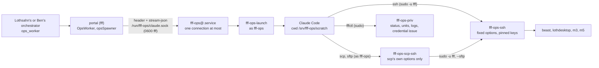

# The orchestration worker (w597)

**TL;DR:** one Claude Code session with a real shell, living in the portal VM (`fff` on Loth2400) as its own Linux
account, `fff-ops`. Only Lothsahn's and Ben's own orchestrators can give it work, through their `ops_worker` tool. It
reaches the machines over ssh with the portal's existing key, copies files to and from them with scp and sftp over that
same ssh (w612), reads the portal's state, prints the portal's ssh key line and pins a new machine's host key
(`fff-machine-ssh`, w676), and issues a machine credential straight into a file on the machine. So it takes a new
machine from nothing to online by itself, once a person has added its record and let the portal in ([A new
machine](#a-new-machine)). It has no git, no downloads, no package installs, no builds, no Unity and no game
workspace: heavy work runs on the target machine over ssh. The VM enforces this, not only its prompt: a 2 GiB `noexec`
scratch file system is all it can write, it can reach only Anthropic's API and the tailnet, and its only sudo rights
are two wrappers. It can also deploy the portal (`fffctl update`), but only after Lothsahn or Ben asks for that in a turn
of their own: the portal then leaves a one-use, 15-minute grant that the root wrapper checks.

Lothsahn asked for it on 2026-10-07: "Let's give you a real worker--not with unity, and not with a FinalFactory
workspace, but with a claude so you can execute commands locally for orchestration." He settled three points: "You
will get exactly one, it's hardcoded, and it's only to orchestrate stuff from you and ben", it runs in the portal VM,
and "that worker has no access to unity, our workspace, git, etc? It has very limited disk space and should not
download things." Then he added the deploy: "Yes, please modify the ops worker to update yourself."

## Using it

A person's own orchestrator (Lothsahn's or Ben's) has the `ops_worker` tool:

| action | what it does |
|---|---|
| `send` (`text`, `fresh`) | gives it a job or a follow-up. **Every new job starts a fresh conversation and a fresh process** (w738): `fresh: true` asks for it explicitly, and a new job is also the first message after the last job ended (12 hours), a message from the other person's orchestrator, and a deploy. Nothing, no context and no token, carries over from one job to the next. A **new job** needs a turn the person started with a message of their own. Within that job (12 hours), the orchestrator's harness turns (a check-in, a timer, its `[ops worker]` report) may follow up, with no count (w627) |
| `deploy` (`text`: the person's words) | a portal deploy (`fffctl update`). Only in a turn the person started with their own message: never a check-in, a timer, a relayed report or a job's follow-up. See [Deploys](#deploys) |
| `status` | its state, the job and whose it is, its limits, and its last 20 steps |
| `interrupt` | ends its turn |
| `stop` | ends its process (the conversation stays, and the next `send` resumes it) |

When one of its turns ends, the orchestrator of the person whose job it is gets an `[ops worker] finished a turn: ...`
message, the same way a worker's report arrives. `agent_transcript ops-worker` reads it at any time.

**A job that is a request's last step** (w631: w605 waited on a portal deploy and w600 on a machine re-run, both done
through this worker, and the ledger never heard). `send` and `deploy` take `work_ids`: the open or stalled requests
("w605") whose step left after their merge this job is. The server checks they exist and are open, keeps them on the job
(`data/ops-worker.json`, so they survive a deploy's restart; a follow-up adds to them), and adds to the worker's message
how to close them: a line `DONE: <id>` for each request the job finishes, once done and verified (for a deploy, only in
the report after the restart), or `<id>: still open: <what>`. At its turn's end those lines go to the ledger as a
worker's would (`Orchestrators.opsTurnEnded`, with every check of a DONE: [orchestrators.md](orchestrators.md),
"Ledger cleanup"), both the request's people and the job's person hear a close, and the `[ops worker]` message ends with
what the ledger did (`[ledger] w605 closed as done on its DONE line`, or why a DONE was not accepted). A DONE for a
request the job was not sent for is refused. A portal deploy or a machine update closes the requests that waited only on
it even without this, once the portal or every connected daemon runs their merge (the PR pass's deploy re-check).

In its shell, the worker types ordinary commands:

```bash
ssh m5 whoami                                   # an alias from deploy/vm/guest/machines.ssh (m3, m5, beast, Loth2800)
ssh rydin@beast 'powershell -NoProfile -Command Get-ScheduledTask ffsb*'   # user@host, as list_machines shows it
ssh m5 'bash -s' < /srv/fff-ops/scratch/check.sh                           # a script it wrote, run on the machine
scp ./install.ps1 rydin@beast:                  # a file from its scratch to a machine (its home folder there; w612)
scp m5:/tmp/install.log ./                      # a log back into its scratch
sftp -b cmds m5                                 # sftp with a batch of put/get lines (no terminal)
fffctl status                                   # the portal: release, health, Tailscale, backups
fffctl logs 300                                 # the portal's journal, secrets redacted
fff-machine-ssh --check                         # the portal's ssh to each machine, then its key line (w676)
fff-machine-ssh --key                           # only the portal's authorized_keys line, for a new machine
fff-machine-ssh --pin ben-ryding@biscuit SHA256:NrEQ...   # pin a new machine's host key (its own fingerprint)
fffctl credential issue m5 --to m5              # a new credential for m5, written into ~/.ff-factory/ on m5
```

To update a machine's worker install, it runs the update there (w613, [worker-install.md](worker-install.md),
"Updating"). The update asks nothing; keeps every setting, the machine's own credential and the PATH; restarts the
daemon; and says what changed and what the portal sees:

```bash
ssh m5 'bash -c "$(curl -fsSL https://raw.githubusercontent.com/Final-Factory/ff-factory/main/scripts/worker/install.sh)" -- --update --root /Users/Shared/ffw'
ssh beast 'powershell -NoProfile -ExecutionPolicy Bypass -Command "& ([scriptblock]::Create((irm https://raw.githubusercontent.com/Final-Factory/ff-factory/main/scripts/worker/install.ps1))) -Update -Root C:\ffw"'
```

An update needs no new credential: never `fffctl credential issue` for one (issuing cuts the running daemon off).

### Updating and re-running a machine's installer (w855)

**This is the worker's job, never a person's** (lothsahn, 2026-10-10: "don't ask ben to run installers.  Update your
instructions.  Stop doing that.  When we say update the machines, do the update, including installers if necessary").
It covers a daemon update, a sandbox count on a worker-root install (add_machine refuses `max_sandboxes` there and now
says so), an agent or editor limit that the installer owns, and a reinstall. w847 (raising biscuit to 3 sandboxes) asked
Ben to run it; it should have been this.

The route has two halves. The dispatcher makes the settings it can (`add_machine` `max_unity`, `max_agents_per_sandbox`,
`max_sandbox_agents`) and sends the requester's orchestrator the step in a `decide_work` note, naming the exact action.
The orchestrator then calls `ops_worker` with action **`machine_update`**: `machine`, exactly one `work_ids` entry (the
person's own open request that asks for it), and `max_sandboxes`, `max_agents_per_sandbox` or `max_unity` for what
changes. After a verified portal deploy none of this is needed for the daemon update itself: FF Factory does it, to every
machine, by itself ([After a verified deploy](#after-a-verified-deploy-w887)). "Update the machines" at any other time is one
such call per machine, with no setting named. An update never needs a drain or a wait (w605): it stops only the daemon, and
the agents in their agent hosts, mid-turn ones included, run on and are adopted by the new daemon
([worker-install.md](worker-install.md), "An update does not stop running work").

**The gate** (`OpsWorker.machineInstall`, `server/opsWorker.ts`; tested in `server/opsWorker.test.ts`):

- Only Lothsahn's or Ben's own orchestrator (as for every action here).
- **Any turn of theirs**, a `[dispatch]`, a timer or a check-in included: the gate is the request, not the turn. The
  request must exist, be open or stalled, and list that person among its requesters, so it is their own recorded
  words (the same footing the dispatcher's `add_machine` runs on: "only for a request its person asked for in their own
  words"). A plain `send` of a new job still needs a turn the person started.
- The server writes the command itself from the machine's record (the `--update` form above, its ssh target and root,
  plus only the settings named, whole numbers 1 to 16). The orchestrator's free text never reaches the worker's
  shell on this path. A machine with no worker root (the portal's own host, or an older install) is refused.
- The worker's own rules stay: it runs that command once and nothing else, issues no credential, and reports what the
  update printed; the job is sent for the request, so its `DONE:` line closes it.

Its `ssh`, `scp`, `sftp`, `fffctl` and `fff-machine-ssh` are wrappers on its PATH (`/usr/local/lib/fff/ops-bin`).
`fffctl machine-ssh-check` still works: it is `fff-machine-ssh --check`. It also has `list_machines`,
`list_sandboxes` and `system_status` (read only) and its own `wake_me`.

## A new machine

Lothsahn, 2026-10-07 (w676): "Make the op machine worker able to run fff-machine-ssh", then "And any other commands
necessary to install a new worker". The motive: Ben's biscuit setup asked the worker for `fff-machine-ssh --check` and it
answered `command not found`, so it read the key line out of m3's `authorized_keys` instead.

The worker takes a new Mac, Windows PC or Linux PC from nothing to "online; ready". Four steps stay a person's, because
each is a setting, a trust decision or a change on the machine before the portal can reach it:

| Step | Who | How |
|---|---|---|
| 1. The machine's record | a person (Lothsahn or Ben) | asks the dispatcher in their own words, in its chat or a request they file: "add_machine biscuit, worker_install, ssh_host ben-ryding@biscuit". `add_machine` is a user-asked tool (`USER_ASKED_TOOLS`, `server/belts.ts`): it runs only for a person's own words. With `worker_install` it makes the record alone (`MachineManager.addInstallRecord`, `server/machines.ts`): no ssh deploy and no credential. The installer's credential check (`GET /machine/whoami`) and the daemon's link need it, and `fffctl credential issue` refuses a machine without one. The worker never adds it: it has no tool for it, and its `credential issue` says to ask |
| 2. The tailnet | a person | the machine in the tailnet policy's `tcp:22` grant for `tag:fff-portal`, and its key expiry off ([RUNBOOK](../deploy/vm/RUNBOOK.md) section 1, "Adding a machine") |
| 3. sshd and the portal's key on the machine | a person, on the machine | sshd on (Linux: `sudo apt install openssh-server`; Mac: Remote Login; Windows: OpenSSH Server). The line `fff-machine-ssh --key` prints goes into the ssh user's `~/.ssh/authorized_keys` (a Windows administrator: `C:\ProgramData\ssh\administrators_authorized_keys`). The worker can print the line and pass it on; it cannot put it there, because it cannot reach the machine yet |
| 4. The host key's fingerprint | a person, on the machine | `ssh-keygen -l -f /etc/ssh/ssh_host_ed25519_key.pub` (Windows: `C:\ProgramData\ssh\ssh_host_ed25519_key.pub`), sent to the worker with the job. It is what makes the pin trustworthy: the worker pins only a key that the machine itself shows to the person and the tailnet shows to the VM |

The person's go reaches the worker the usual way: their own orchestrator sends the job (`ops_worker send`, in a turn the
person started), with the machine id, its ssh target, its fingerprint and the install's answers (root, sandboxes, agents,
editors). Then the worker, in its shell:

1. `list_machines`: the record is there (status "Setting up", "waiting for its worker installer"). If not, it stops and
   asks for step 1.
2. `fff-machine-ssh --pin ben-ryding@biscuit SHA256:...`: pins the host key and writes the alias `biscuit`. Refused,
   with nothing written, when the key the machine shows over the tailnet is not that fingerprint, when it does not answer
   on port 22, or when anything already pins that host (`machines.ssh`, an earlier pin, or a worker installer's
   registration in `known_hosts2`). A refusal goes back to the person: it never pins what it read from the network
   itself. A machine already in `machines.ssh` (biscuit since PR #225) needs no pin: `fff-machine-ssh --check` shows it.
3. `ssh ben-ryding@biscuit whoami`: the portal gets in. "Permission denied" means step 3 is missing:
   `fff-machine-ssh --check` prints the line again.
4. The machine's prerequisites, over ssh ([worker-install.md](worker-install.md), "Install" and "Linux"): node 22.6+, git
   2.48+, git-lfs, Claude Code logged in, Unity. Installing a missing one there is the machine's business (`sudo` there
   may need a person).
5. `fffctl credential issue biscuit --to ben-ryding@biscuit`: the credential goes from the VM straight into
   `~/.ff-factory/machine-credential-biscuit` on the machine; the worker sees only that path and its last four
   characters.
6. The installer, over ssh, with every answer as an option (ssh has no terminal for its questions): on a Mac or Linux PC
   `ssh ben-ryding@biscuit 'bash -c "$(curl -fsSL https://raw.githubusercontent.com/Final-Factory/ff-factory/main/scripts/worker/install.sh)" -- --root ~/ffw --portal-url <the portal URL> --max-sandboxes 3 --max-agents-per-sandbox 2 --max-unity 2 --credential-file ~/.ff-factory/machine-credential-biscuit'`,
   on Windows `install.ps1` with `-Root -PortalUrl -MaxSandboxes -MaxAgentsPerSandbox -MaxUnity -CredentialFile`. It
   registers the machine's host keys with the portal itself (`known_hosts2`) and waits until the portal sees the daemon
   online. A long one: `wake_me` and check back.
7. Delete the credential file on the machine (the job's own file): `ssh ben-ryding@biscuit 'rm ~/.ff-factory/machine-credential-biscuit'`.
8. `list_machines`: online and ready, its root and platform filled in; `fff-machine-ssh --check` shows the machine's
   line with `ssh: ok`. Its report ends with what each step answered.

What the worker may not do with these tools: pin a key it did not get from a person who read it on the machine, change
or remove a pin (a reinstalled machine's new key is a person's: `machines.ssh` and a deploy), run `--fix` or `--data`,
add or remove a machine record, issue a credential for a machine that is not being (re)installed, or change any setting.

## How it runs



The portal service runs with `NoNewPrivileges` and holds every secret, so the worker cannot be an ordinary child
process of the portal: it would get the portal's account and everything that account reads. Instead:

1. `ops_worker send` goes through `OpsWorker.send` (`server/opsWorker.ts`), which checks who is calling. It then
   starts the session `ops-worker` (kind `ops`). Its options set `spawnClaudeCodeProcess` to `opsSpawner`.
2. `opsSpawner` connects to `/run/fff-ops/claude.sock`. The socket belongs to `fff-ops.socket`: it is mode 0600 and
   owned by `fff`, so only the portal can connect. `Accept=yes` with `MaxConnections=1` means one process at a time.
   The socket unit orders and requires no service (w698): a socket after a service is an ordering cycle at boot, and systemd
   then drops the socket's start job, which left the door dead after the 2026-10-08 nightly restart. The scratch file
   system is `fff-ops@.service`'s `Requires=`, and `fff-health` restarts the socket if it is ever found stopped.
   The spawner sends one header line: the CLI's arguments, Claude Code's own environment variables and the credential.
3. systemd starts `fff-ops@.service` for the connection, as `fff-ops`, inside the unit's sandbox. `fff-ops-launch`
   reads the header and builds the environment from nothing. It passes the Claude credential on file descriptor 3
   (`CLAUDE_CODE_OAUTH_TOKEN_FILE_DESCRIPTOR`), so the credential is in no environment a command could print. Then it
   answers `OK` and execs Claude Code. Claude Code's stdin and stdout are the socket. If something is wrong (another
   SDK version, no credential), the launcher answers `ERR <why>` instead, and the transcript shows that reason.
4. The binary is `/usr/local/lib/fff/ops/claude`, the same Claude Code as the Agent SDK the portal runs.
   `fff-ops-sync` copies it there (as root) at every portal start, because `fff-ops` cannot enter `/srv/fff`. The
   launcher refuses to run it when the header's SDK version differs.
5. **One process at a time, in turn (w638).** While a connection is open, systemd drops any other the moment it
   arrives, without a word ("Too many incoming connections (1), dropping connection." in the VM's journal). A stop
   (`fresh: true`, `ops_worker stop`, the idle stop, the portal's) sends Claude Code the SDK's own interrupt and ends
   its input, so it ends its turn and exits; the spawner keeps the socket until then. The next process waits for that
   close, then connects, and tries again every 250 ms while systemd still drops it (it frees the connection a moment
   after the process exits), for up to 60 s (`OPS_SLOT`). Before this, a fresh job connected while the old process was
   still exiting, systemd dropped it, and the job failed with "Claude Code process exited with code 1" (twice on
   2026-10-07). `deploy/vm/test/fff-ops-socket.test.sh` checks it under real systemd in CI.

## What it may do, and what enforces it

| It may | Enforced by |
|---|---|
| ssh to the enrolled machines with the portal's key | `sudoers.d/fff-ops` lets it run `fff-ops-ssh` as `fff`, and nothing else as `fff`. That wrapper takes a machine (`m5`, `user@host`) and never an ssh option: `-o ProxyCommand` or `-F` would run a command as `fff`. Its options are fixed: `StrictHostKeyChecking=yes` (only host keys pinned in `known_hosts` or `known_hosts2`), no agent, X11 or port forwarding, no `LocalCommand`, no proxy, no shared connection, `BatchMode`. The tailnet policy lets the portal's tag reach only the machines (beast, lothdesktop, m3, m5, biscuit) on port 22 (RUNBOOK section 1) |
| run the worker installer on a machine (an update, a sandbox count, a reinstall: [Updating and re-running a machine's installer](#updating-and-re-running-a-machines-installer-w855)) | ssh, above. The installer runs on the machine, with the machine's disk and network. A setting change opens a job only from a turn its person started, or with `ops_worker machine_update` for one of that person's own open requests (the server writes the command) |
| copy files to and from the machines with scp and sftp (w612) | `/usr/bin/scp` and `/usr/bin/sftp` run as `fff-ops` (its PATH's `scp` and `sftp` add `-S fff-ops-scp-ssh`), so the local side of a copy is only what `fff-ops` may read and write: its scratch, never `/srv/fff` or the vault key. `fff-ops-scp-ssh` takes the arguments scp and sftp give their ssh, lets through only their own fixed safe settings (no `-o ProxyCommand`, `-F`, `-i`, `-J`, `-S`, port 22 only) and hands the machine alone to `fff-ops-ssh --sftp TARGET`, the machine's sftp subsystem (or, for `scp -O`, scp's own `scp -t`/`scp -f` command). The machine side is the same ssh as above: the portal's key, pinned host keys, the same network. The guard refuses scp's ssh options and the portal's files as a source or destination, with a reason |
| read the portal's state | `fff-ops-priv` (`status`, `state`, `units [--check]`, `logs N` redacted, `machine-ssh --check`, `credential list`) and the read-only tools `list_machines`, `list_sandboxes` and `system_status` |
| read the vault, machine credentials and the migration's usage (w745) | `fffctl vault list` (the entries: name, kind, env, last four characters, a 12-character fingerprint of the value's hash, grants and the Claude pools' meters), `fffctl vault list --names`, `fffctl vault help`, `fffctl machine-credential list` (the same as `credential list`) and `fffctl migrate --help`. `fff-ops-priv` passes exactly these forms. Never a value: `vault list` shows what `show` in `server/vaultCli.ts` shows anyone who runs it, and there is no `vault get`. Every other vault form (`init`, `export-key`, `add`, `add-claude`, `put`, `rotate`, `grant`, `remove`, `rename`, `new-key`, and `export`, the one that prints a value, root to root for the FFBox host's nightly copy: docs/vault.md section 12), `machine-credential issue` and `revoke`, and every `migrate` mode stay a person's |
| read the portal's critical units (w743) | `fffctl units` and `fffctl units --check` (its PATH's `fffctl` is `sudo -n fff-ops-priv`; the worker types no `sudo`, which its guard refuses). Both are `fffctl units` as root and read only: every critical unit's active and enabled state, the watchdog's verdict and its last restarts; `--check` prints `down: unit=state ...` and exits 1 when one is not active and enabled, else prints that every unit is and exits 0. `fff-ops-priv` passes exactly those two forms: `units --fix`, `units --check extra`, any other word and every `fffctl watchdog` form (run, pause, resume, reset) are refused with exit 2, and the unit restarts stay a person's. CI runs the allowed and refused forms against a fake `fffctl` (`deploy/vm/test/fff-ops.test.sh`) |
| see the portal's ssh to the machines and its public key line (w676) | `fff-machine-ssh --check` and `--key` (its PATH's `fff-machine-ssh` is `sudo -n fff-ops-priv machine-ssh`): `fff-ops-priv` runs `/usr/local/lib/fff/fff-machine-ssh` as `fff` with the installed `machines.ssh`. It prints `id_ed25519.pub` and never reads the private key; CI looks for the private key in its output |
| pin a new machine's host key (w676) | `fff-machine-ssh --pin USER@HOST FINGERPRINT`, the same way. As `fff`, it writes the key into the portal account's `~/.ssh/known_hosts` and `~/.ssh/fff-pins.ssh` (0600 `fff`, which `fff-ops` cannot read or write) and the alias into the managed block of `~/.ssh/config`, only when the key HOST shows over the tailnet now is FINGERPRINT and nothing pins HOST yet (`machines.ssh`, an earlier pin, `known_hosts` or `known_hosts2`). `fff-ops-priv` passes only `--check`, `--key` and `--pin` with exactly two words: never `--fix` or `--data` (a file of the worker's would be pinned) |
| issue a machine credential | `fffctl credential issue ID --to TARGET`: as root, it checks that TARGET answers ssh first (an issued credential replaces the machine's old one) and that the portal has a record for ID (w676: `state.json`, read as root), issues to a root-only temp file, pipes it over ssh into `~/.ff-factory/machine-credential-ID` on the machine (Windows: `%USERPROFILE%\.ff-factory\`), and prints only that path and the last four characters. The token never passes through the worker, the transcript or chat |
| write notes and scripts | its scratch folder `/srv/fff-ops/scratch` (the guard), on its own file system (the OS) |

| It may not | Enforced by |
|---|---|
| read the portal's config, data, secrets or keys | Unix permissions: `/srv/fff` is 0700 `fff`, and `/etc/fff/vault.key` is root's. The guard also refuses these paths with a reason, and refuses `/proc/*/environ` |
| restart or roll back the portal; change settings; change the vault, tokens or migrations; backups or shutdown; pause, run or reset the watchdog | `fff-ops-priv` has none of those subcommands (it has `vault`, `machine-credential` and `migrate` only for their read-only forms, above), and sudoers allows nothing else as root. The guard refuses `fffctl restart` and the like with a reason |
| deploy the portal on its own initiative, or on anyone's word but Lothsahn's or Ben's own | `fff-ops-priv update` runs only with the grant the portal writes into its data folder on `ops_worker deploy`, which the server allows only in the person's own turn. `fff-ops` cannot write that folder (0700 `fff`), so it cannot make a grant. The grant is good for 15 minutes and is removed before the update runs, so it works once |
| copy the portal's secrets or keys off the VM | scp and sftp run as `fff-ops`, which cannot read `/srv/fff` (0700 `fff`) or `/etc/fff/vault.key` (root's): CI copies each of them and gets "Permission denied". `fff-ops-ssh` runs as `fff` but never sees a local path: it only carries the stream. The guard refuses those paths in an scp or sftp command (relative ones too) |
| git, downloads, package installs, builds, interpreters | The network: the unit allows only loopback, the VM's resolvers, Anthropic's API (`160.79.104.0/23`, `2607:6bc0::/48`, [Anthropic's published inbound ranges](https://platform.claude.com/docs/en/api/ip-addresses)) and the tailnet (`100.64.0.0/10`, `fd7a:115c:a1e0::/48`). The disk: everything it can write is on a 2 GiB `noexec` file system. sudo: no `apt`. The guard refuses `git`, `curl`, `wget`, `rsync`, `apt`, `npm`, `pip`, `python`, `node` and the like, so the worker learns why at once. scp and sftp reach only what ssh reaches: the machines whose host keys are pinned, over the tailnet. They add no address to the allowlist and no nft rule: the copy is the same ssh process, as `fff`, inside the same unit |
| print a credential | The launcher keeps the Claude credential out of its environment (fd 3). The guard refuses `env`, `printenv`, `export -p` and `/proc/*/environ`. Transcripts and the audit log redact Claude, GitHub, FFBox, machine, Tailscale, API and private keys (`redactSecrets`) |
| be reached by anyone else | `SessionManager.send` refuses a session of kind `ops` unless the message comes through `OpsWorker` (Lothsahn's or Ben's own orchestrator) or is its own `wake_me`. That covers the dispatcher, people's chats (HTTP 403), workers, standing agents, the intake, FFBox, `/mcp` and every harness notice. `ops_worker` is in neither the dispatcher's belt nor `/mcp`'s |
| Steam, spending money, publishing | It has no Steam login, GitHub token or Discord token in the VM, and the network fence blocks those services. On a machine, the prompt and the audit trail are the fence: see the threat notes |

The unit's sandbox (`fff-ops@.service`, written by `deploy/vm/guest/install.sh`):

- `ProtectSystem=strict`, with `ReadWritePaths` limited to its scratch and to `/srv/fff`. `fff-ops` itself cannot
  enter `/srv/fff`. It stays writable only for what sudo runs as root there: issuing a credential writes the portal's
  machine-token file.
- `ProtectHome=tmpfs`.
- A private 64 MB `/tmp`, 16 MB `/var/tmp` and 16 MB `/dev/shm`.
- `IPAddressDeny=any` with the allowlist above.
- `MemoryMax=1536M`, `TasksMax=256`, `CPUWeight=50` (the portal has priority).
- `RuntimeMaxSec=8h`.
- No `NoNewPrivileges` and no setting that implies it, because sudo needs setuid. Its sudo rights are what bounds it.

## The disk cap

Everything `fff-ops` can write is one ext4 file system in `/var/lib/fff-ops/scratch.img`, `OPS_DISK_MB=2048` by
default. It is mounted at `/srv/fff-ops` with `nosuid,nodev,noexec` by `fff-ops-scratch.service`. Its home, Claude
Code's own files (`/srv/fff-ops/home/.claude`, the conversation) and its `TMPDIR` are all on it. When it is full,
the worker's writes fail and the VM's own disk is untouched. CI writes 3 GB into it and checks for "No space left on
device".

- Why 2 GiB (a guess with a basis): the copy of all of BEAST's conversations, every agent's, was about 700 MB
  (measured in the migration, RUNBOOK section 4). One worker's conversations and a few scripts fit easily. The VM's
  disk is about 118 GB.
- To resize it, stop the socket and the scratch, then grow the image and the file system:
  `sudo systemctl stop fff-ops.socket fff-ops-scratch.service`,
  `sudo truncate -s 4G /var/lib/fff-ops/scratch.img && sudo e2fsck -f /var/lib/fff-ops/scratch.img && sudo resize2fs /var/lib/fff-ops/scratch.img`,
  set `OPS_DISK_MB=4096` in `/etc/fff/fff.conf`, then `sudo systemctl start fff-ops-scratch.service fff-ops.socket`.

## Model, budget and lifetime

Fixed in `OPS_LIMITS` (`server/opsWorker.ts`), like the worker itself:

| Setting | Value | Basis |
|---|---|---|
| model, effort | `opus`, `medium` | sourced: the game repo's CLAUDE.md drops the driver to medium "for purely operational sessions" |
| account | the orchestrators' (`claudeAccounts.orchestrator`): in the VM, the subscription token file, or with `"vault"` (w738) **the Claude token pool of the person whose orchestrator gave it the job**, picked at the start of every job by the pool rules in docs/vault.md section 4: the caps hold it ("held" with the reason and the next reset, like that person's other workers), and it never falls to the dispatcher's token. A caller with no vault token yet keeps the token file. A new job from the other person's orchestrator starts a fresh process on that person's token. | sourced: D4 / design 5.2 put the orchestrators on it, and the worker works only for their people. The account must be a token: the VM's claude.ai login belongs to `fff`, which `fff-ops` cannot read, so the launcher refuses with "no Claude credential" |
| spend cap | $25 per process (the SDK's `maxBudgetUsd`, which the CLI enforces) | a guess: a runaway guard. On the subscription token, the cost is plan usage, and the dollar figure is the SDK's estimate |
| idle stop | 1 hour, then the process stops and the conversation stays | sourced: the same hour idle workers get (`IDLE_REAP_MS`), the prompt cache's lifetime |
| turn limit | 2 hours, then FF Factory interrupts the turn | a guess: an install with its waits fits, and longer waits use `wake_me` |
| process limit | 8 hours (`RuntimeMaxSec`), enforced by systemd | a guess: a backstop if the portal's checks fail |
| a job | 12 hours of follow-ups from the orchestrator's harness turns after a person's own turn opened it, as many as the job needs | a guess: one evening's reinstall. Follow-ups were never counted, and w627 (lothsahn, 2026-10-07: "an infinite number of messages to each other and the portal worker") keeps it so |
| memory | 1536 MB (`MemoryMax`) | measured basis: an idle claude process used 100-300 MB resident and 450-650 MB committed (BEAST, 2026-10-04, orchestrators.md). The VM has 4 GiB |

The session record stays for good, with its conversation. `fresh: true` starts a new conversation: the transcript
goes on, with a line marking the new job and whose it is. Every new job does this (w738), not only `fresh: true`; a follow-up within the job keeps the conversation and the process, and with them the token it started on.

## Audit

- **Its transcript**, on the dashboard: a "Orchestration worker" row under the Dispatcher in the sidebar opens it
  read-only. Each Bash call shows with its command and output, as for any agent. The store redacts secrets before
  anything is written or shown (`redactValue`, `server/store.ts`). This change adds machine credentials, Anthropic
  API keys, Tailscale keys, age identities and private-key blocks to the patterns.
- **The portal's journal**: every tool call it makes, `ops-worker: Bash: <command>`, and every refusal,
  `ops-worker: REFUSED ...`, redacted (`fffctl logs`, or `journalctl -u fff-portal`). So are the messages it gets.
- **The VM's journal**: `fff-ops-ssh` logs each ssh (`journalctl -t fff-ops-ssh`), `fff-ops-priv` each fffctl
  (`-t fff-ops-priv`), sudo each elevation, and the launcher each start (`-t fff-ops`).

## Deploys

Lothsahn, 2026-10-07: "Yes, please modify the ops worker to update yourself." After the first deploy of this feature
(his, by hand), later portal updates can go through the worker.

1. Lothsahn or Ben tells their orchestrator to deploy. In that same turn, the orchestrator calls `ops_worker deploy`.
   The server checks the turn is the person's own (`personTurn`, as for approvals: the person's message opened it, and
   a harness message delivered while it runs does not change that, w607). It refuses turns that check-ins, timers,
   relayed reports, FFBox and Discord text, or workers' and standing agents' reports opened, and a job's follow-ups.
2. The server writes `data/ops-deploy.grant`, `{by, at, expires}`, 15 minutes, owned by `fff` with mode 0600. It saves
   the deploy in `data/ops-worker.json` and sends the worker a `[deploy]` message with the steps.
3. The worker runs `fffctl status`, then `fffctl update`. `fff-ops-priv` (root):
   - checks the grant is the portal's and still in time;
   - removes it;
   - prints the commit the portal runs;
   - runs `fffctl update --no-wait`.

   It takes no options, so there is no other ref and no drain setting. The update itself is `fff-update`'s, as for a
   person: build `origin/main` beside the running release, drain, restart, verify, and roll back by itself when the
   new release does not answer (RUNBOOK section 6).
4. The worker ends its turn with the commit it started from, and sets `wake_me 20` as a fallback.
5. **The restart.** The portal stops its sessions, so the worker's socket closes and its Claude Code exits:
   `KillMode=control-group` ends anything it left in `fff-ops@.service`. The update itself runs on regardless,
   because it is `fff-update.service`, started by `fff-update.path`, not a child of the worker. What carries the job
   across the restart:
   - its conversation, on its own scratch file system, which outlives the process;
   - its session record;
   - the deploy record in `data/ops-worker.json`.

   When the new portal starts (within the hour), `OpsWorker.start` sends the worker `[deploy] The portal has started
   again...`, once. A new `fff-ops@` instance resumes the conversation, and the worker reports to the person: the
   commit before, the commit now, verified or rolled back, and `fffctl status`. If the update needed no restart
   (already up to date) or the build failed, its `wake_me` brings it back to report from `fffctl status` and
   `fffctl logs`. The wake is kept in `data/wakes.json` across restarts.

6. **The machines follow by themselves** once the deploy has verified (never after a rollback): [After a verified
   deploy](#after-a-verified-deploy-w887). The worker does not update them, and its messages say so.

CI checks the parts that need no Claude token, in a real guest, after the update step's own restart:
- `fff-ops.socket` still listens, and the launcher still starts Claude Code;
- `fffctl update` through the worker's wrapper is refused with no grant and with a grant that ran out;
- a fresh grant works once and is gone;
- the portal still runs the same commit afterwards.

`server/opsWorker.test.ts` checks that the server gives a grant only in the person's own turn, and that the report
message is sent once after a restart. A real deploy by the worker, with its report, is the first such use after this
merges.

## After a verified deploy (w887)

Lothsahn, 2026-10-10: "Update FFFactory so that after updating the portal and validating, it automatically updated all the
machines." Then, asked "Isn't it possible to update a machine without disrupting running agents?": it is (w605), so there is
no drain and no wait.

**TL;DR:** once `fff-update` has verified a new portal release, the portal itself runs the worker installer's update on every
online worker-root machine, one at a time, over its own ssh, and sends ONE report to the orchestrator of whoever asked for the
deploy. A machine that is offline is updated when it comes back. No request, no ops job, no worker.

- **The trigger is the verification, never the restart.** `fff-update verify` (`deploy/vm/guest/fff-update`, run by
  `fff-health`) writes `data/update.verified.json` (`{sha, previous, at}`) only when the new release answers `/api/health`
  with its commit. A rollback (`cmd_rollback`) removes `update.verifying.json` and writes nothing, so a rolled-back deploy
  updates no machine. The portal (`MachineRollout`, `server/machineRollout.ts`) looks for the marker every 30 s, takes it once
  (renaming it `update.verified.done.json`; a marker older than a day is only retired) and keeps the rollout in
  `data/machine-rollout.json`, which survives a portal restart. Checked in `deploy/vm/test/ci-vm-e2e.sh` (the marker after the
  update, none after the rollback) and in `server/machineRollout.test.ts`.
- **Authority.** The person's deploy approval covers it (`ops_worker deploy`, or Lothsahn's own `sudo fffctl update`): the
  rollout opens no request and no ops job, and the only command it can run is the installer's update form, written by the
  server from the machine's record (`workerUpdateRemote`, the function `machine_update` uses) with **no setting named, so
  every limit stays as it is**. Anything the installer says it changed (`~ key: before -> after`) is flagged in the report.
  Off with config `machines.autoUpdateAfterDeploy: false`, and in a dry run.
- **Running agents are not drained or waited for.** The update stops only the daemon; agents run on in their agent hosts and
  the new daemon adopts them (w605). Before each machine the rollout counts its live agents; after it, the daemon's hello
  says which it took back (`MachineManager.liveAtHello`). The report gives "N of M adopted" and names any that ended (the
  portal resumes a mid-turn one; an idle one comes back on its next message).
- **Which machines.** Worker-root machines (a record with a root folder), one at a time. The portal's own host is skipped (the
  portal runs its daemon itself) and so is a machine deployed over ssh (the portal redeploys it once idle, as before). A daemon
  already on the deployed commit is left alone.
- **Offline or asleep** machines stay pending and are updated on the first pass (30 s) after their hello. The main report
  waits up to 10 minutes after the verification for machines that are only reconnecting to the new portal; one still offline
  then is listed as waiting, and a short follow-up message names it once it has been updated.
- **A failure on one machine** is recorded and the rest carry on. The installer checks every prerequisite before it touches
  anything and exits 2 with the old daemon running ("Not updating: ... the daemon was not touched"); a machine seen online
  after a failed run is kept as it was. If a failed run leaves the machine offline or outdated, the rollout runs the
  installer again with `--daemon-ref <the commit the daemon ran before>` (`-DaemonRef` on Windows) to put the old code back;
  if that fails too, the report says the daemon is OFFLINE and needs a person, the one case that does.
- **The report** is one `[machine updates]` message to the orchestrator of the person whose `ops_worker deploy` it was
  (`OpsWorker.deployRequester`: the last deploy asked for within 3 hours before the verification), else to the dispatcher (a
  deploy by hand). Per machine: updated, already current, skipped (with why), failed (with the installer's own lines and the
  rollback outcome) or waiting; the commit before and after; "Limits unchanged"; the agents adopted and any that ended. The ops
  worker is told in its `[deploy]` messages that it does not update the machines.
- **Not replaced:** a change of setting (a sandbox count, an editor limit) is still `ops_worker machine_update`.

## In the portal

- `list_sandboxes` and `list_machines` end with a group of their own: "Orchestration worker (the portal VM; not game
  capacity, not counted in any limit)", with its state, job and limits.
- It is in no machine's session list, so the fleet's capacity, placement and agent meters never count it.
- The idle reaper leaves it alone. Its own lifetime rules above apply.
- On the page it has its own sidebar row, and its panel is read-only. Nobody writes to it there, and the server
  answers 403 if someone tries. Lothsahn and Ben may interrupt it. Its permission mode, name and record are fixed.

## Threat notes

What living in the VM gives it, by design:

- **The portal's ssh key, by proxy.** It can run any command, as the portal's account on each machine, that the
  portal's key is authorized for. That means `rydin` on BEAST (an administrator), `benryding` on m3 and m5, and the
  installer-registered accounts. This is the job: running the worker installer, stopping a daemon. **No new key goes
  on any machine**, Ben's included: it uses the key that is already authorized there (`from=` the VM's tailnet
  address). It never reads the key itself, because `fff-ops-ssh` runs as `fff`.
- **Root, narrowly**: the subcommands of `fff-ops-priv`. A bug there is root in the VM, so the script takes no
  free-form argument except a machine id and an ssh target, both pattern-checked, and runs no shell on its input.
- **The portal deploy, on a person's word.** A worker that deploys the portal changes what every agent runs: the
  orchestrators, the dispatcher, the guards, and this worker's own fences, which come with the release's guest
  `install.sh`. What limits that:
  - **What it deploys** is only `origin/main` as GitHub has it. `fff-ops-priv update` takes no ref or option, and the
    worker has no git and cannot push. So it can deploy only what was already merged to main through a pull request
    and its CI, by someone else's hands.
  - **When** is only after Lothsahn or Ben asks in a turn of their own. The grant is the server's, written where
    `fff-ops` cannot write, good for 15 minutes and used once. A prompt injection that reaches the worker, or a
    harness turn of the orchestrator, cannot deploy.
  - **How** is the person's own path: `fff-update` builds beside the running release, drains, verifies, and rolls
    back by itself when the new release does not answer. The worker cannot roll back, restart or change settings.
  - **Audit**: `ops-worker: <person> asked for a portal deploy` in the portal's journal, `fff-ops-priv` naming who and
    the commit it started from (`journalctl -t fff-ops-priv`), fff-update's own log and `update.result.json`, and the
    worker's report of the commits before and after.

  The first deploy of this feature stays Lothsahn's by hand (`sudo fff-vm ssh 'sudo fffctl update'`). What is merged
  to main still needs review: a merged change that loosened these fences would reach the VM through the next deploy,
  whoever starts it.
- **The Claude credential** of its process: Claude Code holds it in memory. It is not in any environment, and the
  Bash tool's children cannot read their parent's memory (Ubuntu's Yama `ptrace_scope` 1 lets a process trace only
  its descendants).
- **The tailnet.** It sits on the portal's node, so it reaches what the tailnet policy lets the portal reach: the four
  machines on port 22.
- **Files both ways (w612).** scp and sftp can put any file the worker can read onto a machine, and write any file the
  portal's account there may write: the same reach as `ssh m5 'cat > file' < file`, which it already had, now without
  the workaround. What it can read in the VM is its own scratch and the world-readable system files; the portal's
  config, data, secrets, keys and the vault key are not among them.

What it does not get: the portal's `config.json`, `data/` (the ledger, transcripts, the vault, other machines'
tokens), the `secrets` folder, the vault key, `gh`'s token, Max's Discord token, the backup key, the host
(`fff-vm`), the Funnel, or the portal's HTTP API with any login.

Residual risks, and what bounds each:

- **An orchestrator and the worker answering each other.** Each `[ops worker]` report opens a harness turn of the
  orchestrator, which may `send` a follow-up, which ends in another report. Follow-ups have no count (w627). What ends
  such a run: the job's 12 hours (after them a `send` opens a new job, which needs the person's own turn), the $25 spend
  cap of a process, the 2-hour turn limit, and every step in the dashboard's transcript.
- **Prompt injection through an orchestrator.** A relayed report could ask Lothsahn's orchestrator to have the worker
  do something on a machine. Bounds: a new job needs the person's own turn, and harness turns can only follow up a job
  that turn opened. Every command is in the transcript and journal. The person's orchestrator relays the worker's
  reports, as with any worker.
- **Remote commands are not fenced.** On a machine, the worker can do whatever the portal's account can do there,
  deleting included. That is inherent to "run the installer remotely". Bounds: its prompt (ask before deleting
  anything that is not the job's own), the audit trail, and the people who start it.
- **A host key the worker pins (w676).** A pin decides which machine the portal's ssh trusts under that name. Bounds:
  the fingerprint comes from a person who read it on the machine, and the key the machine shows over the tailnet (a
  WireGuard link to that node, not the open network) must equal it; it pins only a host nothing pins yet, so it cannot
  replace a known machine's key; the pin writes as `fff` into files `fff-ops` cannot touch; and each pin is in the
  journal (`journalctl -t fff-ops-priv`) and the transcript. A worker that invented a fingerprint could pin only a key a
  tailnet node really shows for that name, the same trust `machines.ssh`'s own keys were checked against (w537).
  Removing a pin (`~/.ssh/fff-pins.ssh` and its `known_hosts` line) is a person's.
- **Credential issue cuts a machine off.** Issuing replaces the old credential, and the machine's daemon drops within
  20 s. That is right for a reinstall and wrong otherwise. Bounds: it checks that the machine answers ssh before it
  issues, and the brief says to issue only for a machine being (re)installed. Revoking stays a person's.
- **The guard is a seatbelt.** Its shell parser can be fooled, as `standingGuard`'s can (`docs/standing-agents.md`).
  The boundary is the account: sudoers, permissions, the network allowlist and the disk cap. CI checks those in a real
  guest.
- **The network allowlist is by address.** If Anthropic's API moved off its published ranges, the worker would fail
  to start (visible, not silent), and `OPS_ALLOW_NETS` in `/etc/fff/fff.conf` would need widening, then `fffctl
  update` to rewrite the unit.

## A new fffctl command

**The rule** (Lothsahn, 2026-10-09, w745): "anytime a new fffctl command is provided, all read only parts of it should be allowed by the orchestrator worker". When a pull request adds an `fffctl` command or a form of one, it also allows that command's read-only parts to the worker, in the same pull request. A form is read-only when it:

- writes no file (a log, a known_hosts entry, a copy of a key, a temp file the command keeps),
- starts, stops, pauses, resets or runs no unit (`watchdog run` can restart one, so it is not read-only),
- changes nothing in the vault or in config,
- and prints no secret: never a token or a key, only what `fffctl vault list` shows (names, last four characters, a fingerprint).

If a form could print a secret, or you are unsure, it is not read-only: leave it a person's and say why in the pull request. Pinning the arguments of a form that changes state does not make it read-only.

What to change, all in the one pull request:

1. `FFFCTL_FORMS` in `server/opsWorker.ts`: the command with its `allowed` (read-only) and `changes` forms. `OPS_FFFCTL` follows from it. The server's shell guard checks the command word, and for `vault`, `machine-credential` and `migrate` the form word too.
2. `deploy/vm/guest/fff-ops-priv`: a case with the exact arguments pinned (`exec "$FFFCTL" ...`), the header comment and the refusal text. Anything not pinned there is refused with exit 2 before `fffctl` runs.
3. Tests: allowed and refused forms in `deploy/vm/test/fff-ops.test.sh` (against a fake `fffctl`) and in `server/opsWorker.test.ts`.
4. This file: the "It may" table.
5. The two places that assert what the worker may not do, in case they list your form as refused: the `for sub in ...` loop near the top of the `fff-ops-priv` block in `deploy/vm/test/fff-ops.test.sh` (no subcommand of that name) and the `for bad in ...` list in `deploy/vm/test/ci-vm-e2e.sh` (run in the nested VM, about 15 minutes: the one check that runs the real `sudo` rules, and the only one not run on a laptop). w745 found both only after CI failed on them.

Tests that read these scripts read LF: Windows runners check out CRLF, so strip `\r` when you read them (as `server/opsFffctlForms.test.ts` does).

`server/opsFffctlForms.test.ts` enforces the first two: it reads `fffctl`, `server/vaultCli.ts` and `scripts/fff-migrate.ts`, and fails when a command or form exists that the table does not classify, when the table lists one that is gone, and when `fff-ops-priv` and the guard disagree. A new command that has forms of its own (a new `case` inside it) is added to the `discovered` list in that test.

**How such a change ships**: it changes `fff-ops-priv` and the server's guard, not the sudoers file (one root file, `fff-ops-priv`), so a portal deploy (`fffctl update`) carries it. The host's `install.sh --guest-only` adds nothing.

## Deploying it

Lothsahn deploys it (deploys are his). On Loth2400:

w676 (`fff-machine-ssh` for the worker, `--pin`, the record check, `add_machine worker_install`) needs only a portal
deploy (`fffctl update`, or `ops_worker deploy` on Lothsahn's or Ben's own word): the update installs the new
release's scripts and its `ops-bin/fff-machine-ssh`, re-runs `fff-machine-ssh --fix` because the script changed, and
restarts the portal on the new server code. The sudoers file and the units do not change, so no guest re-install.

w743 (`fffctl units [--check]` for the worker) is the same kind: it changes `fff-ops-priv` and the server's shell guard (`OPS_FFFCTL` in `server/opsWorker.ts`), not the sudoers file (`fff-ops-priv` is still its one root file) or the units. A portal deploy carries it; the host's `install.sh --guest-only` adds nothing.

```bash
sudo fff-vm ssh 'sudo fffctl update'
```

The update runs the new release's guest `install.sh`, which creates `fff-ops`, the scratch image and its mount, the
sudoers file, the wrappers and the units, starts `fff-ops.socket`, and copies the worker's Claude Code. The portal then
restarts with a drain. Check it:

1. `sudo fff-vm ssh 'systemctl is-active fff-ops.socket fff-ops-scratch.service; findmnt /srv/fff-ops'`:
   `active active` and an ext4 mount with `noexec`.
2. From his orchestrator, in a turn of his own: "ops_worker send: run `fffctl status` and `ssh m5 whoami`". The
   `[ops worker]` report should show the portal active and `benryding`.
3. After the w612 deploy (scp), the same way: "ops_worker send: write `hello` into `t.txt` in your scratch, `scp t.txt
   m5:/tmp/w612.txt`, `scp m5:/tmp/w612.txt back.txt`, show `back.txt`, then `ssh m5 'rm /tmp/w612.txt'`". The report
   should show `hello`.

If it does not start, the transcript says why, in the launcher's words: a version mismatch (restart the portal once:
`fff-ops-sync` runs at its start), no credential (the orchestrators' account is a login, not a token), or the socket
missing (the update did not run the new `install.sh`). "still had its one process after 60 s" means the last process
did not exit after its stop (see `ops_worker status`). `journalctl -t fff-ops -t fff-ops-ssh -t fff-ops-priv` in the
VM shows its side, and `journalctl -u fff-ops.socket` any dropped connection.

## Code and tests

- `server/opsWorker.ts`: the session, who may send, the guard, the spawner, the brief and the limits.
  `server/agents.ts`: `opsOptions`, the `ops_worker` tool, and the group in the lists. `server/belts.ts`: the
  `ops_worker` and `ops` belts. `server/sessions.ts`: the send gate. `server/index.ts`: the page's routes.
- `deploy/vm/guest`: `fff-ops-launch`, `fff-ops-ssh`, `fff-ops-scp-ssh`, `fff-ops-priv`, `fff-ops-sync`, `fff-machine-ssh` (w676: `--key`, `--pin`), `ops-bin/`,
  `units/fff-ops.socket`, and the install step (9/10) that writes `fff-ops@.service`, `fff-ops-scratch.service` and
  the sudoers file.
- `server/opsWorker.test.ts`: who reaches it, the belts, the shell seatbelt, writes and reads, redaction, the header,
  the spawner against a fake socket, a fresh job from every state the last process can be in (just after a turn,
  mid-turn, after the idle stop, after a failed start, a resume after a stop) through the real Agent SDK and a
  stand-in for systemd's one-connection socket (w638), the one session with its job rule and lifetime, and a deploy
  (only in the person's own turn, the grant, the report after the restart).
- `deploy/vm/test/fff-ops-socket.test.sh` (CI's unit-test job on Linux, w638): `fff-ops.socket`'s own settings under
  real systemd, the real launcher with a fake claude and the portal's `opsSpawner`: systemd drops a second connection
  while one is open, and a new process started right after a stop runs, the last one idle or mid-turn.
- `deploy/vm/test/fff-units.test.sh` and `fff-watchdog.test.sh` (run by `lint.sh`, w698): every critical unit is enabled by
  `install.sh` with the right `WantedBy`, a socket is never ordered after a service (and `systemd-analyze verify default.target`
  catches the old one), and the unit watchdog restarts a stopped `fff-ops.socket` with a back-off, a log line and a record.
- `deploy/vm/test/fff-ops.test.sh` (run by `lint.sh`): the launcher against a fake claude (arguments, environment,
  fd 3, refusals), the ssh wrapper against a fake ssh, real scp and sftp copies both ways through the wrappers to a fake
  machine running a real `sftp-server` (and the options, port, host and command they refuse), and the root wrapper's
  subcommands; as root (CI's lint), `fff-ops-priv machine-ssh` against a fake `fff-machine-ssh`: `--check`, `--key`
  and `--pin` pass, `--fix`, `--data` and anything else do not, and `credential issue` needs the record (w676).
- `deploy/vm/test/fff-machine-ssh.test.sh` (run by `lint.sh`): `--key` prints the key line alone, and `--pin` pins a
  new machine only when the fingerprint and the tailnet agree, once, keeps it through `--check` and `--fix`, and refuses
  a wrong fingerprint, a host that does not answer, one already pinned in `machines.ssh` or `known_hosts2`, and bad
  arguments, with nothing written (w676).
- `server/machineRollout.test.ts` (w887): a verified deploy updates every online worker-root machine with the installer's update form and no setting named; no marker (a rollback) updates nothing; an offline machine is deferred, reported as waiting and followed up when it comes back; one machine failing is isolated and an offline daemon is put back on its old commit; agents adopted across an update are counted and any that ended are named; one report to the deploy's requester (the dispatcher for a deploy by hand).
- `server/machines.test.ts`: `add_machine worker_install` makes the record alone (no credential, no ssh deploy), refuses
  folders and an existing ssh machine, is left alone by the offline watch and a portal restart, and its first hello
  makes it ready (w676).
- `deploy/vm/test/ci-vm-e2e.sh`, "the orchestration worker" step, in a real guest:
  - the account, the scratch and its cap, and the socket's owner;
  - `fff-ops` cannot read the portal's secrets, and its two sudo rights are all it has;
  - a credential is not issued for an unreachable machine, nor for one with no record (w676);
  - Claude Code starts through the socket, and another SDK version is refused;
  - the unit's own fences on a probe: sudo works inside them, Anthropic's API is reachable, example.com is not, and
    only the scratch is writable;
  - scp and sftp inside those fences (w612), to an sshd of CI's own on the guest's loopback with the portal's key and a
    pinned host key: copies both ways (sftp and `scp -O`) arrive, and a host whose key is not pinned, example.com, an
    `-o ProxyCommand` and the portal's config, ssh key and vault key are each refused, with nothing arriving;
  - the worker's `fff-machine-ssh` inside its fences (w676): `--check` and `--key` give the portal's public key line
    and not the private key, `--pin` refuses a wrong fingerprint and pins the guest's own sshd (standing in for a new
    machine) with its real one, once, logged in the journal, and `--fix` and `--data` are refused;
  - and, in the update step: the worker's socket and launcher survive the portal's restart, and its `fffctl update` is
    refused with no grant or a grant that ran out, while a fresh grant works once.
- Not tested in CI: a real Claude turn (CI has no token) and ssh to a real machine. Lothsahn's check above covers both.
