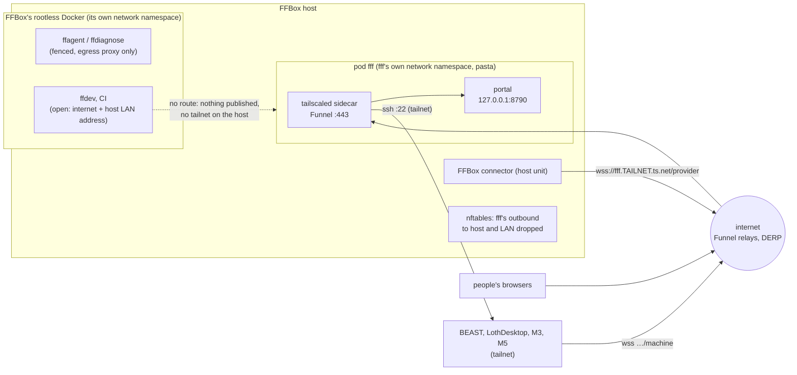

# The portal in its own container on the FFBox host (design)

**TL;DR:** Run the portal (orchestrators, dispatcher, standing agents, ledger and `data/`, web UI, `/machine` and
`/provider`, machine control) as a rootless Podman pod under its own Unix account, `fff`, on the FFBox host. Tailscale
runs inside the pod and nothing is published on the host. FFBox and FF Factory then share the hardware, the kernel and
the internet line, and nothing else: no account, file, Docker daemon, network or secret. FFBox reaches the portal
through its public Funnel URL, as it reaches BEAST today. BEAST keeps only its daemon and workers. Before the move,
FF Factory needs a portal-only mode, a way to turn BEAST from "the portal's own host" into an ordinary ssh machine
(with its Dev Drive self-recovery moving into BEAST's daemon), and a container path for `request_app_update`
([Code changes](#6-what-changes-in-ff-factorys-code)). Estimated cut-over downtime is 5 to 15 minutes (a guess until
the dry run times it). Workers keep running throughout. One limit no design on a shared host removes: whoever has root
on the FFBox host can read the portal's secrets, including the ssh key to Ben's machines.

Status: design only, for w439 (Lothsahn's request to design this container). Nothing is deployed. The prerequisite is
w424 (BEAST's sandboxes moved under BEAST's own daemon, [beast-machine.md](beast-machine.md)) running live, with
`machines.keepAgentsOnRestart` on.

**How claims are labelled.** *(sourced: X)* means a document or a code line says so. *(measured: how)* means it was
counted or run for this design on 2026-10-05. *(guess)* means it is not verified yet, and the dry run
([7.2](#72-dry-run-on-a-copy)) or a named check settles it. Code references are to ff-factory `main` at commit
1938d50 (2026-10-05). References starting `ffbox` are to the private ffbox repo, which was only read: this page
leaves out the box's addresses, account names and audit items, as [ffbox.md](ffbox.md) does.

## What moves and what stays

| Moves into the container | Stays where it is |
|---|---|
| `server/index.ts` and everything it runs: each person's orchestrator, the dispatcher, standing agents (`standingRoot`), the ledger, intake, the Max and FFBox pages | BEAST's daemon, sandboxes, Unity editors and workers ([beast-machine.md](beast-machine.md)) |
| `config.json` and all of `data/`: state, ledger, transcripts, attachments, orchestrator memory, push keys, tokens' hashes | LothDesktop, M3 and M5 daemons, unchanged except the portal URL they dial |
| The orchestrators' read-only clone of the game repo (`repo.basePath`) | The Dev Drive and its SYSTEM helper tasks on BEAST (their code moves into BEAST's daemon, change 4) |
| Review media (`publish_review`, `review.root`), unless [decision D9](#8-risks-and-open-decisions) says otherwise | FFBox: its config, containers, units and data are not touched |

Voice transcription on BEAST's GPU does not move: the FFBox host has no GPU *(sourced: [ffbox.md](ffbox.md), "Where")*.
See [2.6](#26-voice).

## 1. Isolation

### 1.1 What is hostile, and what the portal holds

FFBox assumes its containers are hostile *(sourced: ffbox `docs/docker-security-model.md`, "The container is assumed
hostile")*. They run on a rootless Docker daemon under an FFBox account *(sourced: [ffbox.md](ffbox.md), "Where")*.
Code can end up running in one of them through:

- `ffagent`: any player's Discord text. Fenced network: only an egress proxy with a short allowlist.
- `ffdiagnose`: a hostile crash or desync upload. Fenced.
- `ffdev`: operators' turns, which can carry a player's words from the same thread. Open network: "the whole
  internet, and this machine's own LAN address with it" *(sourced: ffbox docker-security-model, "The class that is not
  fenced", measured there on 2026-08-25)*.
- the game repo's CI runner jobs, which run whatever a branch's workflow file says.

An attacker in one of those can get to three depths:

- **E0**, still inside the container: whatever its network reaches.
- **E1**, out of the container as FFBox's rootless daemon account: a container-runtime bug or a mount mistake.
- **E2**, root on the host: a kernel bug reachable from a user namespace, or E1 plus a local privilege escalation.

What the portal holds, which is what such an attacker would want:

| Secret or power | On BEAST today | In the container |
|---|---|---|
| The host Claude token and people's own tokens | `config.json` `claudeEnv`, `userClaudeEnv` | moved as is |
| Lothsahn's claude.ai login (new) | none | `/fff/claude/.credentials.json` |
| GitHub credential (`gh` PR queries, the memory repo push) | BEAST's `gh` login | a new fine-grained token ([D7](#8-risks-and-open-decisions)) |
| The ssh key that deploys daemons to BEAST, LothDesktop, M3 and M5 | BEAST's `~/.ssh` *(sourced: [machines.md](machines.md), "Requirements")* | a new key made in the container |
| Max's Discord bot token | the ffdiscord config and `secrets.env` under `~/.config/ffbox` *(sourced: `server/discordConfig.ts`)* | its own copy in the container's home |
| VAPID push key, push subscriptions, login sessions, hashed API keys and machine tokens | `data/` | moved as is |
| Tailscale node key | BEAST's Tailscale | the sidecar's own state volume |
| Transcripts (whatever agents saw), attachments (players' saves and logs), orchestrator memory | `data/` | moved as is |
| Powers: start and stop workers on every machine, push code, delete sandboxes, approve intake work, post as Max through workers | | the same |

### 1.2 The options

| Option | From an FFBox container (E0) | As FFBox's daemon account (E1) | As host root (E2) | Cost | Verdict |
|---|---|---|---|---|---|
| **1. Rootless Podman under a dedicated `fff` account** | Nothing: the pod publishes no port, the portal binds the pod's own loopback, and the pod's network namespace belongs to another account | Nothing: files are `0700` under `fff`, another uid with a disjoint subuid range, so no file access and no ptrace. Podman has no daemon socket to steal | Everything | A user, linger, three Quadlet files, Podman 5 | **Recommended** |
| 2. Rootless Docker: a second daemon under `fff` | As 1 | As 1 | Everything | A second `dockerd` beside FFBox's; two `docker` CLIs whose target depends on `DOCKER_HOST`, an easy operator mistake; no built-in update with rollback | Acceptable fallback if Lothsahn prefers Docker |
| 3. A separate rootful Docker daemon with `userns-remap` | As 1 if nothing is published | Nothing, if its socket is root-only | Everything | `dockerd` still runs as root under userns-remap *(sourced: Docker docs, "Isolate containers with a user namespace")* and manages host iptables. FFBox moved off a root daemon on purpose *(sourced: ffbox docker-security-model, "The host rule, and why there is none now")* | No: more root code on the box, nothing gained over 1 |
| 4. A container on FFBox's own Docker daemon (remapped or not) | Shares FFBox's networks unless configured otherwise | **Full control**: whoever holds that daemon's socket can exec into the portal, copy its volumes and read its environment. A rootless daemon cannot userns-remap anyway; it already runs in a user namespace | Everything | none | **Ruled out**: it is the sharing Lothsahn excluded |
| 5. gVisor (`runsc`) as the runtime | As 1 | As 1: the files on disk are still protected only by permissions | Everything | Does not run under rootless Docker without a test-only unsafe flag *(sourced: google/gvisor#12575, open since 2026-02-02)* or under rootless Podman *(sourced: google/gvisor#311)*, so it needs option 3's root daemon. It protects the host from a compromised portal, not the portal from FFBox | No |
| 6. Kata Containers (a VM per container) | As 1 | As 1 | Everything: host root reads guest memory and disk | Needs KVM and a root containerd or CRI-O; "Kata Containers does not support Podman" *(sourced: kata-containers `docs/Limitations.md`)* | No |
| 7. A small VM, for comparison | As 1 with no forwarded port | Nothing: the disk image is root-owned | Everything, unless confidential-VM memory encryption (SEV-SNP, TDX) with attestation, which is out of scope | A second OS to patch, libvirt as root, a fixed RAM reservation, its own update path | Not now. Its one gain over 1: a compromised portal would also have to escape a VM to reach FFBox. Revisit if the portal ever runs untrusted code (today orchestrators and standing agents are read-only by default) |

The boundary against FFBox is the Unix account, not the runtime. Against E2 nothing on a shared host helps, so root on
the FFBox host is the trust boundary: Lothsahn, and anyone with general `sudo` there, can read everything the portal
holds, as Ben can on BEAST today. FFBox's own code does not run as root. Its updater runs as the checkout's owner with
`sudo` only for `systemctl` verbs on its own units, and installing a unit is deliberately not granted *(sourced: ffbox
`systemd/ffbox-update.service`)*. So a push to ffbox master, which FF Factory's workers may make ([ffbox.md](ffbox.md)),
runs as FFBox's accounts, and the `fff` permissions keep those out. That stays true only while no FFBox account has
general `sudo`.

### 1.3 The `fff` account and its storage

Done once by Lothsahn as root (it touches the host, not FFBox's config):

- A system account `fff` with a locked password, a shell, no `authorized_keys`, and no supplementary groups (not
  `docker`, `sudo`, `adm`, `systemd-journal`, `kvm`, nor any FFBox group such as the intake group). People reach it with
  `sudo machinectl shell fff@`, which gives a proper systemd user session for `systemctl --user`.
- Its own 65,536 subordinate uids and gids in `/etc/subuid` and `/etc/subgid`, checked not to overlap the range of
  FFBox's daemon account, so no uid inside an FFBox container ever owns an `fff` file.
- `loginctl enable-linger fff`, so its user units start at boot with nobody signed in *(sourced: Docker's rootless
  docs use the same `enable-linger` for the same reason)*.
- A ZFS dataset `<pool>/fff` mounted at `/srv/fff`, owned by `fff`, mode `0700`, with a `quota` (200 GB, a guess) and a
  `reservation` (50 GB) so neither side can fill the other's disk, and `zfs allow fff snapshot,hold,send,destroy` on it
  for update snapshots. The host has ZFS *(sourced: [ffbox.md](ffbox.md), "Where")*.
- CPU and memory caps on `fff`'s user slice (`systemctl set-property user-<uid>.slice CPUQuota=800% MemoryMax=24G`;
  sizes are guesses, set from the dry run's day of measurement), so the portal cannot starve FFBox's Unity CI. FFBox's
  runs carry their own memory and pid limits *(sourced: ffbox docker-security-model, "What contains it")*; a
  `CPUWeight` on the slice keeps the portal responsive while CI is busy *(guess)*.
- **Podman 5 or later**, for Quadlet's `Notify=healthy` *(sourced: Podman 5.0.0 release notes)*. Podman 4.7 to 4.9 has
  `--sdnotify=healthy` *(sourced: Podman 4.7.0 release notes)*, passed through `PodmanArgs` *(guess: check that
  Quadlet's generated unit takes it)*. Ubuntu 24.04 ships 4.9.3 and restricts unprivileged user namespaces through
  AppArmor (`kernel.apparmor_restrict_unprivileged_userns=1`), which has tripped both rootless Podman and rootless
  Docker *(sourced: containers/podman#25905, moby/moby#47480)*. FFBox's rootless Docker already runs on this host, so
  the host allows it somehow; check how (a profile or the sysctl) and give Podman the same. The host's Ubuntu release is
  not known here *(guess: check `lsb_release -a`)*.
- Optional tamper evidence: an `auditd` rule that logs reads of `/srv/fff/home`, `/srv/fff/config` and
  `/srv/fff/claude` by any uid other than `fff`'s. It cannot stop root; it shows when root, or anyone else, looked.

### 1.4 Network



Five rules:

1. **Tailscale runs only inside the pod's network namespace, never on the host.** FFBox keeps the box off the tailnet
   on purpose, because `ffdev` shares the host's network and a tailnet there would put BEAST and the Macs within its
   reach *(sourced: ffbox docker-security-model, "The FF Factory link")*. A tailscaled in the pod puts its interface and
   routes in the pod's namespace. The host's routing table gets no tailnet route, so an `ffdev` packet to a `100.x`
   address follows the default route and goes nowhere. Host networking (`Network=host`) for either container is ruled
   out for the same reason.
2. **Nothing is published on the host.** No `PublishPort`. `ffdev` can open any port on the host's LAN address
   *(sourced: as above)*, so a published port would be an open door from FFBox's open class. The portal listens on
   `127.0.0.1:8790` inside the pod; the only way in is the sidecar's Funnel on the tailnet. `fffctl status` (part of
   change 15) runs `ss -ltnp` and fails if any `fff` process listens on a host address.
3. **Its own namespace, no shared bridge.** Rootless Podman gives the pod a network namespace owned by `fff`, with
   pasta for outbound traffic and the gateway-to-host mapping off by default (`--no-map-gw`) *(sourced: Podman
   networking docs and containers/podman#28718)*. FFBox's bridges live inside its own rootlesskit namespace *(sourced:
   ffbox docker-security-model, "The host rule")*. There is no route between the two either way.
4. **Outbound traffic filtered on the host, by account.** With rootless networking the pod's outbound connections are
   sockets of `fff`'s pasta process in the host namespace, so the host can filter them with an nftables `meta skuid`
   match. Lothsahn installs a table that touches only `fff`'s traffic (check `nft list ruleset` first so it fits any
   existing firewall):

   ```nft
   table inet fff_egress {
     chain out {
       type filter hook output priority 0; policy accept;
       meta skuid != "fff" accept
       ct state established,related accept
       ip daddr 127.0.0.53 udp dport 53 accept        # the host's stub resolver, if pasta forwards DNS to it
       ip daddr { 127.0.0.0/8, 10.0.0.0/8, 172.16.0.0/12, 192.168.0.0/16, 169.254.0.0/16 } drop
       ip6 daddr { ::1, fc00::/7, fe80::/10 } drop
     }
   }
   ```

   It keeps the portal away from FFBox's services on the host (its web page, intake endpoint, model proxy, sshd) and
   from the rest of Loth's LAN, and leaves the internet: Anthropic, GitHub, Discord, ntfy, the browsers' push services,
   Tailscale's coordination and DERP servers, npm at build time. Tailnet traffic is WireGuard over UDP to peers' public
   addresses or to DERP, so it passes; a direct path to LothDesktop over Loth's LAN is dropped and falls back to NAT
   traversal or DERP *(guess: fine for a control link)*. That the `skuid` match catches pasta's sockets is a guess
   (pasta is an ordinary process of `fff`); the dry run checks the counters ([7.2](#72-dry-run-on-a-copy), check 10).
5. **Tailnet policy** (Ben's tailnet admin, [D3](#8-risks-and-open-decisions)). The pod's node joins with a tag,
   `tag:fff-portal`, from an auth key or OAuth client made for that tag, so it does not expire with a person's login.
   Grants: people's devices and the four machines may reach `tag:fff-portal` on 443; `tag:fff-portal` may reach the four
   machines on port 22; nothing else. `nodeAttrs` gives `funnel` to `tag:fff-portal` only. Funnel needs MagicDNS, HTTPS
   certificates and that attribute, and listens only on 443, 8443 or 10000 *(sourced: Tailscale KB 1223, "Funnel")*.

### 1.5 Secrets

- **One place each.** Every secret is a file under `/srv/fff`, `0600` in a `0700` directory, owned by `fff`
  (`UserNS=keep-id` maps the container's user onto `fff`). None is in the image, a unit file, an environment variable a
  unit sets, a command line or a log.
- **Mounted once.** Only the portal container mounts `config`, `data`, `home` and `claude`; only the Tailscale
  container mounts its state. No FFBox container, unit or account mounts anything under `/srv/fff`, and the pod mounts
  nothing of FFBox's.
- **New where possible:** a new ssh key made in the container, a new GitHub token, a new Tailscale node.
  **Moved as they are:** `config.json` (Claude tokens; FFBox's connector token is kept only as its SHA-256 *(sourced:
  [connector contract](ffbox-connector-contract.md), "Auth")*) and `data/`. **Copied:** Max's Discord token from BEAST's
  ffdiscord config into the container's own, with `FFBOX_CONFIG_DIR=/fff/home/.config/ffbox` set explicitly
  (`server/discordConfig.ts` reads `FFBOX_CONFIG_DIR`, else `~/.config/ffbox`). On the FFBox host, `~/.config/ffbox` of
  FFBox's own account is FFBox's real configuration; the portal never reads it.
- **Backups.** ZFS snapshots of `<pool>/fff` every hour, kept 48 hours, plus one before every update, for fast local
  rollback. Every night a job in the pod (it needs the pod's tailnet) archives `config`, `data`, `claude`, `home` and
  `agents`, encrypts it with `age` to a public key whose private key is kept off the FFBox host
  (by Ben and Lothsahn), and sends it over ssh to BEAST (for example `F:\fff-backups`, last 14 kept). The host holds only
  the public key, so a later compromise of the host cannot open older backups. Nothing here costs money. The dry run
  restores one ([7.2](#72-dry-run-on-a-copy), check 12).
- **At rest:** ZFS native encryption for the dataset is optional. It protects pulled disks, not a running host, since
  the key has to be on the host to boot unattended.

### 1.6 Keeping FFBox's operators and code out of the volume

- **FFBox's code** runs as FFBox's own accounts. The `fff` tree is `0700`, `fff` is in none of their groups and they are
  in none of its, and the subuid ranges do not overlap. Its processes cannot ptrace `fff`'s (another uid; Ubuntu's Yama
  default allows ptrace only of descendants).
- **No socket to share.** FFBox's Docker socket stays in its account's runtime folder. Podman has no daemon; `fff`'s
  systemd user instance lives in `/run/user/<uid>`, mode `0700`.
- **Process lists.** Other accounts can see `fff`'s processes and command lines (the Linux default). The portal puts no
  secret on a command line; spawned agents get their tokens through the environment, which other uids cannot read.
  Mounting `/proc` with `hidepid=invisible` would hide them, but it is a host-wide change on FFBox's box and is not
  proposed.
- **Logs** go to a file in `/srv/fff/logs`, not the journal, where the `adm` and `systemd-journal` groups could read
  them ([2.5](#25-health-restart-and-logs)).
- **Operators.** Root reads everything. That is Lothsahn, and anyone given general `sudo` on that host. Ben puts his
  machines' ssh access and his tokens under that trust ([D2](#8-risks-and-open-decisions)); the audit rule in 1.3 makes
  such reads visible.
- **FF Factory's own agents.** Nothing stops an orchestrator or a standing agent from reading `config.json`, `~/.ssh`
  or the Claude credentials: the only path rule is for orchestrators' memory writes *(measured: searched
  `server/guard.ts`, `server/standingGuard.ts` and `server/orchestratorMemory.ts` for `credentials.json`, `.ssh` and
  `config.json`; the one hit is the write rule at `orchestratorMemory.ts:89`)*. The gap exists on BEAST today; moving the
  secrets is the moment to close it (change 7).

## 2. Image and runtime

### 2.1 One pod, two containers

- **`fff-tailscale`**: `docker.io/tailscale/tailscale:stable` *(measured: the tag exists on Docker Hub, updated
  2026-09-24)*, pinned by digest. Kernel networking in the pod's namespace (`TS_USERSPACE=false`, which needs
  `/dev/net/tun` and `NET_ADMIN` *(sourced: Tailscale's Docker parameters page)*). In a rootless pod both are scoped to
  `fff`'s user and network namespaces, so they reach no further than the pod. `TS_STATE_DIR` on its own volume,
  `TS_HOSTNAME=fff`, `TS_AUTH_ONCE=true`, `TS_ENABLE_HEALTH_CHECK=true`, and `TS_SERVE_CONFIG` pointing Funnel 443 at
  `http://127.0.0.1:8790`. If the TUN device cannot be passed into a rootless container *(guess: it can)*, the fallback
  is userspace mode with a SOCKS5 proxy on `127.0.0.1:1055` and the portal's ssh going through it (`ProxyCommand`).
  A sidecar rather than tailscaled in the portal image: the portal and the agents it runs cannot read the node key,
  Tailscale updates on its own, and "machine up, portal down" stays visible to the outside watchdog.
- **`fff-portal`**: built on the host from ff-factory (2.2).

### 2.2 The portal image

```dockerfile
FROM docker.io/library/node:24-trixie-slim@sha256:<pinned>
RUN apt-get update \
 && apt-get install -y --no-install-recommends git git-lfs openssh-client ca-certificates tini procps rsync age \
 && <add cli.github.com's apt source and install gh> \
 && rm -rf /var/lib/apt/lists/*
WORKDIR /app
# A git checkout of ff-factory at the commit being built, .git included.
COPY --chown=node:node . /app
RUN npm ci --no-audit --no-fund && npm --prefix web ci --no-audit --no-fund && npm --prefix web run build
USER node
ENV FFSB_CONFIG=/fff/config/config.json HOME=/fff/home CLAUDE_CONFIG_DIR=/fff/claude NODE_ENV=production
ENTRYPOINT ["tini", "--"]
CMD ["node", "server/index.ts"]
```

- **Node 24**, the version CI tests with (`.github/workflows/ci.yml`, `NODE_VERSION: 24`); `package.json` needs 23.6 or
  later. `node:24-trixie-slim` exists *(measured: Docker Hub, updated 2026-09-19)*. Pinned by digest and rebuilt weekly
  for Debian's security fixes (3).
- **Claude Code.** The Agent SDK installs its own Linux binary as an npm optional dependency
  (`@anthropic-ai/claude-agent-sdk-linux-x64`, *measured in package-lock.json*), and every session runs that. People need
  a `claude` on the PATH only to sign in with `/login`, so the image links that binary as `claude` *(guess: it takes
  interactive use; if not, install the standalone CLI at the SDK's version)*.
- **`.git` stays in the image.** Deploying a daemon bundles the app with `git archive` of the app's own HEAD
  (`server/machineDeploy.ts:435-438`), and the version line reads git.
- **gh, git, ssh, rsync, age**: `gh` for PR queries (`server/gitStatus.ts:48`, `server/intake.ts:914`,
  `server/ledgerSweep.ts:273`, `server/publicGit.ts:35`), git for the base clone and the memory repo, ssh and scp for
  deploying daemons (`server/machineDeploy.ts:18`), rsync and age for the migration and backups.
- **Not in it:** Python, CUDA and Unity (voice off, no sandboxes), and no configuration or data of any kind.
- **Plugins.** Orchestrators load no settings from disk (`server/agents.ts:3146-3147`, `settingSources: []`), so they
  need none. Standing agents load user settings (`server/standing.ts:895`), so the final-factory-agents plugins are
  registered once in `/fff/claude` (`registerAgents.sh`), as on BEAST.
- **PID 1** is `tini`, which reaps the Claude processes the server spawns.

### 2.3 Volumes

All under `/srv/fff` on the `fff` dataset.

| Host folder | In the container | Holds | Size | Backed up |
|---|---|---|---|---|
| `config/` | `/fff/config` | `config.json` and `.prev`. A folder, not a file mount: the server rewrites it through a temp file and a rename (`server/appConfig.ts:453`, `server/durable.ts:144-150`) | under 1 MB | yes |
| `data/` | `/fff/data` | `state.json` and its versions, `work.json`, intake, transcripts, attachments (stored by SHA-256, 30 days), `orchestrator-memory/` (`server/orchestratorMemory.ts`, `defaultMemoryRoot`), providers, the restart and resume files | 479 transcripts on BEAST *(measured: file count, 2026-10-05)*; total size measured in the dry run (guess under 20 GB) | yes |
| `claude/` | `/fff/claude` (`CLAUDE_CONFIG_DIR`) | Lothsahn's login, Claude Code's session histories (`projects/`), plugins | guess 1-5 GB | yes |
| `home/` | `/fff/home` (`HOME`) | `.ssh` (key, config, known_hosts), `.config/gh`, `.config/ffbox` (ffdiscord config and `secrets.env`), `.gitconfig` | tiny | yes |
| `base/` | `/fff/base` (`repo.basePath`) | the game repo, cloned with `GIT_LFS_SKIP_SMUDGE=1`, for orchestrators' reads | git objects 1.27 GiB *(measured: `git count-objects -vH` in BEAST's base clone)*; BEAST's working tree with LFS files is 11 GB *(measured)*, without them less *(guess: 3-5 GB)* | no, re-cloned |
| `agents/` | `/fff/agents` (`standingRoot`) | standing agents' folders and `NOTES.md` | small | yes |
| `review/` | `/fff/review` (`review.root`) | `publish_review` media | grows with clips | [D9](#8-risks-and-open-decisions) |
| `logs/` | not mounted | the portal's stdout and stderr | capped | no |
| `tailscale/` | `/var/lib/tailscale` in the sidecar only | the node's identity | tiny | no: if it is lost, a new auth key and the same hostname take the name back once the old node is removed in the admin console |
| none | `/tmp`, tmpfs 8 GB | agents' own temp folders (`ffa-<session>`) | | no |

### 2.4 Quadlet units

In `/srv/fff/.config/containers/systemd/` *(sourced: podman-systemd.unit(5), rootless unit locations)*:

```ini
# fff.pod
[Pod]
PodName=fff
Network=pasta
UserNS=keep-id:uid=1000,gid=1000
# No PublishPort: nothing listens on the host.
[Install]
WantedBy=default.target
```

```ini
# fff-tailscale.container
[Container]
Image=docker.io/tailscale/tailscale:stable
Pod=fff.pod
AutoUpdate=registry
AddDevice=/dev/net/tun
AddCapability=NET_ADMIN
NoNewPrivileges=true
Environment=TS_USERSPACE=false TS_HOSTNAME=fff TS_STATE_DIR=/var/lib/tailscale TS_AUTH_ONCE=true
Environment=TS_SERVE_CONFIG=/config/serve.json TS_ENABLE_HEALTH_CHECK=true
Volume=/srv/fff/tailscale:/var/lib/tailscale
Volume=/srv/fff/tailscale-serve:/config:ro
[Service]
Restart=always
[Install]
WantedBy=default.target
```

```ini
# fff-portal.container
[Unit]
After=fff-tailscale.service
[Container]
Image=localhost/fff-portal:current
Pod=fff.pod
HostName=fff
ReadOnly=true
Tmpfs=/tmp:rw,size=8g,mode=1777
NoNewPrivileges=true
DropCapability=ALL
Volume=/srv/fff/config:/fff/config
Volume=/srv/fff/data:/fff/data
Volume=/srv/fff/claude:/fff/claude
Volume=/srv/fff/home:/fff/home
Volume=/srv/fff/base:/fff/base
Volume=/srv/fff/agents:/fff/agents
Volume=/srv/fff/review:/fff/review
HealthCmd=node -e "fetch('http://127.0.0.1:8790/api/health').then(r=>process.exit(r.ok?0:1),()=>process.exit(1))"
HealthInterval=30s
HealthRetries=4
HealthStartPeriod=2m
HealthOnFailure=kill
Notify=healthy
StopTimeout=75
LogDriver=k8s-file
PodmanArgs=--log-opt=path=/srv/fff/logs/portal.log --log-opt=max-size=50mb
[Service]
Restart=always
RestartSec=5
[Install]
WantedBy=default.target
```

The portal needs no capability: it binds port 8790 and starts processes. With `ReadOnly=true`, nothing may write under
`/app` at run time *(guess: nothing does; the dry run would show `EROFS` errors)*. The first auth key for the tag goes
into the Tailscale state once (`TS_AUTHKEY` passed by hand on the first start, then removed); `TS_AUTH_ONCE` keeps it
from being needed again.

### 2.5 Health, restart and logs

- **Health.** `GET /api/health` answers `{ ok: true, version, web }` without a login (`server/index.ts:1231`). It is
  checked every 30 s from inside the container; after 4 failures Podman kills the container and systemd starts it again
  5 s later. `Notify=healthy` keeps the unit "starting" until the first passing check, which the update's rollback
  relies on (3).
- **A stop is a clean stop.** On SIGTERM the server writes `data/resume.json`, stops its agent processes, flushes state
  and exits 0 (`server/index.ts:1579-1580`, `stopServer` at `server/index.ts:1431-1453`). So `systemctl --user restart
  fff-portal` is a clean restart that resumes the interrupted sessions, and `Restart=always` brings the server back after
  its own exit 0 at the end of a drain. `StopTimeout=75` covers the 60 s grace [restart.md](restart.md) describes.
- **Crash loops.** systemd restarts it every 5 s; the server's own guard (a second unclean stop within 30 minutes only
  reports, [restart.md](restart.md)) still applies. Unclean-stop detection keeps working: `index.ts:1681` dates the
  boot from `os.uptime()`, which in a container is the host kernel's, so a host reboot reads as "went down" and a
  container crash as "only the server stopped".
- **Logs** go to `/srv/fff/logs/portal.log`, capped at 50 MB *(guess: Podman's k8s-file driver rotates or truncates at
  the cap; check which)*, inside `fff`'s `0700` tree rather than the journal. `fffctl logs` tails it. Three messages in
  the code point at `data/supervisor.log` and change to this file (change 13).

### 2.6 Voice

Off at cut-over (`voice.enabled: false`). The host has no GPU, and with voice on the server installs uv, Python and
CUDA wheels at startup (`server/config.ts:390-396`, `server/voice.ts:67-71`). The browser's own speech engines take
over, as they already do when the local engine is missing *(sourced: [voice.md](voice.md), "fallbacks")*. Whisper on
the CPU (`voice.device: "cpu"`, `voice.cpuThreads`) can be tried later within the pod's CPU cap, once someone measures
its latency on that host.

## 3. Supervisor and updates

| On BEAST today | In the container |
|---|---|
| The `ffsb-server` task at logon, Limited (`scripts/install-autostart.ps1`) | The Quadlet units and linger: up at boot with nobody signed in. BEAST's automatic sign-in stops mattering to the portal |
| `scripts/supervise.ps1`: restarts node, backs off up to a minute | systemd `Restart=always` plus the health check |
| `scripts/restart.ps1` (drain, stop, start through the task) | `fffctl restart [--no-drain] [--drain-minutes N]`: writes the same JSON to `data/restart.request`, which the server already reads every second (`server/index.ts:1583-1598`); it drains, stops and exits 0, and systemd starts it again |
| `restart.ps1 -Update`, `update.ps1`, `update-steps.ps1` (pull, `npm ci`, web build at the next supervisor start) | `fff-update` builds a new image while the old portal runs, then swaps (below) |
| `request_app_update` (`server/agents.ts:2260-2273`; refuses without a `supervise.ps1` process) | writes `data/update.wanted`; a systemd path unit starts `fff-update` (change 5) |
| The elevation checks and the hand-off to the Limited task (`server/elevation.ts`) | Not applicable: off Windows, `server/elevation.ts:69-70` counts only uid 0 as elevated, and the portal runs as uid 1000 in its user namespace |
| `ffsb-helper-*` SYSTEM tasks: Dev Drive mount, trim, compact, detach, reboot, pagefile ([self-recovery.md](self-recovery.md)) | Not on the portal's host. BEAST keeps the tasks; its daemon starts them (change 4) |
| The headless-browser reaper (`server/reaper.ts`) | Not needed: the portal runs no browsers. Off Windows it finds nothing (`server/reaper.ts:93-109` lists processes through PowerShell) |
| Disk levels and continuous clean-up (`server/hostHealth.ts`, `server/cleanup.ts`) | Kept, measuring the dataset's free space against thresholds sized to its quota; `cleanup.ts:176-189` already has Linux rules |
| Crash-safe data files (`server/durable.ts`) | Unchanged; on Linux it also fsyncs the folder after the rename ([self-recovery.md](self-recovery.md), section 6) |
| The outside watchdog on the M5 | Unchanged mechanism, new URL ([4.2](#42-who-changes-what-at-the-cut-over)) |

### The update flow

1. **Request.** `request_app_update`, or `fffctl update` from a person, writes `data/update.wanted` with who asked and
   the drain minutes. A path unit (`fff-update.path`, `PathExists=/srv/fff/data/update.wanted`) starts
   `fff-update.service`, a one-shot run as `fff` outside the container. The container never gets Podman access.
2. **Build while the old portal runs.** `fff-update` fetches `origin/main` into its own clone
   (`/srv/fff/build/ff-factory`). Nobody edits that clone, so `update-steps.ps1`'s fast-forward, republish and rewrite
   checks reduce to "take `origin/main` and record the HEAD before and after". It builds `localhost/fff-portal:<sha>`.
   The unit tests for that commit already ran in CI on ubuntu-latest. A failed build stops here: `update.result.json`
   gets `ok: false` and the reason, the running portal reports it, and nothing restarts.
3. **Snapshot**: `zfs snapshot <pool>/fff@pre-<sha>`.
4. **Swap.** Tag the new image `:current` (the old one becomes `:previous`), then write `data/restart.request`
   `{ "drain": true, "drainMinutes": N, "reason": "update to <sha>", "update": true }`. The server drains as it does
   today. With `keepAgentsOnRestart` on, the daemons' workers are neither asked to wrap up nor stopped
   ([beast-machine.md](beast-machine.md), "Backlog step 2"), so once every worker runs on a daemon the drain covers only
   the sessions the portal itself runs. The server writes the resume file and exits; systemd starts the new image.
5. **Verify.** The unit turns active only once healthy. `fff-update` then checks that `/api/health` reports the new
   version within 5 minutes.
6. **Roll back by itself** when it does not: tag `:previous` as `:current`, restart, and write `update.result.json`
   `{ "ok": false, "error": "rolled back: …", "headBefore", "headAfter" }`. The server's `[app restarted]` summary
   already reads that file ([restart.md](restart.md), "Files in data").

An update's downtime becomes the restart alone, 20 to 60 s on BEAST *(sourced: [machines.md](machines.md))*, instead
of the several minutes an update takes today, because the build happens before the stop.

- **Manual rollback**: `fffctl rollback` (tag `:previous` as `:current`, restart). Data goes back only by hand
  (`zfs rollback` to the pre-update snapshot), because data formats move forward: `durable.ts`'s versions cover
  crashes, not downgrades.
- **The Tailscale sidecar** updates through `podman auto-update` (`AutoUpdate=registry`, the daily timer), which rolls
  back by default when the restarted unit fails *(sourced: podman-auto-update(1))*.
- **Base image fixes**: `fff-update --rebuild` weekly from a timer, same commit, `--pull`, same swap and rollback.
- **An update cut off by a crash** (`server/index.ts:1690-1695`): after an unclean stop with an update pending, the
  server today writes `update.request` and exits 0 for a supervisor to update before it starts again. In the container
  it writes `update.wanted` instead and carries on (change 5).

## 4. Networking and reachability

### 4.1 The address

One new name that stays: `https://fff.<tailnet>.ts.net` (the name is [D3](#8-risks-and-open-decisions)), served by the
sidecar's Funnel. It belongs to the node's name, not to a computer: a node made on another host with the same hostname
gets the same name once the old node is removed, so a later move keeps the URL. Keeping BEAST's current URL would need
the container to take BEAST's node name while BEAST still uses it (ssh aliases, and the game repo's nightly scripts
reach BEAST by name *(sourced: [beast-machine.md](beast-machine.md), "BEAST-specific things left in place")*).

### 4.2 Who changes what at the cut-over

| Who | Today | After | Who acts |
|---|---|---|---|
| People's browsers | BEAST's Funnel URL | the new URL. Sign in again: cookies belong to the old host name, while the accounts and passwords move with `data/`. On a phone, add the Home Screen app again and turn notifications back on, since a push subscription belongs to the old origin's service worker ([README](../README.md), "Notifications and the phone") | each person |
| `/mcp` clients (`claude mcp add … /mcp`) | the old URL | `claude mcp add` again with the new URL; the API keys stay valid (`data/api-keys.json` moves) | each person |
| Daemons on LothDesktop, M3, M5 | dial the portal's public URL *(sourced: [machines.md](machines.md): "The Macs reach it through its public URL, not a tailnet IP")*, stored per machine (`state.json` `machines[].portalUrl`, read first at `server/machines.ts:630`) and in the daemon's config (`server/machineDeploy.ts:414-417`) | the new URL, by a `relocate` message the old portal sends each connected daemon just before it stops (change 9): the daemon rewrites its config and reconnects, keeps its agents running and replays its queued events (up to 20,000 *(sourced: [beast-machine.md](beast-machine.md))*). Without change 9: rewrite `portalUrl` in the copied state, and the new portal redeploys over ssh each daemon that has not connected after 2 minutes *(sourced: [machines.md](machines.md))* | the migration script |
| BEAST's daemon | the portal's own host: `local: true`, portal URL `http://127.0.0.1:<port>`, deployed without ssh (`server/machines.ts:98`) | an ordinary Windows machine deployed over ssh, at the new URL (change 3) | the migration script |
| FFBox's connector | `fff.url` = BEAST's Funnel URL | the new URL. It is rendered into the connector's unit at install and needs root to change *(sourced: ffbox docker-security-model, "Where the token goes takes root to change")*. The token stays: FF Factory keeps its SHA-256 in `config.json`, which moves. FFBox's HTTP posts to `POST /api/intake/ffbox` (Max's escalations and intake diagnoses, [contract](ffbox-connector-contract.md)) go to the same portal: wherever FFBox's config names that base URL changes too, and the scoped API key stays valid | Lothsahn |
| The outside watchdog on the M5 | `GET <BEAST URL>/api/health` and a ping of BEAST | `outsideWatch.healthUrl` follows `publicUrl`; the M5's daemon gets the new config when it connects ([self-recovery.md](self-recovery.md), section 4). The ping reaches the sidecar, so "up, portal down" still means the pod is up and the portal is not. Lothsahn subscribes to the same ntfy topic (`system_status` names it) | the migration script, Lothsahn |
| Wake-on-LAN | the M5 wakes BEAST when BEAST and the portal are down | Not for the portal: its host is a server, and BIOS power-on after a power cut plus linger bring it back. Clear `mac`, `ip` and `broadcast` in `outside-watch.json`: they are BEAST's (read through PowerShell, Windows only, `server/outsideWatch.ts:61-62`), and waking BEAST is the wrong answer to a dead portal. Waking BEAST as a worker machine needs the watch to take a second target with a fixed MAC (change 12, optional): a WHEA hard reset reboots by itself, so it matters only after a power-off | the migration script |

FFBox reaches the container the way it reaches BEAST today: out to the Funnel URL over the internet, TLS verified
*(sourced: [contract](ffbox-connector-contract.md), "Security checklist for the connector")*. It never uses localhost,
the LAN or the tailnet, and it is not on the tailnet. That traffic leaves the host and comes back through Tailscale's
Funnel relays *(guess: works like any other client; the dry run's check 4 tests it from the FFBox host)*.

### 4.3 SSH and keys

- The container makes its own ed25519 key once (`/fff/home/.ssh/id_ed25519`, `0600`). It never leaves the volume, except
  inside the encrypted backups.
- Its public key goes onto each machine with a source restriction:
  `from="<the pod's tailnet IP>",no-agent-forwarding,no-port-forwarding,no-X11-forwarding ssh-ed25519 …`, in
  `~/.ssh/authorized_keys` on the Macs and, for a Windows account in Administrators,
  `C:\ProgramData\ssh\administrators_authorized_keys` *(sourced: [machines.md](machines.md), "Setting up a Windows PC",
  step 3)*. *(Guess: deploys work with those options; the dry run's check 5 tests one.)* BEAST already runs an OpenSSH
  server: the game repo's nightly scripts reach it over ssh *(sourced: [beast-machine.md](beast-machine.md))*.
- `~/.ssh/config` in the container names `beast`, `lothdesktop`, `m3` and `m5` by their MagicDNS names, with
  `StrictHostKeyChecking yes`. `known_hosts` is seeded from BEAST's entries for those hosts (public keys) and checked
  against `ssh-keyscan` over the tailnet.
- The tailnet policy allows the tag only port 22 on those four (1.4, rule 5).
- After the move, remove the portal's BEAST key from the other machines' `authorized_keys`, unless something else
  uses it; check first.
- Rotation: `fffctl rotate-ssh-key` makes a new key, installs its public half through the old one, then removes the old
  one.

## 5. Claude account

### 5.1 Who runs on which account

What the code does today:

- A person's own orchestrator runs on their entry in `userClaudeEnv` when they have one, otherwise on the account
  `claudeAccounts.orchestrator` picks *(sourced: [orchestrators.md](orchestrators.md), "The two kinds")*.
- The dispatcher gets `claudeEnvFor(cfg, owner ?? systemPayer, hostProcessEnv(cfg, 'orchestrator'))`
  (`server/agents.ts:3159`): the system payer's own token if `userClaudeEnv` has one for them (the system payer is Ben,
  `server/identity.ts:55-59`), otherwise the orchestrator role's account.
- Standing agents: `claudeAccounts.standing`, with the requester's own token on top; scheduled runs count as the
  system payer's.
- Workers: their machine's setting, unchanged by this move.

### 5.2 Putting the orchestrators and the dispatcher on Lothsahn's plan

1. Lothsahn signs in inside the container: `sudo machinectl shell fff@`, `podman exec -it fff-portal claude`, then
   `/login` with his claude.ai account. The login lands in `/fff/claude/.credentials.json` and is "this host's login".
   The usage poll every 15 minutes and every orchestrator run refresh it with its refresh token, as any `claude` run
   would *(sourced: README, "Credentials for the usage meter")*. The README also warns that an interactive login "can
   lapse on an always-on box" ([D6](#8-risks-and-open-decisions)).
2. `claudeAccounts.orchestrator: "login"`. It is in `set_app_config`'s allowlist and is refused when no usable login is
   stored (`hostLoginProblem`, `server/secrets.ts`).
3. A new key, `claudeAccounts.dispatcher: "login"` (change 6), so the dispatcher uses the host login even when the
   system payer has a token of their own. Setting `systemPayer` to Lothsahn instead would also move scheduled standing
   runs and FFBox-triggered work onto his token wherever they run (`server/identity.ts:55-59`), and the request keeps
   workers where they are.
4. Lothsahn's own orchestrator is on his account either way: his own token if he has one in `userClaudeEnv`, else the
   login.
5. Ben's orchestrator is an open question ([D4](#8-risks-and-open-decisions)). Either it runs on Lothsahn's login too
   (no code), or on Ben's own account for his chat only. The second needs a per-person orchestrator credential (a code
   change, S to M), because putting Ben's token in `userClaudeEnv.ben` would also move every worker Ben asks for onto it,
   wherever it runs *(sourced: [identity.md](identity.md), "Local billing")*. Check `system_status`'s account line
   before the cut-over: if `userClaudeEnv.ben` already exists, Ben's work already runs on his token today.

### 5.3 Workers stay as they are

- The host token (`claudeEnv.CLAUDE_CODE_OAUTH_TOKEN`) moves with `config.json`. Machines with
  `machines.useHostClaudeEnv: true` keep receiving it in their launch spec *(sourced: [accounts.md](accounts.md))*.
- **BEAST needs an explicit setting.** As the portal's own host it follows `claudeAccounts.workers` unless
  `machines.useHostClaudeEnv` names it; as an ordinary machine it follows `machines.useHostClaudeEnv`, which defaults to
  `true` *(sourced: [beast-machine.md](beast-machine.md), the "What changes" table; [accounts.md](accounts.md))*. Before
  the switch, set `machines.useHostClaudeEnv` for `beast`: `false` if `claudeAccounts.workers` is `"login"` today (BEAST's
  workers then keep BEAST's own stored login), `true` if it is `"token"`. Without that, BEAST's workers could change
  account silently.
- `claudeAccounts.standing: "login"`, if set today, would silently move standing agents from BEAST's login to
  Lothsahn's. It needs a decision ([D5](#8-risks-and-open-decisions)).

### 5.4 Usage visibility

- The sidebar's meters show this host's login as an account of its own, under Lothsahn's email. One login signed in on
  several computers is one account *(sourced: README, "Claude plan" meters)*, so if LothDesktop's workers use his login,
  both appear as one set of meters. Each person's token and each machine's login keep their own meters, and
  `system_status`'s account section starts with one line naming every role's account *(sourced:
  [accounts.md](accounts.md), "Attribution")*.
- What the meters cannot split: the plan's numbers are account-wide (the same claude.ai usage data as Claude Code's
  `/usage`, README). Lothsahn's own Claude Code use, his workers on LothDesktop if they run on his login, and his FFBox
  operator turns, which FFBox bills to the operator's own credential *(sourced: [ffbox.md](ffbox.md), "Models and who
  pays")*, all draw on the same 5-hour and weekly limits as the orchestrators.
- Per role, FF Factory's own spend is in `data/spend.json` (`server/usage.ts:633`) and each session records the account
  it started on.
- Before the cut-over, measure a week of the orchestrators' and dispatcher's use. It is not measured here *(guess: small
  next to the workers')*; [D4](#8-risks-and-open-decisions) depends on it.

## 6. What changes in FF Factory's code

The portal already runs on Linux in CI: the unit tests run on ubuntu-latest, and the Playwright job boots the whole
server there with Linux paths and voice off (`.github/workflows/ci.yml`, `e2e/server.ts:101-111`). What follows is what
assumes Windows, or assumes the portal's host also hosts sandboxes. Found by reading `server/`, `machine/`, `shared/`
and `scripts/` at commit 1938d50; the line numbers marked spot-checked were re-read for this page. Sizes: **S** is
config or a few lines plus a test, **M** is tens of lines plus tests, **L** moves or rewrites a module.

**Needed before the cut-over**

| # | Where | Today | In the container | Change | Size |
|---|---|---|---|---|---|
| 1 | `server/config.ts:561-563`; `server/agents.ts:1693-1711` (spot-checked); `server/placement.ts:116-133`; `server/sandboxes.ts:258-264` | `sandboxRoot`, `repo` and `unity` are required. "this host" is listed in the capacity block whenever no local machine exists | "this host" shows no sandboxes and room for `limits.maxSandboxes` of them, so it can be named "Next new game-repo work" | `hostSandboxes: false`: hide "this host" from capacity and placement, refuse host `create_sandbox` with a clear reason, make `unity` optional. `limits.maxSandboxes: 0` nearly does it, but `set_app_config` only takes 1 to 8 | S-M |
| 2 | `server/hostHealth.ts:161-171` (spot-checked); `server/privileged.ts:25,49`; `server/agents.ts:2243-2257` | A missing `sandboxRoot` counts as a lost drive: it blocks host agents and standing runs (`server/sessions.ts:728,789`, `server/standing.ts:405`) and starts the `ffsb-helper-mount` task | blocks standing agents; every `host_recovery` action but `cleanup` fails to start `schtasks` | no drive watch in portal-only mode; watch the data volume with thresholds sized to its quota (defaults 80 and 40 GB, `server/config.ts:519-520`); hide the Windows-only `host_recovery` actions | S |
| 3 | `server/machines.ts:621` and `:756` (spot-checked), `:98`, `:625` | A machine cannot go from `local` to ssh ("remove it first"), and a local machine holding sandboxes cannot be removed | BEAST is stuck as the portal's own host, which a Linux portal refuses to deploy (`:625`) | `convert_machine {id, to: "ssh" or "local", ssh_host, portal_url}`: keeps the sandbox records, agents and token, redeploys over ssh. Both ways, for the rollback. The Linux-to-Windows deploy path (`server/machineDeployWin.ts`: ssh, scp, an encoded PowerShell bootstrap) has not been run from Linux | M |
| 4 | `server/hostHealth.ts`, `server/privileged.ts`, `server/reaper.ts:93-109` | BEAST's Dev Drive remount, the other helper actions and the browser reaper run in the portal, and stay there under w424's design for BEAST's own daemon ([beast-machine.md](beast-machine.md), "What changes") | they would leave BEAST with the portal | move them into the Windows branch of `machine/daemon.ts`: watch `sandbox_root`, start `ffsb-helper-mount`, then restart that machine's editors and resume its agents; the reaper too. Or decide BEAST does without automatic remount ([D11](#8-risks-and-open-decisions)) | M-L |
| 5 | `server/agents.ts:2268` (spot-checked); `server/index.ts:1690-1695` (spot-checked) | `request_app_update` refuses without a `supervise.ps1` process; a pending update after a crash is handed to the supervisor by exiting 0 | refused; the crash path would restart the old image without updating | the updater handshake of section 3: `fff-update` writes a heartbeat file, the tool writes `update.wanted`, the crash path does the same | M |
| 6 | `server/agents.ts:3159` | the dispatcher runs on the system payer's own token when there is one | not on Lothsahn's plan if Ben has a token in `userClaudeEnv` | `claudeAccounts.dispatcher` (config check, `set_app_config` allowlist, test) | S |
| 7 | `server/guard.ts`, `server/standingGuard.ts`, `server/orchestratorMemory.ts` | no rule keeps orchestrators or standing agents from reading `config.json`, `~/.ssh` or Claude's credentials | the same gap, on a shared host | refuse Read, Grep and Glob under `/fff/config`, `/fff/home`, `/fff/claude` and `/fff/data`, except an orchestrator's own memory folder | S-M |
| 8 | `server/standingGuard.ts:233-238` (spot-checked) | off-limits paths in a standing agent's shell command are recognised only with a drive letter | a POSIX path such as `/fff/base` is never checked (the read-only command allowlist still applies) | match absolute POSIX paths too | S-M |
| 15 | new: `deploy/container/` | | | Containerfile, the three Quadlet files, `fffctl`, `fff-update`, the nft table, the backup job, the migration script, `config.container.example.json` (`config.example.json:8-30` uses `C:/` paths, and `path.resolve('C:/ffsb')` on Linux gives `<cwd>/C:/ffsb`) | M |
| 16 | `.github/workflows/ci.yml` | | | build the image and boot it with a test config until `/api/health` answers | S-M |

**Recommended**

| # | Where | Today | Change | Size |
|---|---|---|---|---|
| 9 | `machine/daemon.ts:337`; `server/machineDeploy.ts:414-417` | a daemon dials the URL written at deploy | a `relocate {url}` message, so moving the portal (and moving it back) needs no ssh redeploy | S-M |
| 10 | `server/sessions.ts:274` | sessions resume by Claude session id; Claude Code keeps histories under `CLAUDE_CONFIG_DIR/projects/<the cwd as a folder name>`, and the orchestrators' cwd moves from `C:\ffsb\_base` to `/fff/base`, standing agents' from `F:\ffsb\_agents\<name>` to `/fff/agents/<name>` | the migration copies those folders under their new names *(guess: a resumed conversation accepts the new cwd; the dry run tests one)*. Fallback: a fresh conversation (`server/index.ts:894`), with the ledger and orchestrator memory carried over | S |
| 11 | `server/agents.ts:2209`; `server/sandboxes.ts:331` | the base clone is fetched only by `list_branches` and sandbox creation, and its working tree, which orchestrators read, is never moved | a timer that fetches and checks out `origin/develop` detached every 15 minutes, under `withBaseRepoLock` | S |
| 12 | `server/outsideWatch.ts:61-62,86` | the LAN adapter is read through PowerShell; off Windows the old values stay | clear them off Windows; optionally a second watch target with a fixed MAC, for waking BEAST | S |
| 13 | `server/agents.ts:3083`, `:2273`; `server/placement.ts:177,189`; `server/restart.ts:187` | text naming `F:\ffsb\_review`, "ssh to the M5 from BEAST" and `data/supervisor.log` | say where things are in the container | S |
| 14 | `server/agents.ts:2326-2331`; `server/proc.ts:136-158` | `republish_public` starts `scripts/republish-public.ps1` through PowerShell | port it to Node, or run it on a Windows machine | M |
| 17 | new | | a `FFSB_DRY_RUN=1` switch that turns off everything that acts outside (schedules, wakes, timers, intake, push, the FFBox link, machine deploys, the outside watch) for the dry run | S-M |

**Works unchanged on Linux:** `server/discordConfig.ts` (honours `FFBOX_CONFIG_DIR`, `FFBOX_SECRETS`,
`FFDISCORD_APP_TOKEN`); `server/usage.ts:193-194` (`CLAUDE_CONFIG_DIR`); `server/cleanup.ts:176-189` (Linux rules);
`server/proc.ts:101-123` (POSIX process trees); `server/durable.ts`; `server/elevation.ts` (not elevated off Windows);
`server/watchdog.ts:385` (no host editors to watch); `server/providers.ts` and the connector contract; `server/auth.ts`.

**Config only:** `voice.enabled: false`, `hostGuard.devDriveVhdx: ""`, `hostDiskPaths: []`,
`hostGuard.reapBrowsersAfterHours: 0`, Linux values for `repo.basePath`, `sandboxRoot`, `standingRoot`, `review.root`,
`protectedPaths` and `publicUrl`.

Rough effort for 1 to 8, 15 and 16: two to three weeks of one worker's time *(guess)*.

## 7. Migration

### 7.1 Before anything

- w424 (BEAST's sandboxes under BEAST's own daemon) is live: BEAST's sandboxes are listed as `beast/<name>`.
- `machines.keepAgentsOnRestart` is on, after the check [beast-machine.md](beast-machine.md) asks for: a portal restart
  leaves the daemon's agents running and replays their events.
- Changes 1 to 8, 15 and 16 (and 9, 10, 17 if taken) are merged and running on BEAST's portal.
- Lothsahn has done 1.3 and 1.4 on the host, and Ben the tailnet policy.

### 7.2 Dry run on a copy

Nothing in it is visible to anyone, and the copy must not act on the world.

1. **A separate node**: `TS_HOSTNAME=fff-dryrun` with Funnel, so no daemon, browser or FFBox finds it.
2. **Copy, timed.** From inside the dry-run pod, pull BEAST's data over ssh with Windows' own `tar` on BEAST's side:
   `ssh beast "tar -C C:/ff-sandboxes -cf - config.json data" | tar -C /fff/stage -xf -`. Record the size and the time:
   they decide the cut-over's copy step.
3. **Defuse the copy.** With `FFSB_DRY_RUN=1` (change 17), or by hand: `providers.ffbox.enabled: false`, intake off,
   `outsideWatch.enabled: false`; delete `push-subscriptions.json`, `resume.json`, `restart.pending.json`, `wakes.json`
   and `timers.json`; pause every standing agent; blank every machine's ssh host in the copy, so the portal cannot
   redeploy a real daemon; no Discord token; no `claudeEnv` or `userClaudeEnv`, so no worker can start. The pod's key is
   authorized only where steps 2 and check 5 need it. The copy holds real machine-token hashes, but the daemons dial
   BEAST, so none connects.
4. **Checks**, each recorded with the number seen:
   1. It starts and loads the state with no "restored" note; session, work-item and transcript counts equal BEAST's.
   2. Sign-in over the dry-run URL from a phone and a desktop; transcripts render; an attachment downloads with the
      right SHA-256.
   3. One orchestrator conversation resumes after the session-history copy, with one message on Lothsahn's login.
   4. `e2e/mockConnector.ts` connects through Funnel with a test token, once from outside and once from the FFBox host
      itself as an ordinary user (the hairpin path).
   5. `ssh m3 exit 0` from the pod with the new key and the `from=` option.
   6. A throwaway daemon (`machine/daemon.ts` with a test id and token, run in a scratch container, installed on no
      machine) connects, is sent `relocate` to a second URL and back.
   7. Update: build an image from a newer commit, swap, healthy, new version shown; then a deliberately broken image
      that exits at start: it rolls back by itself and `update.result.json` says so.
   8. Health kill: `podman kill -s STOP` the portal; it is killed and back within about 2 minutes, with its resume note.
   9. Start without a sign-in: `loginctl terminate-user fff`, then start the units again. A real host reboot is
      Lothsahn's call.
   10. Firewall: from inside the pod, connections to the host's LAN address, to the host's loopback services and to
       another LAN host are refused, and the nft counters for `fff` move; the internet works.
   11. From FFBox's side (Lothsahn): no new listener on the host (`ss -ltnp`), and an `ffdev`-class container cannot
       reach the pod or any tailnet address.
   12. Backup and restore: an encrypted archive reaches BEAST; restored into an empty dataset with the private key, it
       starts.
   13. A day of the defused portal running: memory, CPU and disk growth, for the caps in 1.3.
5. **Clean up**: remove the `fff-dryrun` node and delete the copied data, which holds real secrets.

### 7.3 Cut-over

At a quiet moment Ben and Lothsahn pick. Workers may be mid-turn (they keep running); nobody should be mid-conversation
with an orchestrator.

1. **The day before**: the final image is built and tagged; the production node `fff` has joined, with Funnel and the
   tailnet policy in place, and the portal container not started; the new public key is on the four machines; a first
   full copy of BEAST's `config.json` and `data/` sits in `/srv/fff/stage`.
2. **Drain and hold**: write `restart.request` `{ "drain": true, "hold": true, … }` to BEAST's portal. It drains (with
   `keepAgentsOnRestart`, only its own sessions), writes `drain.done` and holds for up to 5 minutes without exiting
   (`server/restart.ts:270`, `:394-399`).
3. **Relocate and stop**: the old portal sends `relocate` with the new URL to every connected daemon (change 9), then
   stops (`scripts\stop-server.ps1`). Disable the `ffsb-server` task so nothing starts it again.
4. **Delta copy**: the files changed since the first copy (`tar --newer-mtime` on BEAST's side), and Claude's session
   histories for the orchestrators and standing agents, under their new folder names (change 10). Files BEAST deleted
   in between (expired attachments) stay in the copy *(guess: harmless; the clean-up and the attachment expiry remove
   them)*.
5. **Rewrite the copy** with the migration script, its `--dry-run` output read first: BEAST from `local` to ssh (change
   3), `publicUrl`, every `machines[].portalUrl`, `outside-watch.json` without BEAST's MAC, the Linux paths,
   `voice.enabled: false`, the `claudeAccounts` keys of section 5, `machines.useHostClaudeEnv` for `beast`.
6. **Start** the portal container. Healthy. Daemons reconnect within a minute; a daemon that does not gets
   `machine_daemon redeploy` from the new portal.
7. **FFBox**: Lothsahn re-renders the connector's unit with the new `fff.url` and the escalation base URL. The FFBox card
   shows it connected.
8. **People** open the new URL, sign in, add the phone app again and turn notifications on, and point `/mcp` at it.

### 7.4 Checks afterwards

In the first hour, then again after a day:

- `list_machines`: beast, lothdesktop, m3 and m5 online and current, no redeploy loop; BEAST's sandboxes still under
  `beast/`.
- Workers that were running are reported "Still running there (not interrupted)"; the dispatcher starts one worker on
  each machine; a `wake_me` fires; a standing agent runs.
- The FFBox card is connected, capacity arrives, a `board_check` is answered, and the next escalation or diagnosis
  `POST` is accepted.
- The Max page's token check passes; intake reads Discord.
- The meters show Lothsahn's login, and `system_status`'s first account line puts the orchestrators and the dispatcher
  on it.
- The outside watch: stop the portal container for 4 minutes at a quiet moment; the M5's ntfy alert says the machine
  is up and the portal down, then that it is back.
- `portal.log` holds no token-shaped string.
- On BEAST: nothing of the old portal runs; the daemon's log is normal.

### 7.5 Rollback to BEAST

Keep BEAST's old portal folder and data untouched for two weeks (its task disabled, not removed).

- **Quick, in the first hours, when little happened**: the container portal sends `relocate` back to every daemon (the
  old Funnel URL, and `http://127.0.0.1:<port>` for BEAST), then stops. On BEAST, enable and start `ffsb-server` on the
  old data, whose records still call BEAST's daemon local *(guess: the daemon's install is the same scheduled task
  whichever way it was deployed; change 3 checks it)*. Everything recorded in the container since the cut-over is lost
  (ledger entries, transcripts); list it from the container before stopping.
- **Full, after real use**: relocate and stop as above, copy the container's `config.json` and `data/` back to BEAST
  (tar over ssh from the pod), run the migration script's reverse rewrites (BEAST back to local, the URLs, the Windows
  paths), and start the old portal.
- Either way: Lothsahn puts FFBox's `fff.url` back; people go back to the old URL, where their old cookies may still
  work.

### 7.6 Downtime estimate

| Step | Time | Basis |
|---|---|---|
| Drain, relocate, stop | 1-2 min | guess: with `keepAgentsOnRestart` the drain covers only the portal's own sessions |
| Delta copy | 1-5 min | guess; the dry run's copy size and rate settle it |
| Session histories and rewrites | about 1 min | guess |
| Start to healthy | under 1 min | 20-60 s restarts on BEAST *(sourced: [machines.md](machines.md))*; guess for the container |
| Daemons reconnect | under 1 min with `relocate` (their retry is every 2 s for the first 2 minutes, machines.md); up to about 5 min by ssh redeploy | sourced, plus a guess for the deploy time |
| FFBox's connector | minutes, alongside | Lothsahn |

About **5 to 15 minutes** without the portal *(guess, until the dry run times it)*. Workers on the machines keep
running and their events queue. People lose the web page and their orchestrators for that window. FFBox keeps working
on its own: it hands operator turns to FF Factory only while connected, and runs them itself otherwise *(sourced:
[ffbox.md](ffbox.md), "Dev requests")*.

## 8. Risks and open decisions

For Lothsahn, and for Ben, whose BEAST hosts the portal today and who shares it. Each has a recommendation and what
it rests on.

| # | Decision | Recommendation | Basis | Whose |
|---|---|---|---|---|
| D1 | Container runtime | Rootless Podman under `fff`; rootless Docker as a second daemon is the fallback | 1.2: the same boundary either way; Podman brings update with rollback, and the box's one Docker stays FFBox's | Lothsahn |
| D2 | Root on the FFBox host can read the portal's secrets, including the ssh key to Ben's machines and the host token | Accept, with `from=`-restricted keys, a tailnet policy that allows only port 22, the audit rule, and `sudo` on that box kept narrow | 1.2: nothing on a shared host stops root | Ben (his machines and tokens), Lothsahn |
| D3 | Tailnet and name | The pod's node in Ben's tailnet, where the daemons and BEAST are ([machines.md](machines.md)), tagged `tag:fff-portal`, Funnel for that tag only; name `fff` or another neutral name that will not change again | 4.1 | Ben |
| D4 | Ben's orchestrator's account | Measure a week of orchestration first. If it is small next to Lothsahn's plan, put it on his login (no code); otherwise give Ben's chat its own credential (code, S-M) | 5.2, 5.4 | Ben and Lothsahn |
| D5 | Standing agents' account | Keep them on the host token, so their billing does not change with the move | 5.3 | Ben (the system payer), Lothsahn |
| D6 | Lothsahn's login or a long-lived token | The interactive `/login` (no code): every run and every 15-minute usage poll refresh it. A `claude setup-token` token would need a slot other than `claudeEnv`, which also serves the machines' workers | README, [accounts.md](accounts.md) | Lothsahn |
| D7 | The portal's GitHub credential | A fine-grained token on a machine user (not a person's account), read access to the repos the portal queries, write only on the orchestrator-memory repo | 1.1; the `gh` calls listed in 2.2 | Ben |
| D8 | Max's Discord token | The container keeps its own copy now. Later, a separate bot for FF Factory, so the two systems share no credential at all | 1.5; the "nothing shared" rule | Lothsahn |
| D9 | Where `publish_review` media lives | On the portal, seen through the dashboard (no code). Routing it to BEAST so Ben can open it in Explorer is a code change (M) | [review.md](review.md): the folder is on "the portal's computer" | Ben |
| D10 | Voice | Off at cut-over (browser engines); try Whisper on the CPU later | 2.6 | whoever uses voice |
| D11 | BEAST's Dev Drive self-recovery | Move it into BEAST's daemon before the cut-over (change 4) | the 2026-09-24 outage, when Windows dropped F: and nothing came back without an administrator ([self-recovery.md](self-recovery.md)) | Ben |
| D12 | Resource caps on the shared host | CPU and memory caps on `fff`'s slice, plus the ZFS quota and reservation, sized from the dry run's measured day | 1.3 | Lothsahn |

**Risks**

- **One host for both.** An FFBox host outage now also takes down the portal; today they fail separately. The M5's
  watch alerts, nightly backups sit on BEAST, the image builds anywhere, and a node re-made elsewhere with the same
  hostname keeps the URL.
- **Funnel's limits and the hairpin.** FFBox's connector reaches a container on its own host through Tailscale's
  relays, and Funnel has bandwidth limits that cannot be configured *(sourced: Tailscale KB 1223)*. Today's traffic
  already takes that path (attachments up to 200 MB, report zips through the connector), so the change is the hairpin;
  the dry run's check 4 covers it.
- **Podman version and AppArmor** on the host's Ubuntu (1.3).
- **A published port or a host-network container by mistake** would open the portal to `ffdev`. `fffctl status`
  checks for it, and the Quadlet files carry no `PublishPort`.
- **TUN in a rootless pod** *(guess: works)*; the fallback is userspace networking with a SOCKS proxy (2.1).
- **Prompt injection in standing agents** that read Discord text now runs on a host that also runs FFBox. An escape
  from the portal container lands as `fff`, with no access to FFBox. That is better than BEAST today, where agents run
  as the portal's own Windows user (README, "Known gaps").
- **Orchestrator conversations at the move**: if the copied session histories do not resume, each orchestrator starts
  a fresh conversation; the ledger and its memory carry over.
- **Two portals at once** (the dry run, a rollback) talking to the same daemons or to FFBox: the dry run's defusing,
  `relocate` before every stop, the connector's one-connection rule (close `4000`) and each daemon's single portal URL
  keep it from happening, or keep it short.
