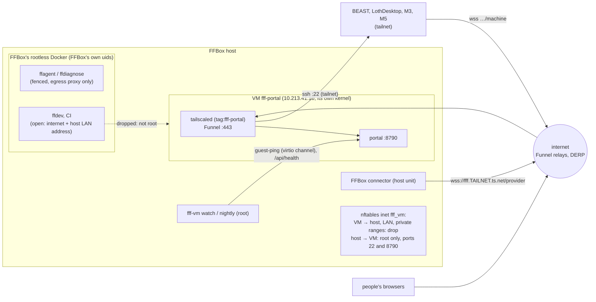

# The portal in its own VM on the FFBox host (design and install scripts)

**TL;DR:** Run the portal (orchestrators, dispatcher, ledger and `data/`, web UI, `/machine` and `/provider`, machine
control; no standing agents or workers) in a KVM/QEMU virtual machine on the FFBox host, managed by libvirt. The VM
has its own Ubuntu, its own Tailscale node with Funnel, and its own isolated virtual network: NAT out to the internet,
nothing in. An nftables table on the host keeps the VM away from the host's services, FFBox's containers and
Lothsahn's LAN. The same table keeps everything on the host except root away from the VM. FFBox and FF Factory share
the hardware and the internet line, and nothing else: no account, file, Docker, network or secret. FFBox reaches the
portal through its public Funnel URL, as it reaches BEAST today. The host watches the VM: a guest-agent ping and the
portal's health every minute, a reset after three failed checks, and a watchdog device as a second layer. Every night
it drains the portal, cold-restarts the VM for its security updates and snapshots the disk. Scripts for all of it are
in [`deploy/vm/`](../deploy/vm): for the host (run by Lothsahn as root) and for the guest. CI builds the whole thing
in a nested VM on every change to them. Sizing: 2 vCPUs, 4 GiB RAM, a 120 GiB disk, from BEAST's portal measured over
20 hours (peak 1.1 GB resident, 2.5 GB Windows private, half a core) with headroom ([Sizing](#9-sizing)); 8 GiB first,
4 GiB since Lothsahn's decision of 2026-10-06 (w537). One
limit no design on a shared host removes: root on the FFBox host can read the VM's memory and disk, including the ssh
key to Ben's machines.

Status: design and scripts, for w441 (Lothsahn: "Revise it to be a VM"). It revises w439's container design: the code
changes, the migration, the Claude account section and the decisions carry over. Nothing is deployed. The
prerequisite is w424 (BEAST's sandboxes moved under BEAST's own daemon, [beast-machine.md](beast-machine.md)) running
live, with `machines.keepAgentsOnRestart` on.

**How claims are labelled.** *(sourced: X)* means a document or a code line says so. *(measured: how)* means it was
counted or run for this design on 2026-10-05. *(guess)* means it is not verified yet, and the dry run
([7.2](#72-dry-run-in-the-vm)) or a named check settles it. Code references are to ff-factory `main` at commit
1938d50 (2026-10-05) unless they name this branch. References starting `ffbox` are to the private ffbox repo, which
was only read: this page leaves out the box's addresses, account names and audit items, as [ffbox.md](ffbox.md) does.
*CI* means the end-to-end job of [`.github/workflows/vm-scripts.yml`](../.github/workflows/vm-scripts.yml), which runs
the host and guest scripts for real on a throwaway GitHub runner ([10.3](#103-what-ci-proves)).

## What moves and what stays

| Moves into the VM | Stays where it is |
|---|---|
| `server/index.ts` and everything it runs: each person's orchestrator, the dispatcher, standing agents (`standingRoot`), the ledger, intake, the Max and FFBox pages | BEAST's daemon, sandboxes, Unity editors and workers ([beast-machine.md](beast-machine.md)) |
| `config.json` and all of `data/`: state, ledger, transcripts, attachments, orchestrator memory, push keys, tokens' hashes | LothDesktop, M3 and M5 daemons, unchanged except the portal URL they dial |
| The orchestrators' read-only clone of the game repo (`repo.basePath`) | The Dev Drive and its SYSTEM helper tasks on BEAST (their code moves into BEAST's daemon, change 4) |
| Review media (`publish_review`, `review.root`), unless [decision D9](#8-risks-and-open-decisions) says otherwise | FFBox: its config, containers, units and data are not touched |

Voice transcription on BEAST's GPU does not move: the FFBox host has no GPU *(sourced: [ffbox.md](ffbox.md), "Where")*.
See [2.6](#26-voice).

**No standing agents run in the VM** (Lothsahn, [D16](#8-risks-and-open-decisions)): only the orchestrators and the
dispatcher do, and other machines run every other agent. Today there is one standing agent, Ben's
`nightly-regression-sentry` (as the orchestrator reported it: daily at 03:00, opus, `shell_read` and `delegate`, up
to 75 minutes). It moves to a worker machine with the machine assignment described below, under a separate request
(Lothsahn). In portal-only mode the VM refuses to start a standing agent of its own (change 19; since w510 that is the only mode, and the portal runs no standing agent process anywhere). Their
definitions, schedules and history stay in `data/state.json`, which moves.

An earlier version of this page said that running a standing agent on a worker machine needed new code. That was
wrong. A standing agent can already be assigned to a machine (`update_standing_agent` with a machine,
`server/standing.ts:241-245`). The portal keeps its cron, budget and run history. That machine's daemon runs the
Claude process next to its main clone (`place()`, `server/standing.ts:817-834`; `createSession`, `:780`). The
delegation tools are answered by the portal "wherever its process runs" (`handlers()`, `server/standing.ts:929`).
It runs on the one machine it is assigned to, rather than one the placement rules pick. The move starts a fresh
conversation there and a new `NOTES.md` (`:256-260`), so the notes are copied across by hand. A cron trigger is read
in the portal's local time, so the VM's time zone (`VM_TIMEZONE`, UTC by default) moves a 03:00 schedule unless the
trigger is rewritten or the zone is set to BEAST's.

## 1. Isolation

### 1.1 What is hostile, and what the portal holds

FFBox assumes its containers are hostile *(sourced: ffbox `docs/docker-security-model.md`, "The container is assumed
hostile")*. They run on a rootless Docker daemon under an FFBox account *(sourced: [ffbox.md](ffbox.md), "Where")*.
Code can end up running in one of them through:

- `ffagent`: any player's Discord text. Fenced network: only an egress proxy with a short allowlist.
- `ffdiagnose`: a hostile crash or desync upload. Fenced.
- `ffdev`: operators' turns, which can carry a player's words from the same thread. Open network: "the whole
  internet, and this machine's own LAN address with it" *(sourced: ffbox docker-security-model, "The class that is not
  fenced", measured there on 2026-08-25)*.
- the game repo's CI runner jobs, which run whatever a branch's workflow file says.

An attacker in one of those can get to three depths:

- **E0**, still inside the container: whatever its network reaches.
- **E1**, out of the container as FFBox's rootless daemon account: a container-runtime bug or a mount mistake.
- **E2**, root on the host: a kernel bug reachable from a user namespace, or E1 plus a local privilege escalation.

What the portal holds, which is what such an attacker would want:

| Secret or power | On BEAST today | In the VM |
|---|---|---|
| The host Claude token and people's own tokens | `config.json` `claudeEnv`, `userClaudeEnv` | moved as is, `/srv/fff/config/config.json` |
| Lothsahn's subscription token (new, [D4](#8-risks-and-open-decisions)): `claude setup-token`, `sk-ant-oat01-…` | none | `/srv/fff/secrets/claude-oauth-token`, `0600` (`fffctl claude-token`) |
| GitHub credential (`gh` PR queries, the memory repo push) | BEAST's `gh` login | a new fine-grained token ([D7](#8-risks-and-open-decisions)), `fffctl gh-login` |
| The ssh key that deploys daemons to BEAST, LothDesktop, M3 and M5 | BEAST's `~/.ssh` *(sourced: [machines.md](machines.md), "Requirements")* | a new key made in the VM, `/srv/fff/home/.ssh/id_ed25519` |
| Max's Discord token | the ffdiscord config and `secrets.env` under `~/.config/ffbox` *(sourced: `server/discordConfig.ts`)* | its own copy in `/srv/fff/home/.config/ffbox` |
| VAPID push key, push subscriptions, login sessions, hashed API keys and machine tokens | `data/` | moved as is |
| Tailscale node key | BEAST's Tailscale | the VM's own `tailscaled` state |
| Transcripts (whatever agents saw), attachments (players' saves and logs), orchestrator memory | `data/` | moved as is |
| Powers: start and stop workers on every machine, push code, delete sandboxes, approve intake work, post as Max through workers | | the same |

### 1.2 The options

Lothsahn chose the VM (w441, this revision). The table keeps the comparison from w439 (the container design), with
the verdicts updated.

| Option | From an FFBox container (E0) | As FFBox's daemon account (E1) | As host root (E2) | Cost | Verdict |
|---|---|---|---|---|---|
| **1. A KVM/QEMU VM managed by libvirt** | Nothing: the VM's network admits nothing it did not start, and the host's `inet fff_vm` table drops every packet from a host process other than root's to the VM (1.4) | Nothing: the libvirt socket is root's (and group `libvirt`'s, which no FFBox account may be in), the disk is a root-owned zvol (or a qcow2 file of `libvirt-qemu`, `0600`), and QEMU runs as `libvirt-qemu` under its own AppArmor profile *(measured in CI: [10.3](#103-what-ci-proves))* | Everything: guest RAM through `/proc/<qemu pid>/mem` or `virsh dump`, the disk, and commands through the guest agent's `guest-exec`, which Ubuntu does not block *(sourced: noble's `qemu-guest-agent.service` runs `qemu-ga` with no `--block-rpcs`)* | A fixed RAM reservation, a second OS to patch (automated: unattended-upgrades plus the nightly cold restart), libvirt as root on the host | **Chosen** (Lothsahn, w441: this revision) |
| 2. Rootless Podman under a dedicated `fff` account | Nothing (no published port, its own network namespace) | Nothing (`0700` files, another uid, no daemon socket) | Everything | Podman 5, Ubuntu 24.04's AppArmor rule against unprivileged user namespaces *(sourced: containers/podman#25905)*, Quadlet units | The recommendation of w439 (the container design); the fallback if a VM's RAM cannot be spared |
| 3. Rootless Docker under `fff` | As 2 | As 2 | Everything | A second `dockerd`, two `docker` CLIs whose target depends on `DOCKER_HOST` | Fallback of the fallback |
| 4. A container on FFBox's own Docker daemon | Shares FFBox's networks unless configured otherwise | **Full control** through the daemon's socket | Everything | none | **Ruled out**: the sharing Lothsahn excluded |
| 5. gVisor, 6. Kata Containers | | | Everything | need a root runtime; Kata does not support Podman *(sourced: kata-containers `docs/Limitations.md`)* | No (w439, the container design) |

Against E2 nothing on a shared host helps, short of confidential-VM memory encryption (SEV-SNP, TDX) with
attestation, which is out of scope. So root on the FFBox host is the trust boundary: Lothsahn, and anyone with general
`sudo` there, can read everything the portal holds, as Ben can on BEAST today. FFBox's own code does not run as root.
Its updater runs as the checkout's owner, with `sudo` only for `systemctl` verbs on its own units *(sourced: ffbox
`systemd/ffbox-update.service`)*. That stays true only while no FFBox account has general `sudo`, or membership of the
`libvirt` or `disk` groups. The installer lists those groups' members and warns about any (`install.sh` step 2).

### 1.3 What runs on the host

Installed by `deploy/vm/host/install.sh` ([Installing](#10-installing)); nothing of FFBox's is touched.

- **Packages:** `qemu-system-x86`, `qemu-utils`, `libvirt-daemon-system`, `libvirt-clients`, `cloud-image-utils`,
  `nftables`, `jq`, `curl` (and `ubuntu-keyring` and `gpgv`, which Ubuntu already has). libvirtd runs as root, behind a
  root-only socket. Each VM's QEMU runs as `libvirt-qemu` with its own AppArmor profile *(measured in CI on Ubuntu
  24.04: user `libvirt-qemu`, profile `libvirt-<uuid> (enforce)`)*.
- **Host releases: Ubuntu 24.04 today, 26.04 later** (Lothsahn: the FFBox host runs 24.04 and will be upgraded). The
  scripts install the same package names on both and take no version-specific path. What differs *(measured:
  packages.ubuntu.com, 2026-10-05)*:

  | | 24.04 (noble) | 26.04 (resolute) |
  |---|---|---|
  | libvirt | 10.0.0 | 12.0.0 |
  | QEMU | 8.2.2 | 10.2.1 |
  | nftables | 1.0.9 | 1.1.6 |
  | AppArmor | 4.0.0 | 5.0.0 |

  - **libvirt's own firewall rules** use the iptables backend on both. 24.04's libvirt is older than 10.4.0, which
    added the nftables backend. Ubuntu builds 26.04's with iptables first *(sourced: libvirt NEWS 10.4.0;
    resolute's `debian/rules`, `-Dfirewall_backend_priority=iptables,nftables`)*. Either way the VM's own table is a
    separate `inet fff_vm`, which both nft versions load.
  - **The rest is the same on both:** the `default` network the package defines, the virtualization check (`vmx` or
    `svm` in `/proc/cpuinfo`, then `/dev/kvm`), and QEMU's per-VM AppArmor profile.
  - **CI runs the end-to-end test on both host releases, each booting the 26.04 guest** ([10.3](#103-what-ci-proves)),
    and prints each host's versions.
- **The VM** `fff-portal`: q35, `host-passthrough` CPU, virtio disk and network, a serial console logged to
  `/var/log/libvirt/qemu/fff-portal-serial.log`, the guest-agent channel, an `i6300esb` watchdog with `action='reset'`,
  a pvpanic device, `on_crash` restart, and autostart at boot ([2.1](#21-the-vm)).
- **The network** `fff-isolated` on bridge `virbr-fff`, 10.213.41.0/24 (host .1, VM .10). NAT mode, with no DHCP and
  no DNS. libvirt starts no dnsmasq for a network with `<dns enable='no'/>` and no `<dhcp>` *(sourced: libvirt
  `src/network/bridge_driver.c`, `networkNeedsDnsmasq`; measured in CI: no dnsmasq for it)*. The guest has a static
  address and public resolvers, so the VM needs no service on the host at all.
- **The nftables table** `inet fff_vm`, loaded by `fff-vm-firewall.service` before libvirt starts (1.4).
- **The runtime:** `/usr/local/sbin/fff-vm` and four units: `fff-vm-watch.timer` (hang detection, every minute),
  `fff-vm-nightly.timer` (12:00 UTC), `fff-vm-events.service` (watchdog, crash and stop alerts) and
  `fff-vm-firewall.service`.
- **The disk:** a zvol `<pool>/fff-vm/disk0`, not sparse, so its full size is reserved in the pool and neither side can
  fill the other's disk. Or a qcow2 file in `/var/lib/libvirt/images/fff-vm/` ([2.2](#22-the-disk-and-its-backups)).
- **libvirt's `default` network** (virbr0, 192.168.122.0/24, with a dnsmasq) that Ubuntu's package defines with
  autostart on *(measured in CI: right after the package install it was defined, autostart on)*, so it starts at the
  next boot. If this install put libvirt on the host and no domain uses it, the
  network is stopped and its autostart turned off (`DEFAULT_NET_ACTION=auto`); otherwise it is left alone, and
  `uninstall.sh` puts it back.
- **Settings and records:** `/etc/fff-vm/` (root, `0600` files: the config, the generated table, the domain XML, the
  cloud-init seed, the host root's ssh key for `fff-vm ssh`, the ntfy URL) and `/var/lib/fff-vm/manifest`, which lists
  what the install changed so `uninstall.sh` undoes exactly that.

**What it refuses rather than overrides** (exit 3, nothing changed): an nftables table `inet fff_vm` that is not its
own, an interface named `virbr-fff` that is not its network's bridge, any address or route of the host in
10.213.41.0/24, a libvirt network `fff-isolated` or a domain `fff-portal` that is not its own (each carries a
`<description>` marker), another libvirt network using that subnet, a `disk0` zvol or qcow2 file it did not make, a
zvol parent dataset holding other datasets, and libvirtd listening on TCP (16509 or 16514), which would let anything
that reaches the host try to control the VM. The install itself opens no port on the host. It warns, without refusing, about members of the `libvirt` and `disk`
groups. It also warns about a forward chain that drops by default (libvirt adds its own accept rules for the NAT).
Finally it warns when `nftables.service` would flush the whole ruleset on a reload. That would drop the VM's table
too, and `fff-vm watch` loads it again within a minute and alerts; nothing edits `/etc/nftables.conf`. FFBox's
containers come from a rootless daemon, so they add no host iptables rules to collide with *(sourced: ffbox
docker-security-model, "The host rule, and why there is none now")*.

### 1.4 Network

Six rules:

1. **Tailscale runs only inside the VM, never on the host.** FFBox keeps the box off the tailnet on purpose, because
   `ffdev` shares the host's network and a tailnet there would put BEAST and the Macs within its reach *(sourced: ffbox
   docker-security-model, "The FF Factory link")*. The VM's tailnet interface and routes live in the guest's kernel;
   the host's routing table has no tailnet route, so an `ffdev` packet to a `100.x` address follows the host's default
   route and goes nowhere. Tailscale's WireGuard traffic leaves the VM as ordinary UDP through the NAT.
2. **Nothing is forwarded into the VM.** No port forward, no bridge to the LAN. `forward` drops every packet to
   `virbr-fff` that is not a reply to something the VM started. libvirt's own NAT rules do the same; this table holds
   it even if libvirt's change. The only way in from outside is the VM's own Funnel.
3. **The VM reaches the internet and nothing else.** `forward` drops packets from the VM to the private ranges
   (10/8, 172.16/12, 192.168/16, 100.64/10, 169.254/16, loopback, multicast and the reserved blocks) and to every network
   the host is directly connected to, read from `ip route` at install. So a LAN on public addresses is still
   Lothsahn's LAN, and `NET_EXTRA_BLOCK` adds more. It also drops packets with any source address but the VM's own,
   and all IPv6. `input` drops every packet from the VM to the host itself (its sshd, FFBox's web page, intake, model
   proxy, connector), on any of the host's addresses, except replies to root's own checks. Tailnet traffic to the
   machines is WireGuard to their public addresses or DERP, so it passes. A direct path to LothDesktop over Loth's LAN
   is dropped and falls back to NAT traversal or DERP *(guess: fine for a control link)*.
4. **Nothing on the host but root reaches the VM.** `output` accepts packets to the VM only from sockets of uid 0, and
   only to its ssh (22) and the portal (8790): the health check and `fff-vm ssh`. FFBox's containers run on a rootless
   daemon, so their traffic leaves through sockets of FFBox's own uids in the host's namespace (`ffdev`'s "host LAN"
   path included) and is dropped. A container on a bridge is forwarded, and `forward` drops it. *(measured in CI, in
   both disk modes: a non-root account on the host, a non-root container on the host's network, and a bridged
   container all fail to connect to the VM's ssh. From inside the VM, the host's bridge address, its LAN address and
   its LAN gateway fail too, while the internet works. All four drop rules counted packets: 10 from the VM to the
   host, 11 forwarded toward the VM, 10 from the VM to private addresses, 18 from host processes other than root's.)*
   A rootful container would run as root and pass. FFBox has none, and adding one would
   break its own security model *(sourced: ffbox docker-security-model)*.
5. **The guest has its own firewall** (`inet fff_guest`, `deploy/vm/guest`), which drops by default. It accepts the
   host's address on 22 and 8790, `tailscale0` on 443 (Funnel and tailnet HTTPS) and 22 (ssh from the tailnet, for
   whoever the tailnet policy lets reach `tag:fff-portal` on 22; not from the LAN, and never through Funnel), and
   Tailscale's UDP port.
6. **Tailnet policy** (Ben's tailnet admin, [D3](#8-risks-and-open-decisions)). The VM's node joins with a tag,
   `tag:fff-portal`, from a pre-approved, non-ephemeral auth key made for that tag. Tagged nodes' keys do not expire
   *(sourced: Tailscale KB 1085, "Key expiry for tagged devices is disabled by default")*. An OAuth client secret would
   make the node ephemeral unless `?ephemeral=false` is added *(sourced: Tailscale KB 1215)*. Grants: people's devices
   and the four machines may reach `tag:fff-portal` on 443 (and Lothsahn's devices on 22, for ssh into the VM; Ben adds
   it), and `tag:fff-portal` may reach the four machines on port
   22, plus BEAST for backups; nothing else. **In place** since 2026-10-05: Ben replaced the default allow-all with
   these rules and checked them; the old policy is `deploy/vm/tailnet-policy-before-2026-10-05.hujson`. `nodeAttrs` gives `funnel` to `tag:fff-portal` only. Funnel needs MagicDNS,
   HTTPS certificates and that attribute, and listens only on 443, 8443 or 10000 *(sourced: Tailscale KB 1223)*.

### 1.5 Secrets

- **One place each, in the VM.** Every secret is a file under `/srv/fff`, `0600` in `0700` folders owned by `fff`, on
  the VM's own disk. None is in the cloud-init seed (it holds only public keys), a unit file, an environment variable a
  unit sets, a command line or a log. `fffctl tailscale-join` reads the auth key with `--auth-key=file:`, and
  `fffctl gh-login` reads the token from a file, so neither shows in a process list.
- **New where possible:** a new ssh key made in the VM, a new GitHub token, a new Tailscale node, a new backup key,
  and Lothsahn's subscription token (`fffctl claude-token`, [5.2](#52-putting-the-orchestrators-and-the-dispatcher-on-lothsahns-account-his-subscription-token)).
  **Moved as they are:** `config.json` (Claude tokens; FFBox's connector token is kept only as its SHA-256 *(sourced:
  [connector contract](ffbox-connector-contract.md), "Auth")*) and `data/`. **Copied:** Max's Discord token, from
  BEAST's ffdiscord config into `/srv/fff/home/.config/ffbox`, which `server/discordConfig.ts` reads as
  `~/.config/ffbox` of the VM's `fff`. FFBox's own `~/.config/ffbox` is on another kernel's disk; the portal cannot
  reach it.
- **Backups**: two layers ([2.2](#22-the-disk-and-its-backups)). Every night the host snapshots the disk while the VM is
  off, keeping the last 7, for fast whole-machine rollback; those stay on the host, unencrypted, readable by root as
  the live disk is. Every day the guest archives `config`, `data`, `agents` and `home`, encrypts it with `age` to public
  keys whose private keys are kept off the FFBox host (by Ben and Lothsahn), and sends it with sftp to an account on
  BEAST over the tailnet, keeping the last 14. Neither the host nor the VM can open an older backup. Nothing here
  costs money.
- **A copy on the host (w498):** the installer keeps the answers it asked for in `/etc/fff-vm/secrets`
  (`claude-token`, `gh-token`, and the Tailscale auth key until it has been used: 0600 files in a 0700 folder,
  root's), so a rebuilt VM needs no one to find them again. Root on the FFBox host can already read the VM's memory and
  disk ([D2](#8-risks-and-open-decisions)), so this copy moves no trust boundary; it is one more place root reads them.
- **At rest:** LUKS in the guest or ZFS encryption of the zvol is optional. It protects pulled disks, not a running
  host: the key has to be on the host to boot unattended.

### 1.6 Keeping FFBox's operators and code out

- **FFBox's code** runs as FFBox's own accounts. It cannot reach the VM over the network (1.4, rule 4). It cannot
  reach libvirt's socket, which is root's and group `libvirt`'s. It cannot read the disk: a zvol device node is
  `root:disk 0660`, and a qcow2 file is `libvirt-qemu`'s, `0600`. It cannot ptrace QEMU, which runs under another uid.
- **The guest has no FFBox account** and nothing of FFBox's is mounted in it: no shared folder, no virtiofs, no 9p.
- **Operators.** Root reads everything: Lothsahn, and anyone given general `sudo` on that host. Ben puts his machines'
  ssh access and his tokens under that trust ([D2](#8-risks-and-open-decisions)). Root's ways in are the guest agent
  (`guest-exec`, which the nightly drain uses), `fff-vm ssh`, `virsh console` and the disk. The first two are logged in
  the host's journal and the guest's.
- **FF Factory's own agents.** Nothing stops an orchestrator or a standing agent from reading `config.json`, `~/.ssh`
  or the Claude credentials. The only path rule is for orchestrators' memory writes *(measured: searched
  `server/guard.ts`, `server/standingGuard.ts` and `server/orchestratorMemory.ts` for `credentials.json`, `.ssh` and
  `config.json`; the one hit is the write rule at `orchestratorMemory.ts:89`)*. The gap exists on BEAST today; moving
  the secrets is the moment to close it (change 7).

### 1.7 What the VM adds over the container design, and what it does not

**Adds:**

- **A second boundary in the other direction.** A compromised portal (a prompt-injected standing agent that got a
  shell) has to escape KVM and an AppArmor-confined QEMU to reach the host and FFBox. In the container it stood on
  the host's kernel behind a Unix account. That is the gain w439 (the container design) listed as "revisit if the portal ever runs untrusted
  code"; standing agents read Discord text today.
- **No user namespaces on the host for the portal.** Rootless Podman needed a way around Ubuntu 24.04's AppArmor rule
  against unprivileged user namespaces and a TUN device in a rootless pod, both guesses in w439 (the container design). The VM needs neither:
  Tailscale runs in kernel mode in the guest, and the guest is an ordinary Ubuntu machine.
- **Isolation enforced per machine, at the bridge.** The host's table filters one interface. The container design
  filtered by the uid of pasta's sockets (`meta skuid`), which was a guess.
- **Hard limits.** Fixed vCPUs, RAM and disk size, instead of cgroup quotas on a user slice. The disk is its own block
  device, so FFBox cannot fill it and it cannot fill FFBox's.
- **Its own lifecycle.** The portal's OS updates and reboots without touching the FFBox host. A consistent snapshot of
  the whole machine is taken every night while it is off. Machine-level hang detection and a hardware-style watchdog
  are added.

**Does not:**

- **Protect against host root (E2).** Root reads guest RAM and disk and can run commands in the guest through its
  agent. Same as the container, and as Ben on BEAST today.
- **Protect against FF Factory's own agents** reading the portal's secrets inside the guest (change 7).
- **Separate failure domains.** An FFBox host outage still takes the portal down with it.
- **Come free.** It reserves about 8.3 GiB of the host's RAM ([9](#9-sizing)) and adds a second OS. It also adds
  libvirtd, more root code on the box. Its QEMU runs unprivileged and confined, and its socket is root-only.

## 2. The VM and the guest

### 2.1 The VM

`deploy/vm/host/install.sh` makes it from Ubuntu's cloud image. The image is checked against `SHA256SUMS`, whose
signature is checked with `/usr/share/keyrings/ubuntu-cloudimage-keyring.gpg`. On noble that keyring comes from
`ubuntu-keyring`; the `ubuntu-cloudimage-keyring` package is a dummy *(sourced: packages.ubuntu.com file lists)*. The
guest is **Ubuntu 26.04 LTS** (Lothsahn, [D14](#8-risks-and-open-decisions); supported to 2031):
`ubuntu-26.04-server-cloudimg-amd64.img` from `releases/resolute/release`, published since 2026-04-21 *(measured: the
cloud-images.ubuntu.com listing)*. Every package the scripts install exists for resolute *(measured: packages.ubuntu.com,
2026-10-05: qemu-guest-agent 10.2.1, linux-image-extra-virtual 7.0.0, cloud-init 26.1, nftables 1.1.6, unattended-upgrades
2.12, git-lfs, age, jq, curl, openssh-server, util-linux; and for a 26.04 host libvirt 12.0, QEMU 10.2, zfsutils 2.4,
cloud-image-utils)*. NodeSource's `nodistro`, GitHub CLI's `stable` and Tailscale's `resolute` repositories serve it
*(measured: their Release files)*. CI boots this guest on every change ([10.3](#103-what-ci-proves)). 24.04 stays a
setting away (`VM_OS_RELEASE=noble`, `VM_OS_VERSION=24.04`).

cloud-init (a NoCloud seed ISO from `cloud-localds`, read at the first boot only) sets up:

- the admin account `fffadmin`: sudo, key-only ssh, no password. Its keys are the host root's own key (for
  `fff-vm ssh`) and Lothsahn's keys from `/etc/fff-vm/admin_authorized_keys`.
- a static address, a default route through the host's bridge address, and public resolvers.
- `qemu-guest-agent`, `unattended-upgrades` and `nftables`, plus `linux-image-extra-virtual`. The cloud image's kernel
  has no `i6300esb` module: it ships in `linux-modules-extra`, which the cloud image does not install *(sourced:
  packages.ubuntu.com file lists for noble's linux-modules-6.8.0-101-generic and linux-modules-extra-6.8.0-101-generic,
  and its cloud image manifest; resolute splits its kernel the same way, and CI checks the device is armed)*. `package_reboot_if_required` boots once into an upgraded kernel, so the module matches it.
- the watchdog: `RuntimeWatchdogSec=30s` makes PID 1 pet `/dev/watchdog0` *(sourced: systemd-system.conf(5))*.
  `RebootWatchdogSec=10min` covers a hung shutdown. `fff-watchdog-arm.service` loads `i6300esb` with an explicit
  `modprobe` on every boot and re-executes PID 1 if the device appeared after it started. With `modules-load.d` alone
  the module stayed unloaded on every boot after the first *(measured in CI; the cause, Ubuntu's blacklist of watchdog
  drivers, which `systemd-modules-load` honours and an explicit `modprobe` does not, is a guess)* *(measured in CI: `/sys/class/watchdog/watchdog0/state` is `active`)*.
- security updates every day. `Automatic-Reboot "false"`, because the host's nightly cycle restarts the VM. The guest's
  apt timers move to just before it: lists at 10:30 and upgrades at 11:00 UTC, each with up to 10 minutes of random
  delay. Ubuntu's default upgrade timer is 06:00 plus up to 60 minutes *(sourced: noble's apt-daily-upgrade.timer)*.

### 2.2 The disk and its backups

| | zvol (recommended, [D13](#8-risks-and-open-decisions)) | qcow2 |
|---|---|---|
| Where | `<VM_ZVOL_PARENT>/disk0`, raw, `volblocksize=16K`, lz4 | `/var/lib/libvirt/images/fff-vm/disk0.qcow2` |
| Space | Reserved in full in the pool (not sparse): neither side fills the other | Grows as written; a quota needs a dataset of its own |
| Nightly snapshot (VM off) | `zfs snapshot …@fff-nightly-<time>`, the last 7 kept | `qemu-img snapshot -c`, internal, the last 7 kept |
| Rollback | `vm-rollback.sh`: clone, rename, promote; the state before is kept as `disk0-before-rollback-<time>` | `qemu-img snapshot -a`; the state before is kept as a snapshot |
| Off the host | the guest's encrypted backup (below); a `zfs send` of a snapshot is possible but unencrypted unless piped through `age` | the same |

The host has ZFS *(sourced: [ffbox.md](ffbox.md), "Where")*. So the zvol is the recommendation: a fixed reservation,
cheap snapshots, and no double copy-on-write of qcow2 on ZFS. CI tests both modes.

**The guest's backup** (`fff-backup`, daily at 11:15 UTC, before the nightly restart) archives `config`, `data`,
`agents` and `home`, leaving out caches and the Claude CLI's own versions. Review media is included only if
`BACKUP_INCLUDE_REVIEW=yes`. The archive is encrypted with `age -R` to the public keys in
`/etc/fff/backup-recipients.txt` and sent with sftp, as `<name>.part` then renamed, to `BACKUP_SSH_TARGET` with the
VM's own backup key; the newest 14 are kept there. Recommended target: a Windows account on BEAST used for nothing
else, reached over the tailnet ([D17](#8-risks-and-open-decisions)). A failure messages the dispatcher. Restore, with
the portal stopped: `age -d -i key.txt <file> | tar -xz -C /srv/fff`. The dry run restores one ([7.2](#72-dry-run-in-the-vm), check 12).

### 2.3 Inside the guest

`deploy/vm/guest/install.sh` sets it up, run as root in the VM. All of it is under `/srv/fff`, owned by the system
account `fff` (locked password, no sudo), `0700`:

| Folder | Holds | Size | Backed up |
|---|---|---|---|
| `config/` | `config.json` (from [`config.vm.example.json`](../deploy/vm/guest/config.vm.example.json), never overwritten) and `.prev` | under 1 MB | yes |
| `data/` | everything of today's `data/`, plus the updater's hand-off files (3) | data on BEAST not measured yet ([9](#9-sizing)); 479 transcripts *(measured by w439, the container design, 2026-10-05)* | yes |
| `home/` | `HOME` of `fff`: `.claude` (session histories, plugins; a `/login` only if D6's fallback is used), `.ssh`, `.config/gh`, `.config/ffbox`, `.local/bin/claude` | session histories: 0.82 GB for LothDesktop's own user *(measured: `~/.claude/projects`, 2026-10-05)*; guess 1-5 GB for the portal | yes, without caches |
| `app/` | `repo.git` (a bare clone of ff-factory), `releases/<sha12>/` (a worktree each, with its own `node_modules` and web build), `current` and `previous` (symlinks) | per release: measured in CI ([9](#9-sizing)) | no, rebuilt from git |
| `base/` | the game repo, cloned without LFS files, for orchestrators' reads (`fffctl base-clone`) | git objects 1.27 GiB *(measured by w439, the container design: `git count-objects -vH` in BEAST's base clone)*; working tree without LFS files: guess 3-5 GB | no, re-cloned |
| `agents/` | `standingRoot`: empty, since no standing agent runs in the VM (D16) | 0 | yes |
| `review/` | `publish_review` media (`review.root`) | grows with clips | [D9](#8-risks-and-open-decisions) |
| `sandboxes/` | empty: `sandboxRoot` is still required by the config (change 1) | 0 | no |
| `secrets/` | Lothsahn's subscription token (`claude-oauth-token`, `0600`), and nothing in config.json or a unit | tiny | yes |
| `backup/` | root's staging for the encrypted archive, emptied after each upload | | |

The guest's settings (repository, branch, backup target, thresholds) are in `/etc/fff/fff.conf`, whose defaults are
in [`fff.conf.example`](../deploy/vm/guest/fff.conf.example).

`/tmp` is on the root disk (w537). Ubuntu 26.04 mounts it as a tmpfs by default *(sourced: its release notes)*, half
the RAM in systemd's `tmp.mount` (`size=50%`): 1.9 GiB in the 4 GiB VM, which has no swap. The agents' temp folders
(`TMPDIR=/tmp/ffa-<session>`) would take the portal's memory there, and the portal's clean-up, which counts the smaller
of the home folder's and the temp folder's free space (`server/cleanup.ts`), reported 1.9 GB free on the first day.
The guest install masks `tmp.mount`, systemd's documented way back to the disk; it applies from the next boot.

### 2.4 Units in the guest

| Unit | Does | Replaces on BEAST |
|---|---|---|
| `fff-portal.service` | `node server/index.ts` in `app/current` as `fff`, with `FFSB_SUPERVISOR=systemd` and `FFSB_CONFIG`. `Restart=always` every 3 s, `StartLimitIntervalSec=0`. `KillMode=mixed`: SIGTERM to the server only, which records what to resume and stops its agents itself; whatever is left after 75 s is killed. `ExecStartPre=+fff-update activate` switches to a prepared release. `ExecCondition` keeps it stopped while `/run/fff/portal.hold` exists. Hardened: `NoNewPrivileges`, `ProtectSystem=full` | the `ffsb-server` task and `supervise.ps1` |
| `fff-health.timer` (30 s) | `/api/health` from inside; 4 failures in a row after a 2-minute start grace restart the portal; verifies a fresh update (3) | the restart half of `supervise.ps1`, plus a hung-server check BEAST does not have |
| `fff-update.path` → `.service` | starts the updater when `data/update.wanted` appears | `supervise.ps1`'s update step |
| `fff-backup.timer` (11:15 UTC) | the encrypted backup (2.2) | none (new) |
| `fff-base-refresh.timer` (15 min) | fetches the base clone and moves its detached HEAD to `origin/develop` when nothing there is modified | change 11, on the VM's side |
| `fff-guest-firewall.service` | the `inet fff_guest` table (1.4, rule 5) | |

### 2.5 Health, restart and logs

- **Health.** `GET /api/health` answers `{ ok, version, sha, web }` without a login (`server/index.ts:1231`,
  `server/version.ts`). Three layers check it. The guest checks it every 30 s and restarts a server that runs but does
  not answer. systemd restarts a server that exited. The host checks the VM every minute (3).
- **A stop is a clean stop.** On SIGTERM the server writes `data/resume.json`, stops its agent processes, flushes state
  and exits 0 (`server/index.ts:1579-1580`, `stopServer`). With `machines.keepAgentsOnRestart` the daemons' agents carry
  on. `Restart=always` brings the server back after its own exit 0 at the end of a drain.
- **Crash loops.** systemd restarts it every 3 s; the server's own guard (a second unclean stop within 30 minutes only
  reports, [restart.md](restart.md)) still applies. `index.ts` dates the boot from `os.uptime()`, which in a VM is the
  guest's: a VM reset reads as "went down", a server crash as "only the server stopped".
- **Logs** go to the guest's journal (`fffctl logs`; `journalctl -u fff-portal`). The VM has no other user to keep
  out, so the log file of w439 (the container design) is not needed. The text naming `data/supervisor.log` changes with change 13.

### 2.6 Voice

Off at cut-over (`voice.enabled: false`). The host has no GPU, and with voice on the server installs uv, Python and
CUDA wheels at startup (`server/config.ts:390-396`, `server/voice.ts:67-71`). The browser's own speech engines take
over, as they already do when the local engine is missing *(sourced: [voice.md](voice.md), "fallbacks")*. Whisper on
the CPU (`voice.device: "cpu"`, `voice.cpuThreads`) can be tried later within the VM's vCPUs, once someone measures its
latency there.

## 3. Supervision, updates, hang detection and the nightly restart

| On BEAST today | In the VM |
|---|---|
| The `ffsb-server` task at logon, Limited (`scripts/install-autostart.ps1`) | `fff-portal.service`, enabled: up at boot with nobody signed in |
| `scripts/supervise.ps1`: restarts node, backs off up to a minute | `Restart=always`, plus `fff-health` for a server that hangs |
| `scripts/restart.ps1` (drain, stop, start through the task) | `fffctl restart [--no-drain] [--drain-minutes N]`: writes the same JSON to `data/restart.request`, which the server reads every second (`server/index.ts:1583-1598`); it drains, stops and exits 0, and systemd starts it again |
| `restart.ps1 -Update`, `update.ps1`, `update-steps.ps1` | `fffctl update`, or `request_app_update`: the updater builds beside the running server, then asks for the drain (below) |
| `request_app_update` (`server/agents.ts`; refuses without a `supervise.ps1` process) | under systemd it writes `data/update.wanted` (this branch: `systemdSupervised` and `writeUpdateWanted` in `server/restart.ts`, unit tests in `server/restart.test.ts`; Windows unchanged) |
| The elevation checks (`server/elevation.ts`) | Not applicable: off Windows only uid 0 counts as elevated (`server/elevation.ts:69-70`), and `fff` is not root |
| `ffsb-helper-*` SYSTEM tasks ([self-recovery.md](self-recovery.md)) | Not in the VM. BEAST keeps the tasks; its daemon starts them (change 4) |
| The headless-browser reaper (`server/reaper.ts`) | Not needed: no browsers. Off Windows it finds nothing (`server/reaper.ts:93-109`) |
| Disk levels and clean-up (`server/hostHealth.ts`, `server/cleanup.ts`) | Kept, with thresholds for the VM's disk in the template (20 and 10 GB) |
| The outside watchdog on the M5 | Unchanged mechanism, new URL ([4.2](#42-who-changes-what-at-the-cut-over)) |

### The update flow

1. **Request.** `request_app_update`, or `fffctl update`, writes `data/update.wanted` (`{ drainMinutes, reason, at }`).
   `fff-update.path` starts `fff-update request` as root; git and npm run as `fff`.
2. **Build while the old portal runs.** It fetches `origin/main` into `app/repo.git` and adds a worktree
   `app/releases/<sha12>` at that commit. There it runs `npm ci` and `npm --prefix web ci`, then the web build. Nobody
   edits these worktrees, so `update-steps.ps1`'s fast-forward, republish and rewrite checks reduce to "a fresh worktree
   at origin's commit". The unit tests for that commit already ran in CI. If the build fails, the dispatcher gets a
   message saying why and nothing restarts. If origin is at the running commit, it says "already up to date" and
   nothing restarts.
3. **Hand-off.** It writes `data/update.prepared.json`, then `data/restart.request` with
   `{ drain: "auto", drainMinutes, update: true, reason: "update to <sha> (…)" }`. The server drains as it does today,
   writes `data/update.request` and `resume.json`, and exits 0.
4. **Switch.** systemd starts it again. `ExecStartPre=+fff-update activate` sees `update.request`, swaps the `current`
   and `previous` symlinks, writes `update.result.json` (`ok`, `headBefore`, `headAfter`) for the server's
   `[app restarted]` summary, and starts verifying. So the portal is down for the drain's stop and a normal start,
   not for the build *(measured in CI: [9](#9-sizing))*.
5. **Verify.** `fff-health` sees `/api/health` answer with the new SHA within `UPDATE_VERIFY_MIN` (5) minutes: done.
6. **Roll back by itself** when it does not. `current` goes back to the previous release, `update.result.json` says
   `ok: false, "rolled back: …"`, the dispatcher is told, and the portal restarts *(measured in CI: a commit that throws
   at start rolls back by itself)*.

- **An update cut off by a crash** (`server/index.ts:1690-1695`): after an unclean stop with an update pending, the
  server writes `update.request` and exits 0. With no prepared release, `activate` builds one then, while the portal
  is down, and switches. No code change needed.
- **Manual rollback**: `fffctl rollback`. Data goes back only with the host's disk snapshots (`vm-rollback.sh`),
  because data formats move forward: `durable.ts`'s versions cover crashes, not downgrades.
- **Node, gh and Tailscale** update through unattended-upgrades (their repositories are added to its origins with
  `site=` patterns *(sourced: unattended-upgrades README)*), Node within its major version (`node_24.x`). Tailscale
  also has `tailscale set --auto-update` on. The Claude Code CLI updates itself *(sourced: Claude Code setup docs:
  "Native installations automatically update in the background")*. The Agent SDK's own binary moves with ff-factory's
  `package-lock.json`.

### Hang detection (host)

`fff-vm watch` runs every minute (`fff-vm-watch.timer`), as root:

1. The firewall table must be loaded; if it is missing, it is loaded again and an alert sent. If that fails, the VM is
   shut down rather than left unfiltered.
2. A VM that is shut off outside the nightly window is started. A paused VM (an I/O error: the host's disk) is reported,
   not reset.
3. Then two checks: a `guest-ping` through the guest agent's virtio channel, which needs no network, and the portal's
   `/api/health` over the private network.
   - **Either answers:** the guest is alive. If only the portal is down, the guest's own systemd is restarting it, so
     the host only alerts after 20 minutes. After 60 minutes it resets the VM as a last resort
     (`PORTAL_DOWN_RESET_MIN`).
   - **Neither answers 3 times in a row:** `virsh reset`, logged and alerted.
   - **Never during the first boot**, before the agent has answered once (cloud-init installs it, then upgrades and may
     reboot): an alert after 30 minutes, never a reset.
   - **Never within 5 minutes of QEMU's start, nor during the nightly cycle.**
   - **At most 3 resets in 6 hours;** after that only alerts, since a VM that keeps dying needs a person.
4. **The watchdog is the second layer.** If the guest's kernel or PID 1 hangs, nobody pets `i6300esb` and QEMU resets
   the VM *(measured in CI: a guest that stops petting it is reset; `fff-vm-events` reports the watchdog event)*. A
   kernel panic goes to `pvpanic`, then `on_crash` restarts it.

Alerts go to ntfy, to the topic FF Factory's outside watch already uses (`data/outside-watch.json`; `system_status`
names it). The host reads the whole URL from `/etc/fff-vm/ntfy-url` (root, `0600`) and never prints it. Alerts cover
each reset, a watchdog event, a crash, an unexpected stop, an I/O error, a missing firewall table, a long portal
outage, a first boot that does not finish, and a nightly restart that does not come back.

### The nightly restart (host)

`fff-vm nightly`, from `fff-vm-nightly.timer` at **12:00 UTC**:

1. Marks maintenance, so the watch does not count the downtime.
2. **Drains through FF Factory's own drain.** Through the guest agent it runs `fffctl prepare-shutdown --drain-minutes
   10`. That sets `/run/fff/portal.hold`, then writes `restart.request` `{ drain: "auto", drainMinutes: 10 }`. The server
   asks busy agents to commit, push and end their turn, records what to resume, stops its agents and exits 0. Because
   of `ExecCondition`, systemd then leaves it stopped: a condition that fails with 1-254 skips the unit without marking
   it failed, and `Restart=always` does not fire on a skip *(sourced: systemd.service(5); systemd v255
   `src/core/service.c`, `SERVICE_RESTART_ALWAYS: return s->result != SERVICE_SKIP_CONDITION`; measured in CI)*. With
   `keepAgentsOnRestart`, the daemons' workers are not touched.
3. **A cold restart.** `virsh shutdown` (agent, then ACPI), forced off after 5 minutes, then `virsh start`. A cold
   start, not a guest reboot, so a QEMU the host updated is picked up too. While the VM is off it applies a size
   changed in `fff-vm.conf` (w537): `virsh define` of the domain made from the settings, libvirt's previous definition
   kept, and that one defined again (with an alert) if libvirt refuses the new one, the VM does not start with it, or
   the portal does not answer within 15 minutes. A change of disk, seed, network or MAC address is `install.sh`'s.
4. **Snapshots the disk** in between, while nothing writes, and prunes to the last 7.
5. **Waits for the portal.** The hold file was in `/run`, so the portal starts at boot and resumes the interrupted
   sessions (`resume.json`). If it is not back within 10 minutes, an alert.

**Why 12:00 UTC** *(measured: commit times over the last 30 days, all branches)*. Commits to the game repo by UTC hour
bottom out at 21 at 12:00 and 30 at 13:00, against 259 at 21:00 (3,238 in all). ff-factory had no commits from 10:00
to 12:59 (374 in all). The committers' clocks are at -06:00 and -04:00, so 12:00 UTC is 06:00 and 08:00 for them.
The guest's upgrades run at 11:00 and the backup at 11:15, so each night's reboot carries that morning's fixes.
`NIGHTLY_MODE=if-required` restarts only when the guest has `/run/reboot-required` or the host's QEMU binary was
replaced under the running VM. `off` turns it off ([D15](#8-risks-and-open-decisions)).

## 4. Networking and reachability

### 4.1 The address

One new name that stays: `https://fff.<tailnet>.ts.net` (the name is [D3](#8-risks-and-open-decisions)), served by the
VM's Funnel (`fffctl tailscale-join`, which runs `tailscale funnel --bg http://127.0.0.1:8790` *(sourced: Tailscale
KB 1311)*). It belongs to the node's name, not to a computer: a node made elsewhere with the same hostname gets the same
name once the old node is removed, so a later move keeps the URL. Keeping BEAST's current URL would need the VM to take
BEAST's node name while BEAST still uses it (ssh aliases, and the game repo's nightly scripts reach BEAST by name
*(sourced: [beast-machine.md](beast-machine.md), "BEAST-specific things left in place")*).

### 4.2 Who changes what at the cut-over

| Who | Today | After | Who acts |
|---|---|---|---|
| People's browsers | BEAST's Funnel URL | the new URL. Sign in again: cookies belong to the old host name, while the accounts and passwords move with `data/`. On a phone, add the Home Screen app again and turn notifications back on, since a push subscription belongs to the old origin's service worker ([README](../README.md), "Notifications and the phone") | each person |
| `/mcp` clients (`claude mcp add … /mcp`) | the old URL | `claude mcp add` again with the new URL; the API keys stay valid (`data/api-keys.json` moves) | each person |
| Daemons on LothDesktop, M3, M5 | dial the portal's public URL *(sourced: [machines.md](machines.md): "The Macs reach it through its public URL, not a tailnet IP")*, stored per machine (`state.json` `machines[].portalUrl`, read first at `server/machines.ts:630`) and in the daemon's config (`server/machineDeploy.ts:414-417`) | the new URL, by a `relocate` message the old portal sends each connected daemon just before it stops (change 9): the daemon rewrites its config and reconnects, keeps its agents running and replays its queued events (up to 20,000 *(sourced: [beast-machine.md](beast-machine.md))*). Without change 9: rewrite `portalUrl` in the copied state, and the new portal redeploys over ssh each daemon that has not connected after 2 minutes *(sourced: [machines.md](machines.md))* | the migration script |
| BEAST's daemon | the portal's own host: `local: true`, portal URL `http://127.0.0.1:<port>`, deployed without ssh (`server/machines.ts:98`) | an ordinary Windows machine deployed over ssh, at the new URL (change 3) | the migration script |
| FFBox's connector | `fff.url` = BEAST's Funnel URL | the new URL. It is rendered into the connector's unit at install and needs root to change *(sourced: ffbox docker-security-model, "Where the token goes takes root to change")*. The token stays: FF Factory keeps its SHA-256 in `config.json`, which moves. FFBox's HTTP posts to `POST /api/intake/ffbox` (Max's escalations and intake diagnoses, [contract](ffbox-connector-contract.md)) go to the same portal: wherever FFBox's config names that base URL changes too, and the scoped API key stays valid | Lothsahn |
| The outside watchdog on the M5 | `GET <BEAST URL>/api/health` and a ping of BEAST | `outsideWatch.healthUrl` follows `publicUrl`; the M5's daemon gets the new config when it connects ([self-recovery.md](self-recovery.md), section 4). The ping reaches the VM's node, so "up, portal down" still means the VM is up and the portal is not. Lothsahn subscribes to the same ntfy topic, which the host's alerts also use | the migration script, Lothsahn |
| Wake-on-LAN | the M5 wakes BEAST when BEAST and the portal are down | Not for the portal: its host is a server, and the VM autostarts with it. Clear `mac`, `ip` and `broadcast` in `outside-watch.json`: they are BEAST's (read through PowerShell, Windows only, `server/outsideWatch.ts:61-62`), and waking BEAST is the wrong answer to a dead portal. Waking BEAST as a worker machine needs the watch to take a second target with a fixed MAC (change 12, optional) | the migration script |

FFBox reaches the VM the way it reaches BEAST today: out to the Funnel URL over the internet, TLS verified *(sourced:
[contract](ffbox-connector-contract.md), "Security checklist for the connector")*. It never uses localhost, the LAN,
the VM's private address or the tailnet, and it is not on the tailnet. That traffic leaves the host and comes back
through Tailscale's Funnel relays *(guess: works like any other client; the dry run's check 4 tests it from the FFBox
host)*.

### 4.3 SSH and keys

- The guest install makes the portal's ed25519 key (`/srv/fff/home/.ssh/id_ed25519`, `0600`). It never leaves the VM,
  except inside the encrypted backups.
- Its public key goes onto each machine with a source restriction:
  `from="<the VM's tailnet IP>",no-agent-forwarding,no-port-forwarding,no-X11-forwarding ssh-ed25519 …`, in
  `~/.ssh/authorized_keys` on the Macs and, for a Windows account in Administrators,
  `C:\ProgramData\ssh\administrators_authorized_keys` *(sourced: [machines.md](machines.md), "Setting up a Windows PC",
  step 3)*. *(Guess: deploys work with those options; the dry run's check 5 tests one.)*
- `~/.ssh/config` names the machines by the aliases the portal deploys to (`m3`, `m5`, `Loth2800`, and `beast` for
  `rydin@beast`), each with its MagicDNS name and ssh user, under `StrictHostKeyChecking yes`; `known_hosts` holds each
  one's ed25519 host key, pinned, never accepted on first use. Both come from
  [`deploy/vm/guest/machines.ssh`](../deploy/vm/guest/machines.ssh), whose keys were checked on two paths (w537:
  BEAST's long-trusted entries, and BEAST's own sshd over loopback, each equal to a fresh `ssh-keyscan` over the
  tailnet). `fff-machine-ssh --fix` writes them as the portal's account: the guest install runs it, `fffctl update`
  runs it when `machines.ssh` changes, and the host's `deploy/vm/host/machine-ssh.sh --fix` streams it into a VM whose
  copy is older. A machine whose key over the tailnet differs from the pinned one is refused. The cut-over had left
  none of this in the VM, and the first daemon redeploy failed on "Host key verification failed" (2026-10-06).
- The tailnet policy allows the tag only port 22 on those four (1.4, rule 6).
- A separate backup key (`/etc/fff/backup_ed25519`, root's in the guest) goes only to the backup account
  ([D17](#8-risks-and-open-decisions)), so the portal's agents never hold it.
- After the move, remove the portal's BEAST key from the other machines' `authorized_keys`, unless something else uses
  it; check first.
- The host's own key for `fff-vm ssh` (`/etc/fff-vm/ssh/id_ed25519`) reaches only the VM's admin account, only from
  root, only over the private bridge.

## 5. Claude account

### 5.1 Who runs on which account

What the code does today:

- A person's own orchestrator runs on their entry in `userClaudeEnv` when they have one, otherwise on the account
  `claudeAccounts.orchestrator` picks *(sourced: [orchestrators.md](orchestrators.md), "The two kinds")*.
- The dispatcher gets `claudeEnvFor(cfg, owner ?? systemPayer, hostProcessEnv(cfg, 'orchestrator'))`
  (`server/agents.ts:3159`): the system payer's own token if `userClaudeEnv` has one for them (the system payer is Ben,
  `server/identity.ts:55-59`), otherwise the orchestrator role's account.
- Standing agents: `claudeAccounts.standing`, with the requester's own token on top; scheduled runs count as the
  system payer's.
- Workers: their machine's setting, unchanged by this move.

### 5.2 Putting the orchestrators and the dispatcher on Lothsahn's account: his subscription token

**Decided** (Lothsahn, [D4](#8-risks-and-open-decisions)): every orchestrator and the dispatcher run on Lothsahn's
account, with his subscription's long-lived token: the `sk-ant-oat01-…` that `claude setup-token` prints, which
"authenticates with your Claude subscription" *(sourced: Claude Code authentication docs, "Generate a long-lived
token")*. In Lothsahn's words: "I have a sk-ant- token for my subscription and it doesn't do API billing." So it
draws on his Max plan's 5-hour and weekly limits, with no per-token bill. Standing agents stay as they are
([D5](#8-risks-and-open-decisions)), and workers never get the token.

- **Where it is stored.** `/srv/fff/secrets/claude-oauth-token`, `0600`, owned by `fff`, in a `0700` folder, put there
  by `sudo fffctl claude-token --file F`. That reads the token from a file, so it never appears on a command line,
  checks its `sk-ant-oat01-` shape, and only ever prints its last four characters. It is never in `config.json`, a
  unit's `Environment=`, the cloud-init seed or a log. It is in the encrypted daily backup (2.2), so a restore
  brings it back. `claude setup-token` makes a one-year token *(sourced: same docs)*, so it is renewed once a year
  with the same command.
- **How FF Factory passes it** (code change 18). `claudeAccounts.orchestrator`, `.dispatcher` (change 6) and, if
  chosen, `.standing` accept a third value, `"tokenfile"`; `workers` refuses it. A new config key `claudeTokenFile`
  names the file. When it starts a Claude process of a `"tokenfile"` role, the server reads the file and gives that
  process `CLAUDE_CODE_OAUTH_TOKEN`, with every other Claude credential removed first (`usageEnv`,
  `server/usage.ts:174`). The server's own environment never holds the token, and a renewed token applies to the next
  session without a restart. The sites:
  - orchestrators and the dispatcher: `server/agents.ts:3224` (`hostProcessEnv(cfg, 'orchestrator')`, through
    `claudeEnvFor`);
  - standing agents on this host: `server/standing.ts:842`, unchanged while `.standing` stays `"token"` (D5). *(w510: the
    `standing` role is retired and the portal runs no standing agent; one on a machine follows `machines.useHostClaudeEnv`,
    `server/standing.ts` `place`.)*
  - The file's token is laid on after `claudeEnvFor`, so a person's own `userClaudeEnv` token cannot take their
    orchestrator off Lothsahn's account, as decided. Their workers keep their own tokens.
  - Workers cannot get it. Machines' workers get only config `claudeEnv` through `hostClaudeEnvFor`
    (`server/agents.ts:1585`, `:1678`; standing runs on a machine, `server/standing.ts:829`). The VM runs no host
    workers, and `"tokenfile"` is refused for that role anyway (`server/agents.ts:1342`).
- **Why it needs code, and why config `claudeEnv` will not do.** `"login"` and `"token"` are the only account kinds
  (`CLAUDE_ACCOUNTS`, `server/config.ts:13`). `"token"` means config `claudeEnv`, and that is sent whole to every
  machine whose agents use the host's account, which is the default (`usesHostClaudeEnv`, `hostClaudeEnvFor`,
  `server/secrets.ts`). Lothsahn's token there would put every such worker on his plan: the opposite of the
  decision. And the token would sit in `config.json`, which the decision rules out.
- **Redaction** already covers this shape: `sk-ant-oat01-` tokens are masked wherever they would be shown or written
  (`OAUTH_TOKEN_ANYWHERE`, `redactSecrets`, `server/secrets.ts:19-52`).
- **Precedence.** `CLAUDE_CODE_OAUTH_TOKEN` ranks above the `/login` credentials, below an `ANTHROPIC_API_KEY`
  *(sourced: Claude Code authentication docs, "Authentication precedence")*. Removing every other credential before
  setting it, as above, keeps any stray variable from outranking it.
- **The alternatives.** An interactive `/login` in the VM (`fffctl claude-login`, `claudeAccounts.orchestrator:
  "login"`, no code) works too but can lapse on an always-on box (README); it is not the decided route
  ([D6](#8-risks-and-open-decisions)).

### 5.3 Workers stay as they are

- The host token (`claudeEnv.CLAUDE_CODE_OAUTH_TOKEN`) moves with `config.json`. Machines with
  `machines.useHostClaudeEnv: true` keep receiving it in their launch spec *(sourced: [accounts.md](accounts.md))*.
- **BEAST needs an explicit setting.** As the portal's own host it follows `claudeAccounts.workers` unless
  `machines.useHostClaudeEnv` names it; as an ordinary machine it follows `machines.useHostClaudeEnv`, which defaults to
  `true` *(sourced: [beast-machine.md](beast-machine.md), the "What changes" table; [accounts.md](accounts.md))*. Before
  the switch, set `machines.useHostClaudeEnv` for `beast`: `false` if `claudeAccounts.workers` is `"login"` today (BEAST's
  workers then keep BEAST's own stored login), `true` if it is `"token"`. Without that, BEAST's workers could change
  account silently.
- `claudeAccounts.standing: "login"`, if set today, would silently move standing agents from BEAST's login to
  Lothsahn's. It needs a decision ([D5](#8-risks-and-open-decisions)).

### 5.4 Usage visibility

- **The token shows on the plan meters.** The usage poll already reads tokens directly: it sends each one to
  `GET /api/oauth/usage` as that request's only credential (`fetchTokenUsage`, `server/usage.ts:478`). When the
  endpoint refuses a `setup-token` token (it carries only `user:inference`) or rate-limits it, the poll falls back to
  the rate-limit headers of one Haiku request with one output token, made with the same token. The meter then says
  "from rate-limit headers" *(sourced: README, "Credentials for the usage meter"; `server/usage.ts:10-30`)*.
  Change 18 adds the file's token to the poll's list (`tokens()`, `server/usage.ts:663`), labelled
  "Lothsahn's token …abcd". Equal tokens are one account there (`tokenKey`), so the same token in `userClaudeEnv`
  is not counted twice. `system_status`'s account line for the orchestrator and dispatcher roles names it too
  *(sourced: [accounts.md](accounts.md), "Attribution")*.
- **What the meters cannot split.** The plan's numbers are account-wide (README). The orchestrators and the
  dispatcher now draw on the same 5-hour and weekly limits as Lothsahn's own Claude Code use, his workers on
  LothDesktop if they run on his login, and his FFBox operator turns, which FFBox bills to the operator's own
  credential *(sourced: [ffbox.md](ffbox.md), "Models and who pays")*. A login and a token of one account appear as
  two meters, with the same limits behind them.
- Per role, FF Factory's own spend is in `data/spend.json` (`server/usage.ts:633`); each session records the account
  it started on.
- **Before the cut-over,** measure a week of the orchestrators' and the dispatcher's use on BEAST. It is not measured
  here *(guess: small next to the workers')*. Then watch the plan's meters after the move.

## 6. What changes in FF Factory's code

The portal already runs on Linux in CI: the unit tests run on ubuntu-latest, and the Playwright job boots the whole
server there with Linux paths and voice off (`.github/workflows/ci.yml`, `e2e/server.ts:101-111`). CI now also boots it
in the VM from `config.vm.example.json` *(measured in CI)*. What follows is what assumes Windows, or assumes the
portal's host also hosts sandboxes. It was found by reading `server/`, `machine/`, `shared/` and `scripts/` at commit
1938d50; the line numbers marked spot-checked were re-read for this page. Sizes: **S** is config or a few lines plus a
test, **M** is tens of lines plus tests, **L** moves or rewrites a module.

**Already on `main`** (2026-10-05, after this design was written; w464 is the request that carries them):
change 1 as #112 ("w464 (1/3): portal-only mode (hostSandboxes: false)"; w510 later removed the flag, so portal-only is the only mode), change 6 as #113 ("w464 (2/3):
claudeAccounts.dispatcher (change 6)"), change 18 as #117 (w464's token-file account) and change 4 as #120 ("w466:
BEAST's daemon guards BEAST's sandbox drive itself (change 4, D11)"). The rows below are kept as designed. Check each against `main` before
starting it.

**Needed before the cut-over**

| # | Where | Today | In the VM | Change | Size |
|---|---|---|---|---|---|
| 1 | `server/config.ts:561-563`; `server/agents.ts:1693-1711` (spot-checked); `server/placement.ts:116-133`; `server/sandboxes.ts:258-264` | `sandboxRoot`, `repo` and `unity` are required. "this host" is listed in the capacity block whenever no local machine exists | "this host" shows room for sandboxes it must never get; the VM template sets `limits.maxSandboxes: 1` and a non-existent Unity path, which only narrows it | `hostSandboxes: false`: hide "this host" from capacity and placement, refuse host `create_sandbox` with a clear reason, make `unity` optional. `set_app_config` only takes `maxSandboxes` 1 to 8. **Done** (w464, #112; **w510**, 2026-10-06, removed the flag and the portal's own pool: `hostSandboxes` is a retired config key, `sandboxRoot` and `unity` are optional, `set_app_config` no longer takes `limits.maxSandboxes`, "this host" is refused in `placement.*`, and `create_sandbox` without a machine goes to this host's own daemon or is refused) | S-M, done |
| 2 | `server/hostHealth.ts:161-171` (spot-checked); `server/privileged.ts:25,49`; `server/agents.ts:2243-2257` | A missing `sandboxRoot` counts as a lost drive: it blocks host agents and standing runs (`server/sessions.ts:728,789`, `server/standing.ts:405`) and starts the `ffsb-helper-mount` task | the guest install creates an empty `/srv/fff/sandboxes`, which avoids the block; every `host_recovery` action but `cleanup` would fail to start `schtasks` | no drive watch in portal-only mode; hide the Windows-only `host_recovery` actions. **Done** (w464, #112; **w510**: the portal's guard is built with `watchDrive: () => false`, the supervisor no longer waits for the sandbox drive, and `host_recovery` takes only `cleanup`) | S, done |
| 3 | `server/machines.ts:621` and `:756` (spot-checked), `:98`, `:625` | A machine cannot go from `local` to ssh ("remove it first"), and a local machine holding sandboxes cannot be removed | BEAST is stuck as the portal's own host, which a Linux portal refuses to deploy (`:625`) | `convert_machine {id, to: "ssh" or "local", ssh_host, portal_url}`: keeps the sandbox records, agents and token, redeploys over ssh. Both ways, for the rollback. The Linux-to-Windows deploy path (`server/machineDeployWin.ts`: ssh, scp, an encoded PowerShell bootstrap) has not been run from Linux | M |
| 4 | `server/hostHealth.ts`, `server/privileged.ts`, `server/reaper.ts:93-109` | BEAST's Dev Drive remount, the other helper actions, the disk-level guard and the browser reaper run in the portal | they would leave BEAST with the portal | **decided** ([D11](#8-risks-and-open-decisions)): move them into the Windows branch of `machine/daemon.ts`: the F: watch, `ffsb-helper-mount` with its retries, then restart that machine's editors and resume its interrupted agents; the disk-level guard and the browser reaper for BEAST too. The portal-only mode (change 1) runs none of it: the VM has no Dev Drive. **Done** (w466, #120; **w510** removed the portal's own copy of the drive watch, remount, self-test, compact and reboot, so BEAST's daemon's guard is the only one) | M-L, done |
| 5 | `server/agents.ts` `request_app_update`; `server/index.ts:1690-1695` | `request_app_update` refuses without a `supervise.ps1` process | **done on this branch**: under systemd (`FFSB_SUPERVISOR=systemd` plus systemd's `INVOCATION_ID`) it writes `data/update.wanted` for `fff-update`; the crash path's `update.request` is built and switched by `fff-update activate` unchanged | | S, done |
| 6 | `server/agents.ts:3159` | the dispatcher runs on the system payer's own token when there is one | not on Lothsahn's account if Ben has a token in `userClaudeEnv` | `claudeAccounts.dispatcher`, taking `"tokenfile"` with change 18 (config check, `set_app_config` allowlist, test) | S |
| 7 | `server/guard.ts`, `server/standingGuard.ts`, `server/orchestratorMemory.ts` | no rule keeps orchestrators or standing agents from reading `config.json`, `~/.ssh` or Claude's credentials | the same gap, in the VM | refuse Read, Grep and Glob under `/srv/fff/config`, `/srv/fff/home` and `/srv/fff/data`, except an orchestrator's own memory folder | S-M |
| 8 | `server/standingGuard.ts:233-238` (spot-checked) | off-limits paths in a standing agent's shell command are recognised only with a drive letter | no standing agent runs in the VM (D16), so not needed for the move; a standing agent on a Mac has the same gap today | match absolute POSIX paths too (recommended, for Macs) | S-M |
| 19 | `server/standing.ts` (create, update, run), with change 1's portal-only mode | a standing agent with no machine runs on the portal's host | the VM runs only the orchestrators and the dispatcher (D16) | in portal-only mode, refuse to create, run or schedule a standing agent with no machine, with a clear reason; one left from the migration is paused and named in `system_status` until it is moved. **Done** (**w510**, 2026-10-06, [standing-agents.md](standing-agents.md)): `create_standing_agent` and `update_standing_agent` require a machine; one with no machine keeps its record and conversation but never runs (a manual run is refused, a scheduled one is recorded as skipped, with the reason; it is not paused) and `system_status` names it ("Standing agents with no machine …"); a standing agent with a machine keeps running, which the portal-only code of w464 did not do (it skipped those too) | S, done |
| 15 | `deploy/vm/` | | | **done on this branch**: host and guest scripts, units, `fffctl`, `fff-update`, `fff-health`, `fff-backup`, the firewall tables, `config.vm.example.json` (`config.example.json` uses `C:/` paths, and `path.resolve('C:/ffsb')` on Linux gives `<cwd>/C:/ffsb`) | M, done |
| 16 | `.github/workflows/vm-scripts.yml` | | | **done on this branch**: lint, dry runs, and the host and guest scripts end to end in a nested VM, in both disk modes | S-M, done |
| 18 | `server/config.ts:13` (`CLAUDE_ACCOUNTS`), `server/secrets.ts` (`hostProcessEnv`, `hostClaudeEnv`), `server/agents.ts:3224`, `server/standing.ts:842`, `server/usage.ts:663` (`tokens()`), `server/appConfig.ts` | an account is `"login"` or `"token"`, and `"token"` is config `claudeEnv`, which goes to every machine's workers | every orchestrator and the dispatcher must run on Lothsahn's subscription token, kept in a file, and no worker may ([D4](#8-risks-and-open-decisions)) | a `"tokenfile"` account for the orchestrator, dispatcher and standing roles (refused for workers), config `claudeTokenFile`, the token read at each session start into that process's `CLAUDE_CODE_OAUTH_TOKEN` with the other credentials removed and laid on after `claudeEnvFor`, the file's token in the usage poll, `set_app_config` taking `"tokenfile"` but never the token itself; tests ([5.2](#52-putting-the-orchestrators-and-the-dispatcher-on-lothsahns-account-his-subscription-token)). Redaction already covers `sk-ant-oat01-`. The VM's side is done: `fffctl claude-token` and the `secrets/` folder | S-M |

**Recommended**

| # | Where | Today | Change | Size |
|---|---|---|---|---|
| 9 | `machine/daemon.ts:337`; `server/machineDeploy.ts:414-417` | a daemon dials the URL written at deploy | **done** (w466, #115): a `relocate {url}` message, so moving the portal (and moving it back) needs no ssh redeploy. w499 adds `relocate` to `restart.request`, so the old portal sends its daemons on as it drains for the cut-over | S-M, done |
| 10 | `server/sessions.ts:274` | sessions resume by Claude session id; Claude Code keeps histories under `<config dir>/projects/<the cwd as a folder name>`, and the orchestrators' cwd moves from `C:\ffsb\_base` to `/srv/fff/base`, standing agents' from `F:\ffsb\_agents\<name>` to `/srv/fff/agents/<name>` | **done** (w499): `fffctl migrate` copies each orchestrator's, the dispatcher's and this host's standing agents' conversation (`<sdkSessionId>.jsonl` and its folder) under the new folder name (`server/vmMigration.ts` `historyPlan`, `claudeProjectFolder`). The dry run resumes the dispatcher's with `claude --resume --fork-session` on the token file *(measured in CI with a fake CLI that finds the file by the new cwd; the real resume is the dry run's check on the VM)*. Fallback: a fresh conversation (`server/index.ts:894`), with the ledger and orchestrator memory carried over | S, done |
| 11 | `server/agents.ts:2209`; `server/sandboxes.ts:331` | the base clone is fetched only by `list_branches` and sandbox creation, and its working tree, which orchestrators read, is never moved | in the VM `fff-base-refresh.timer` does it every 15 minutes; a server-side timer under `withBaseRepoLock` would serve other Linux hosts too | S |
| 12 | `server/outsideWatch.ts:61-62,86` | the LAN adapter is read through PowerShell; off Windows the old values stay | clear them off Windows; optionally a second watch target with a fixed MAC, for waking BEAST | S |
| 13 | `server/agents.ts:3083`, request_app_update's Windows text; `server/placement.ts:177,189`; `server/restart.ts:187` | text naming `F:\ffsb\_review`, "ssh to the M5 from BEAST" and `data/supervisor.log` | say where things are in the VM (`journalctl -u fff-update`, `fffctl logs`) | S |
| 14 | `server/agents.ts:2326-2331`; `server/proc.ts:136-158` | `republish_public` starts `scripts/republish-public.ps1` through PowerShell and needs `supervise.ps1` | port it to Node, or run it on a Windows machine | M |
| 17 | new | | **done** (w499): `FFSB_DRY_RUN=1` (`server/dryRun.ts`) turns off everything that acts outside: wakes, the heartbeat, timers, standing runs, intake, the ledger sweep, push, the FFBox link, Discord, every daemon link, deploys, redeploys, daemon control, relocate, the outside watch, the memory's git push, the usage poll, the resume after a start, and every Claude process but an orchestrator a person writes to; `claudeEnv` and `userClaudeEnv` are ignored. `/api/health` says `dryRun: true`; every page shows a red bar | S-M, done |

**Works unchanged on Linux:** `server/discordConfig.ts` (honours `FFBOX_CONFIG_DIR`, `FFBOX_SECRETS`,
`FFDISCORD_APP_TOKEN`); `server/usage.ts:193-194` (`CLAUDE_CONFIG_DIR`, else `~/.claude`); `server/cleanup.ts:176-189`
(Linux rules); `server/proc.ts:101-123` (POSIX process trees); `server/durable.ts`; `server/elevation.ts` (not elevated
off Windows); `server/watchdog.ts:385` (no host editors to watch); `server/providers.ts` and the connector contract;
`server/auth.ts`.

**Config only:** `voice.enabled: false`, `hostGuard.devDriveVhdx: ""`, `hostDiskPaths: ["/srv/fff"]`,
`hostGuard.reapBrowsersAfterHours: 0`, Linux values for `repo.basePath`, `sandboxRoot`, `standingRoot`, `review.root`,
`protectedPaths` and `publicUrl`: all in `config.vm.example.json`.

Rough effort for 1 to 4, 6, 7, 18 and 19: about two weeks of one worker's time *(guess)*.

## 7. Migration

### 7.1 Before anything

- w424 (BEAST's sandboxes under BEAST's own daemon) is live: BEAST's sandboxes are listed as `beast/<name>`.
- `machines.keepAgentsOnRestart` is on, after the check [beast-machine.md](beast-machine.md) asks for: a portal restart
  leaves the daemon's agents running and replays their events.
- Changes 1 to 4 and 6 to 8 (and 9, 10, 17 if taken) are merged and running on BEAST's portal.
- Lothsahn has installed the VM ([10](#10-installing)) and the guest, without the cut-over's data; Ben has made the
  tailnet policy.

### 7.2 Dry run in the VM

The VM is idle until the cut-over, so the dry run uses it and is then rolled back. Nothing in it is visible to anyone,
and the copy must not act on the world.

**One command (w499):** `sudo fffctl migrate --dry-run-copy` inside the VM ([RUNBOOK](../deploy/vm/RUNBOOK.md),
"Dry run"; `scripts/fff-migrate.ts`) does steps 1 to 4 and checks 1 and 3:

- **Step 1:** its own snapshot of the VM's config and data in `/srv/fff/migrate/before`. `fff-vm nightly --now` first
  still adds a disk snapshot.
- **Step 2:** the Funnel off (tailnet only, `tailscale serve`) instead of a second node.
- **Step 3:** the copy, pulled over ssh with the portal's key, timed. A file manifest makes a second run copy only what
  changed.
- **Step 4:** `FFSB_DRY_RUN=1` as a systemd drop-in, plus the rewrite of 7.3 step 5 and the backups paused.

It reports PASS or FAIL for:

- the dry-run start;
- no "restored" note;
- the counts against BEAST's copy;
- one orchestrator conversation resuming.

Step 6 is `sudo fffctl migrate --rollback-dry-run`. The steps below are what it does, and the checks a person still
makes.

1. **A snapshot to come back to:** `fff-vm nightly --now` (it drains nothing yet and snapshots the clean install).
2. **A separate node**: `fffctl tailscale-join --hostname fff-dryrun` with Funnel, so no daemon, browser or FFBox finds
   it.
3. **Copy, timed.** From inside the VM, pull BEAST's data over ssh with Windows' own `tar` on BEAST's side:
   `ssh beast "tar -C C:/ff-sandboxes -cf - config.json data" | tar -C /srv/fff/stage -xf -`. Record the size and the
   time: they decide the cut-over's copy step.
4. **Defuse the copy.** With `FFSB_DRY_RUN=1` (change 17: a systemd drop-in for `fff-portal.service`; what it turns off
   is in `server/dryRun.ts`), or by hand: `providers.ffbox.enabled: false`, intake off,
   `outsideWatch.enabled: false`; delete `push-subscriptions.json`, `resume.json`, `restart.pending.json`, `wakes.json`
   and `timers.json`; pause every standing agent; blank every machine's ssh host in the copy, so the portal cannot
   redeploy a real daemon; no Discord token; no `claudeEnv` or `userClaudeEnv`, so no worker can start. The VM's key is
   authorized only where step 3 and check 5 need it. The copy holds real machine-token hashes, but the daemons dial
   BEAST, so none connects.
5. **Checks**, each recorded with the number seen:
   1. It starts and loads the state with no "restored" note; session, work-item and transcript counts equal BEAST's.
   2. Sign-in over the dry-run URL from a phone and a desktop; transcripts render; an attachment downloads with the
      right SHA-256.
   3. One orchestrator conversation resumes after the session-history copy, with one message on Lothsahn's token.
   4. `e2e/mockConnector.ts` connects through Funnel with a test token, once from outside and once from the FFBox host
      itself as an ordinary user (the hairpin path).
   5. `ssh m3 exit 0` from the VM with the new key and the `from=` option.
   6. A throwaway daemon (`machine/daemon.ts` with a test id and token, run in the VM as another user, installed on no
      machine) connects, is sent `relocate` to a second URL and back.
   7. Update: `fffctl update` to a newer commit: built, switched, healthy, new version shown. Then a deliberately broken
      commit, which rolls back by itself, and `update.result.json` says so. (CI does both on every change.)
   8. Health kill: `kill -STOP` the server; it is restarted and back within about 3 minutes, with its resume note.
   9. The nightly cycle: `fff-vm nightly --now` drains, restarts the VM, snapshots, and the portal comes back and
      resumes. A real host reboot is Lothsahn's call.
   10. Firewall: from inside the VM, connections to the host's addresses, to its LAN gateway and to another LAN host are
       refused, and the nft counters move; the internet works. (CI does the same on its runner.)
   11. From FFBox's side (Lothsahn): no new listener on the host (`ss -ltnp`), and an `ffdev`-class container cannot
       reach the VM's address or any tailnet address.
   12. Backup and restore: an encrypted archive reaches BEAST; restored into the VM after a `vm-rollback.sh` to the
       clean snapshot, with the private key, it starts.
   13. A day of the defused portal running: the guest's memory (`free -m`, the node and Claude processes' RSS), CPU
       (`vmstat`), and disk growth, to confirm or change [9](#9-sizing).
6. **Clean up**: remove the `fff-dryrun` node in the admin console, and `vm-rollback.sh --yes` to step 1's snapshot,
   which also removes the copied data holding real secrets. Then destroy the snapshot's `disk0-before-rollback-*`
   volume (`zfs destroy`) once nothing is needed from it.

### 7.3 Cut-over

At a quiet moment Ben and Lothsahn pick. Workers may be mid-turn (they keep running); nobody should be mid-conversation
with an orchestrator.

**One command (w499):** `sudo fffctl migrate --cut-over` inside the VM ([RUNBOOK](../deploy/vm/RUNBOOK.md), "Cut-over")
does steps 2 to 6:

1. It takes the first copy while BEAST runs.
2. It asks for a typed `CUT OVER`.
3. It stops the VM's own portal first, so relocated daemons meet a closed door rather than a refusal.
4. It writes `restart.request` with `relocate` to BEAST over ssh. BEAST's portal drains, relocates its daemons and holds;
   `relocate.result.json` lists each machine.
5. It stops BEAST's portal with `stop-server.ps1` and disables `ffsb-server`.
6. It copies the rest, rewrites it, starts the VM's portal, and waits for each relocated daemon's hello.

Two refusals and one rollback:

- **BEAST's code is too old:** a portal that drains without writing a relocate result runs code from before w499 (2/3).
  It is left running.
- **The VM's portal is not healthy:** the command puts the VM's data back and enables and starts `ffsb-server` again.
  The daemons fall back to BEAST within about 10 minutes.

Steps 7 and 8 stay by hand; the command prints them.

1. **The day before**: the guest runs the release to be used, and the production node `fff` has joined, with Funnel and
   the tailnet policy in place. The portal is held (`fffctl prepare-shutdown`). The new public key is on the four
   machines, and a first full copy of BEAST's `config.json` and `data/` sits in `/srv/fff/stage`.
2. **Drain and hold**: write `restart.request` `{ "drain": true, "hold": true, … }` to BEAST's portal. It drains (with
   `keepAgentsOnRestart`, only its own sessions), writes `drain.done` and holds for up to 5 minutes without exiting
   (`server/restart.ts:270`, `:394-399`).
3. **Relocate and stop**: the old portal sends `relocate` with the new URL to every connected daemon (change 9), then
   stops (`scripts\stop-server.ps1`). Disable the `ffsb-server` task so nothing starts it again.
4. **Delta copy**: the files changed since the first copy (`tar --newer-mtime` on BEAST's side), and Claude's session
   histories for the orchestrators and standing agents, under their new folder names (change 10). Files BEAST deleted
   in between (expired attachments) stay in the copy *(guess: harmless; the clean-up and the attachment expiry remove
   them)*.
5. **Rewrite the copy** with the migration script, reading its `--dry-run` output first: BEAST from `local` to ssh
   (change 3), `publicUrl`, every `machines[].portalUrl`, `outside-watch.json` without BEAST's MAC, the Linux paths,
   `voice.enabled: false`, the `claudeAccounts` keys of section 5, `machines.useHostClaudeEnv` for `beast`. Move it into
   `/srv/fff/config` and `/srv/fff/data`, owned by `fff`.
6. **Start**: `fffctl start`. Healthy. Daemons reconnect within a minute; a daemon that does not gets
   `machine_daemon redeploy` from the new portal.
7. **FFBox**: Lothsahn re-renders the connector's unit with the new `fff.url` and the escalation base URL. The FFBox card
   shows it connected.
8. **People** open the new URL, sign in, add the phone app again and turn notifications on, and point `/mcp` at it.

### 7.4 Checks afterwards

In the first hour, then again after a day:

- `list_machines`: beast, lothdesktop, m3 and m5 online and current, no redeploy loop; BEAST's sandboxes still under
  `beast/`.
- Workers that were running are reported "Still running there (not interrupted)"; the dispatcher starts one worker on
  each machine; a `wake_me` fires; a standing agent runs.
- The FFBox card is connected, capacity arrives, a `board_check` is answered, and the next escalation or diagnosis
  `POST` is accepted.
- The Max page's token check passes; intake reads Discord.
- `system_status`'s first account line puts the orchestrators and the dispatcher on Lothsahn's token, and its meter
  shows numbers.
- The outside watch: hold the portal for 4 minutes at a quiet moment (`fffctl prepare-shutdown`, then `fffctl start`).
  The M5's ntfy alert says the machine is up and the portal down, then that it is back.
- The first nightly restart: the portal is back, the dispatcher got its `[app restarted]` summary, and a snapshot exists.
- `journalctl -u fff-portal` holds no token-shaped string.
- On BEAST: nothing of the old portal runs; the daemon's log is normal.

### 7.5 Rollback to BEAST

Keep BEAST's old portal folder and data untouched for two weeks (its task disabled, not removed).

- **Quick, in the first hours, when little happened**: the VM's portal sends `relocate` back to every daemon (the old
  Funnel URL, and `http://127.0.0.1:<port>` for BEAST), then is held (`fffctl prepare-shutdown`). On BEAST, enable and
  start `ffsb-server` on the old data, whose records still call BEAST's daemon local *(guess: the daemon's install is the
  same scheduled task whichever way it was deployed; change 3 checks it)*. Everything recorded in the VM since the
  cut-over is lost (ledger entries, transcripts); list it from the VM before stopping.
- **Full, after real use**: relocate and hold as above, copy the VM's `config.json` and `data/` back to BEAST (tar over
  ssh from the VM), run the migration script's reverse rewrites (BEAST back to local, the URLs, the Windows paths), and
  start the old portal.
- Either way: Lothsahn puts FFBox's `fff.url` back; people go back to the old URL, where their old cookies may still
  work. The VM stays as it is (its disk and snapshots) until `uninstall.sh` once nothing is needed from it; without
  `--delete-disk` even that keeps the disk.

### 7.6 Downtime estimate

| Step | Time | Basis |
|---|---|---|
| Drain, relocate, stop | 1-2 min | guess: with `keepAgentsOnRestart` the drain covers only the portal's own sessions |
| Delta copy | 1-5 min | guess; the dry run's copy size and rate settle it |
| Session histories and rewrites | about 1 min | guess |
| Start to healthy | under 1 min | the guest's first start *(measured in CI, [9](#9-sizing))*; 20-60 s restarts on BEAST *(sourced: [machines.md](machines.md))* |
| Daemons reconnect | under 1 min with `relocate` (their retry is every 2 s for the first 2 minutes, machines.md); up to about 5 min by ssh redeploy | sourced, plus a guess for the deploy time |
| FFBox's connector | minutes, alongside | Lothsahn |

About **5 to 15 minutes** without the portal *(guess, until the dry run times it)*. Workers on the machines keep
running and their events queue. People lose the web page and their orchestrators for that window. FFBox keeps working
on its own: it hands operator turns to FF Factory only while connected, and runs them itself otherwise *(sourced:
[ffbox.md](ffbox.md), "Dev requests")*.

## 8. Risks and open decisions

For Lothsahn, and for Ben, whose BEAST hosts the portal today and who shares it. Each has a recommendation and what
it rests on.

| # | Decision | Recommendation | Basis | Whose | Status |
|---|---|---|---|---|---|
| D1 | Isolation runtime | A KVM/QEMU VM managed by libvirt. Rootless Podman (w439, the container design) stays the fallback if the RAM cannot be spared | 1.2, 1.7; measured in CI: QEMU as `libvirt-qemu` under an enforcing AppArmor profile, every isolation check passed | Lothsahn | **Decided**: a VM (Lothsahn, w441: this revision) |
| D2 | Root on the FFBox host can read the portal's secrets: the VM's memory and disk, and commands through its guest agent. That includes the ssh key to Ben's machines, the host token and Lothsahn's subscription token | Accept, with `from=`-restricted keys, a tailnet policy that allows only port 22, `sudo` on that box kept narrow, and no FFBox account in `libvirt` or `disk` | 1.2: nothing on a shared host stops root | Ben (his machines and tokens), Lothsahn | **Accepted** with those mitigations (Lothsahn, 2026-10-05). Since w498 the installer also keeps a copy of the tokens in `/etc/fff-vm/secrets` (root-only), for rebuilding the VM: root could read them in the VM anyway, so the boundary is the same (1.5) |
| D3 | Tailnet and name | The VM's node in Ben's tailnet, where the daemons and BEAST are ([machines.md](machines.md)), tagged `tag:fff-portal` from a pre-approved, non-ephemeral auth key, Funnel for that tag only; name `fff` or another neutral name that will not change again | 4.1, 1.4 rule 6 | Ben | **Accepted**: Ben's tailnet, a tagged node (Lothsahn, 2026-10-05) |
| D4 | Which account the orchestrators and the dispatcher run on | Lothsahn's subscription token (`claude setup-token`, `sk-ant-oat01-…`), kept in `/srv/fff/secrets/claude-oauth-token` and passed to those sessions only as `CLAUDE_CODE_OAUTH_TOKEN` (code change 18) | 5.2; Claude Code authentication docs; `server/secrets.ts` (`hostClaudeEnvFor`) | Lothsahn | **Decided**: every orchestrator and the dispatcher on Lothsahn's subscription token, billed against his Max plan, not per token (Lothsahn, 2026-10-05) |
| D5 | Standing agents' account | Keep them as they are (the host token), so their billing does not change with the move | 5.3 | Ben (the system payer), Lothsahn | **Decided**: as now (Lothsahn, 2026-10-05) |
| D6 | Lothsahn's claude.ai `/login` or a long-lived token | The long-lived token (`claude setup-token`), renewed yearly; `/login` (`fffctl claude-login`) stays as a fallback that needs no code | README, [accounts.md](accounts.md) | Lothsahn | **Decided by D4**: the long-lived token |
| D7 | The portal's GitHub credential | A fine-grained token on a machine user (not a person's account), read access to the repos the portal queries, write only on the orchestrator-memory repo (`fffctl gh-login`) | 1.1; the `gh` calls in `server/gitStatus.ts:48`, `server/intake.ts:914`, `server/ledgerSweep.ts:273`, `server/publicGit.ts:35` | Ben | **Agreed**: a bot token (Lothsahn, 2026-10-05) |
| D8 | Max's Discord token | The VM keeps its own copy now. Later, a separate bot for FF Factory, so the two systems share no credential at all | 1.5; the "nothing shared" rule | Lothsahn | **Accepted** (Lothsahn, 2026-10-05) |
| D9 | Where `publish_review` media lives | On the portal, seen through the dashboard (no code), left out of the daily backup. Routing it to BEAST so Ben can open it in Explorer is a code change (M) | [review.md](review.md): the folder is on "the portal's computer" | Ben | **Accepted** (Lothsahn, 2026-10-05) |
| D10 | Voice | Off at cut-over (browser engines); try Whisper on the CPU later | 2.6 | whoever uses voice | **Accepted** (Lothsahn, 2026-10-05) |
| D11 | BEAST's Dev Drive self-recovery | Move it into BEAST's daemon before the cut-over (change 4); the VM runs none of it | the 2026-09-24 outage, when Windows dropped F: and nothing came back without an administrator ([self-recovery.md](self-recovery.md)) | Ben, Lothsahn | **Decided** (Lothsahn, 2026-10-05; Ben leaned the same way, as the orchestrator relayed): into BEAST's daemon, the F: watch, `ffsb-helper-mount` with its retries, editor restarts and agent resumes, the disk guard and the reaper; nothing of it in portal-only mode |
| D12 | The VM's size, and what the host sets aside for it | 2 vCPUs, 4 GiB RAM (about 4.2 GiB of the host with QEMU and libvirt), a 120 GiB disk. One setting each in `/etc/fff-vm/fff-vm.conf`; a change applies at the next nightly cold restart | 9: measured on BEAST over 2.4 h (the portal peaked at 2.0 GB private and half a core), with headroom for three times today's orchestrators; the disk is a guess (`data/` not measured) | Lothsahn | **Decided:** 2 vCPUs and 8 GiB, from w442's measured numbers (Lothsahn, 2026-10-05); **then 4 GiB** (Lothsahn, 2026-10-06: "Change the VM to 4GB ram", w537), after the 20-hour run's summed peak of 1.1 GB resident (2.5 GB Windows private); the disk stays 120 GiB until `data/` and the base clone are measured |
| D13 | The VM's disk | A zvol on the host's pool (`VM_DISK_MODE=zvol`, the default): reserved in full, snapshots, no double copy-on-write | 2.2; both modes tested in CI | Lothsahn | **Decided:** a zvol; the space is there (Lothsahn, 2026-10-05) |
| D14 | The guest's OS | Ubuntu 26.04 LTS (support to 2031), now the default (`VM_OS_RELEASE=resolute`); 24.04 stays a setting away | 2.1: the image and every package measured as published for resolute; CI boots the 26.04 guest | Lothsahn | **Decided:** 26.04 (Lothsahn, 2026-10-05) |
| D15 | The nightly restart | Every night (`NIGHTLY_MODE=always`) at 12:00 UTC, after the guest's upgrades at 11:00 and backup at 11:15. `if-required` restarts only when the guest or the host's QEMU needs it | 3, "Why 12:00 UTC": measured, the quietest hour in 30 days of commits | Lothsahn, Ben | **Accepted:** nightly at 12:00 UTC (Lothsahn, 2026-10-05) |
| D16 | Standing agents | None in the VM: only the orchestrators and the dispatcher run there. The nightly-regression-sentry moves to a worker machine with the machine assignment that exists today (`update_standing_agent` with a machine): the portal keeps its schedule, budget and history, and that machine's daemon runs it, with its delegations still answered and approved by the portal. Its `NOTES.md` is copied across by hand | "What moves"; `server/standing.ts:241-260`, `:780`, `:817-834`, `:929` | Lothsahn; Ben (the sentry is his) | **Decided:** no standing agents in the VM, and the sentry moves with the existing machine assignment, under a separate request (Lothsahn, 2026-10-05). The timer-based worker route is dropped |
| D17 | The backup target | A Windows account on BEAST used for nothing else, reached by sftp over the tailnet with the VM's backup key; age keys held by Ben and Lothsahn, off the FFBox host | 2.2, 1.5 | Ben (BEAST), Lothsahn | **Agreed** (Lothsahn, 2026-10-05) |
| D18 | Alerts | The host's VM alerts go to the ntfy topic of FF Factory's outside watch, so one subscription covers both | 3, "Hang detection" | Lothsahn | **Agreed** (Lothsahn, 2026-10-05) |
| D19 | libvirt's `default` network | Stopped if this install put libvirt on the host and nothing uses it (`DEFAULT_NET_ACTION=auto`); `uninstall.sh` puts it back | 1.3; measured in CI: the package defines it with autostart on | Lothsahn | **Agreed** (Lothsahn, 2026-10-05) |

**Risks**

- **One host for both.** An FFBox host outage also takes down the portal; today they fail separately. The M5's watch
  alerts, nightly backups sit on BEAST, and a node re-made elsewhere with the same hostname keeps the URL.
- **RAM on the shared host.** About 8.3 GiB is fixed for the VM. If FFBox's Unity CI and the VM together exceed the host's
  RAM, the host swaps or kills. Check `free -g` and FFBox's peak before the install; the installer warns when less is
  available than the VM needs.
- **Funnel's limits and the hairpin.** FFBox's connector reaches a VM on its own host through Tailscale's relays, and
  Funnel has bandwidth limits that cannot be configured *(sourced: Tailscale KB 1223)*. Today's traffic already takes
  that path (attachments up to 200 MB, report zips through the connector), so the change is the hairpin; the dry run's
  check 4 covers it.
- **A reload of the host's nftables** with `flush ruleset` drops the VM's table until the watch loads it again (at most
  a minute, alerted). During that minute libvirt's own NAT rules still keep the LAN from reaching the VM, but the VM
  could reach the LAN.
- **The watchdog module** depends on `linux-modules-extra` following each new kernel (`linux-image-extra-virtual`). If
  a kernel ever ships without it, `fff-watchdog-arm` reports `missing`, and the host's own hang detection still
  resets the VM.
- **Prompt injection in standing agents** that read Discord text now runs on a host that also runs FFBox. An escape
  from the portal lands inside the VM, with no access to FFBox. That is better than BEAST today, where agents run as
  the portal's own Windows user (README, "Known gaps").
- **Orchestrator conversations at the move**: if the copied session histories do not resume, each orchestrator starts
  a fresh conversation; the ledger and its memory carry over.
- **Two portals at once** (the dry run, a rollback) talking to the same daemons or to FFBox: the dry run's defusing,
  `relocate` before every stop, the connector's one-connection rule (close `4000`) and each daemon's single portal URL
  keep it from happening, or keep it short.

## 9. Sizing

The VM runs the portal only: orchestrators, the dispatcher, the ledger, the web UI and the connector endpoint. No
workers, no standing agents (D16), no Unity.

**BEAST's portal, measured** by w442 (the request to measure it on BEAST) with
[`deploy/vm/measure/measure-portal.ps1`](../deploy/vm/measure/measure-portal.ps1). The script reads the portal's
process tree every 30 s, giving each Claude process its role from its orchestrator-memory folder or its session id.
These numbers are the first 2.4 hours of a 24-hour run: 280 samples, 14:27 to 16:51 local time on 2026-10-05,
including two portal restarts
([`results/partial-20261005`](../deploy/vm/measure/results/partial-20261005/summary-partial.txt)). The full run ends
about 14:28 UTC on 2026-10-06 and refines them ([D12](#8-risks-and-open-decisions)). It is read-only and does not
read `data/` or the base clone (a protected path for that worker), so those two sizes are still not measured.

| What | Typical (median) | Peak | Basis |
|---|---|---|---|
| The node server | 150 MB working set, 213 MB private; 4.8% of one core | 459 MB working set, 434 MB private; 43% of one core | measured on BEAST, 2.4 h |
| The dispatcher's Claude process | 139 MB working set, 467 MB private | 417 MB, 559 MB private | measured on BEAST, 2.4 h |
| The orchestrators' Claude processes (2 at once) | 244 MB working set together, 994 MB private | 556 MB, 1,246 MB private | measured on BEAST, 2.4 h |
| Everything under the portal | 522 MB working set, 1.67 GB private; 5.8% of one core | 1,066 MB, 1.98 GB private; 50% of one core | measured on BEAST, 2.4 h |
| Everything under the portal, summed per sample | 575 MB working set, 1,690 MB private (p99: 876 MB, 1,942 MB) | 1,134 MB working set, 2,470 MB private, at 00:44:58 UTC with 14 processes (the server's node processes 506 MB, orchestrators 1,031 MB, the dispatcher 532 MB, a new Claude process 400 MB, all private) | measured on BEAST, 20 h (w442's `samples.csv`, 2,325 samples, 2026-10-05 14:27 to 2026-10-06 10:21 UTC; summed by w537) |
| Claude processes at once | 3 (the dispatcher and 2 orchestrators) | 3 | measured on BEAST, 2.4 h; no standing agent or worker ran under the portal |
| One Claude process elsewhere, for scale | 308 MB working set, 567 MB private | 371 MB, 650 MB private | measured on LothDesktop's own daemon (workers), 68 min |
| Building a release in the VM (`npm ci` twice, the web build) | 11-19 s | | measured in CI, 2 vCPUs |
| The host install, the first boot included | 1 min 39 s to 2 min 4 s | | measured in CI, two runs |
| The guest at the first size (2 vCPUs, 8 GiB, Ubuntu 26.04.1), portal idle with empty data | 832 MiB used, 7,103 MiB available; the node server 175 MiB resident | | measured in CI (`free -m`, `ps`) |
| A release on disk (worktree, `node_modules`, web build) | 891 MB, plus a 301 MB npm cache shared by releases | | measured in CI |
| The guest's root filesystem after the install, one release | 6.0 GB used | | measured in CI (`df`) |
| The guest install; an update | 42-46 s on 2 vCPUs; 23-25 s from `fffctl update` to the new version answering, with `/api/health` unanswered for about 4 s | | measured in CI |
| `data/` | not measured | | guess: under 20 GB (w439, the container design) |
| Base clone | git objects 1.27 GiB; working tree without LFS files 3-5 GB | | measured by w439 on BEAST; working tree a guess |
| QEMU and libvirt on the host | about 50 MiB for QEMU, 8 MiB per vCPU, page tables 1 bit per 512 bytes of guest RAM, about 65 MiB for libvirt's daemons | | sourced: KubeVirt's measured RSS budgets (`pkg/hypervisor/kvm/hypervisorbackend.go`); not a Red Hat or libvirt figure |

The private bytes are Windows' committed memory, an upper bound for what the same processes keep resident on Linux.

**The VM:**

| | Value | Reasoning | Label |
|---|---|---|---|
| vCPUs | **2** | The whole portal peaked at half a core and averaged 6% of one. An update's build, which now runs beside the live portal, took 19 s on 2 vCPUs. Not pinned: the vCPUs are host threads that compete with FFBox's CI | measured, with headroom |
| RAM | **4 GiB** (8 GiB until 2026-10-06) | Over 20 hours the whole portal peaked at 1.1 GB resident (working set) and 2.5 GB Windows private, which is committed memory, an upper bound for what Linux keeps resident. With about 0.5 GB for the OS, journald and tailscaled, the peak fits with room to spare; the idle guest used 832 MiB in CI. Less room than 8 GiB for many more people chatting at once: Lothsahn's decision (w537) | measured; the headroom is a guess |
| Disk | **120 GiB** | The OS, 3 releases, the base clone (1.3 GiB of objects and 3-5 GB of files), `data/` up to 20 GB, session histories and backup staging, doubled for growth | guess: `data/` is not measured |
| Host set aside | **about 4.2 GiB RAM**, 2 threads, the zvol's 120 GiB reservation plus its snapshots | 4 GiB, plus QEMU about 70 MiB (50 + 2 × 8 + 2) and libvirt 65 MiB; no memory ballooning down (`currentMemory` = `memory`) | sourced overhead |
| Network | no sizing need | the portal's traffic is control messages, transcripts and attachments up to 200 MB *(sourced: `attachments.maxMB` default)*. BEAST's adapters moved 2.3 GB in and 10.7 GB out a day, but that is the whole host, workers included *(measured on BEAST, an upper bound)* | sourced; measured upper bound |

The sizes are one setting each in `/etc/fff-vm/fff-vm.conf` (`VM_VCPUS`, `VM_MEMORY_MB`). The nightly cold restart
applies a change by itself (w537): with the VM off it defines the domain again from the settings, and goes back to the
previous definition, with an alert, if libvirt refuses the new one or the VM does not come up with it. `fff-vm nightly
--now` does it at once (deploy/vm/RUNBOOK.md, "Changing the VM's size").

## 10. Installing

All of it is run by Lothsahn, as root, on the FFBox host and then in the VM. **Never** on another machine except a
throwaway one.

**The step-by-step commands for tonight's install, with Ben's Tailscale steps, the choices made for it and the open
questions, are in [`deploy/vm/RUNBOOK.md`](../deploy/vm/RUNBOOK.md).** The steps below are the overview.

### 10.1 One command on the host (w498)

`sudo deploy/vm/host/install.sh` installs the host side, then the portal inside the VM, and sets it up. Before it
changes anything it gathers every answer (`deploy/vm/host/answers.sh`): the VM's ZFS dataset and its mountpoint, the
time zone, the admin's ssh key, the alerts' ntfy URL, the owner name, Lothsahn's subscription token, Ben's Tailscale
auth key, the GitHub token (skipped only on an explicit yes) and the backups (may be left empty). Each answer is checked
(token formats, the Tailscale key's age) and stored in `/etc/fff-vm`, so a re-run or a rebuilt VM asks nothing it
knows. Without a terminal, or with `--yes`, it takes the stored answers and, when a required one is missing, stops
with exit 2 and the list, having changed nothing.

1. Host steps 1-10, as before: preflight and conflicts, packages, the firewall table, the isolated network, the disk
   (the ZFS dataset made with the mountpoint given), the cloud-init seed and the domain, the units.
2. The guest (`deploy/vm/host/guest.sh`), over the host's own path into the VM (`fff-vm ssh`: root's key, the private
   bridge): it copies `deploy/vm/guest` in and runs its `install.sh`, then, reading `fffctl state` to do only what is
   missing: `fffctl claude-token`, `tailscale-join` (the used key is then deleted on the host), `gh-login` and
   `base-clone`, `configure` (`ownerName`, `publicUrl` from the Funnel URL, `claudeTokenFile` and `claudeAccounts`
   orchestrator and dispatcher `tokenfile`, then a restart), `backup-config` and a first backup.
3. It ends with `fffctl status` and a short list of what it could not do itself, each with why: the portal's deploy key
   as the whole `from=` line for each machine (4.3), and the backup key's line when the first backup could not reach
   the target.

Secrets reach the VM only over ssh's stdin, into a root-only file in the guest's `/run` (memory), handed to `fffctl`
as a file and removed. Never on a command line, in a log or in the cloud-init seed. On a host where the VM already
runs, the same command changes nothing on the host and does only what is missing inside. `--host-only` and
`--guest-only` run one half; `--rebuild-vm` deletes the VM and its disk (after the VM's name is typed) and makes it
again from the stored answers, asking only for a fresh Tailscale key. The step-by-step version is
[`deploy/vm/RUNBOOK.md`](../deploy/vm/RUNBOOK.md).

### 10.2 By hand, inside the VM

`deploy/vm/guest/install.sh` still runs on its own (`sudo fff-vm ssh`, a clone of ff-factory, `sudo
ff-factory/deploy/vm/guest/install.sh`): it then lists the `fffctl` commands above for a person. `fffctl status` shows
the release, health, Tailscale, the login, the base clone and backups; `fffctl state` the same as JSON. The host's
`fff-vm status` shows the VM from outside.

### 10.3 What CI proves

[`vm-scripts.yml`](../.github/workflows/vm-scripts.yml) runs on `ubuntu-24.04` and `ubuntu-26.04` runners, which have
KVM *(sourced: GitHub changelog 2024-04-02)*. Its plan job picks what a change needs (w505), and says why in the run's
summary:

| When | Lint | End to end |
|---|---|---|
| A PR touching `deploy/vm/host`, `deploy/vm/test` or the workflow | yes | all three below |
| A PR touching other `deploy/vm` files | yes | the representative one: a zvol on a 24.04 host, the FFBox host's own setup |
| A PR touching `server/restart.ts` (drain, restart, hold), the packages the guest builds, or a hunk of `server/index.ts` in its restart, drain, inbox, health or stop code (`VM_MARKERS`) | no | the representative one |
| Any other PR | no | none: it never waits on a VM |
| Every merge to `main` that touched any of those | yes | all three |
| Nightly | yes | all three, plus one at production timing |

The jobs run the fast timing: the test's own settings make the health checks every 10 s (2 failures), the update
verify window 45 s, the portal's stop timeout 15 s and the host watch every 10 s (2 failures), so the scenarios that
wait on those timers take seconds. The same code runs; only the shipped defaults' numbers differ, and the nightly
production-timing job runs with those defaults (5 min verify, 4 checks 30 s apart, 120 s start grace, 75 s stop
timeout, the watch every 60 s with a 300 s boot grace). The boot grace stays 90 s in the fast timing: a first boot takes
about 70 s, and a shorter grace would reset it.

- **Lint:** shellcheck and `bash -n` on every script, `systemd-analyze verify` on every unit, the template's JSON and
  the PowerShell script's syntax. Then both installers' `--dry-run`, checking that nothing changed.
- **End to end**, each booting the 26.04 guest: a zvol (on a file-backed pool) on a 24.04 host, a zvol on a 26.04
  host, and qcow2 on a 24.04 host (which of them, above). Each is run by
  [`ci-vm-e2e.sh`](../deploy/vm/test/ci-vm-e2e.sh):
  - a run with a required token missing stops with exit 2, naming it, before any change (no package, file or table);
  - the host install twice, the second a no-op that leaves the VM running;
  - the guest installed and set up from the host (`install.sh --guest-only --yes`, the stored test answers): the token
    stored 0600 and never printed, config.json's owner and token-file accounts set, the skipped steps listed;
  - cloud-init and the armed watchdog;
  - the isolation, each a connection attempt:
    - the VM reaches the internet;
    - it does not reach the host's bridge address, its LAN address or its gateway;
    - a non-root host account, a non-root container on the host's network and a bridged container do not reach the
      VM;
  - the guest install twice;
  - an update built beside the running portal and switched;
  - a broken update rolled back by itself;
  - a stopped (`SIGSTOP`) server restarted by `fff-health`;
  - `fff-vm nightly --now`: drain, cold restart, snapshot;
  - the watch resetting a guest whose agent and portal stop answering;
  - the watchdog device resetting a guest that stops petting it;
  - the uninstall's dry run, then the uninstall.
- **What it cannot prove:** anything about the real FFBox host (its Ubuntu release, ZFS pool, FFBox's rootless Docker,
  the RAM it has to spare), Tailscale and Funnel (no auth key in CI), Lothsahn's token, and the backup's upload.
  Those are the dry run's checks ([7.2](#72-dry-run-in-the-vm)).
