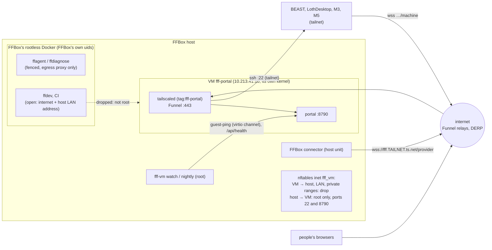

# The portal in its own VM on the FFBox host (design and install scripts)

**TL;DR:** Run the portal (orchestrators, dispatcher, standing agents, ledger and `data/`, web UI, `/machine` and
`/provider`, machine control) in a KVM/QEMU virtual machine on the FFBox host, managed by libvirt. The VM has its own
Ubuntu, its own Tailscale node with Funnel, and its own isolated virtual network: NAT out to the internet, nothing in.
An nftables table on the host keeps the VM away from the host's services, FFBox's containers and Lothsahn's LAN. The
same table keeps everything on the host except root away from the VM. FFBox and FF Factory share the hardware and the
internet line, and nothing else: no account, file, Docker, network or secret. FFBox reaches the portal through its
public Funnel URL, as it reaches BEAST today. The host watches the VM: a guest-agent ping and the portal's health
every minute, a reset after three failed checks, and a watchdog device as a second layer. Every night it drains the
portal, cold-restarts the VM for its security updates and snapshots the disk. Scripts for all of it are in
[`deploy/vm/`](../deploy/vm): for the host (run by Lothsahn as root) and for the guest. CI builds the whole thing in
a nested VM on every change to them. Sizing: 4 vCPUs, 12 GiB RAM, a 120 GiB disk. These are guesses built on
measured pieces; BEAST's own numbers are still to be measured ([Sizing](#9-sizing)). One limit no design on a shared
host removes: root on the FFBox host can read the VM's memory and disk, including the ssh key to Ben's machines.

Status: design and scripts, for w441 (Lothsahn: "Revise it to be a VM"). It revises w439's container design: the code
changes, the migration, the Claude account section and the decisions carry over. Nothing is deployed. The
prerequisite is w424 (BEAST's sandboxes moved under BEAST's own daemon, [beast-machine.md](beast-machine.md)) running
live, with `machines.keepAgentsOnRestart` on.

**How claims are labelled.** *(sourced: X)* means a document or a code line says so. *(measured: how)* means it was
counted or run for this design on 2026-10-05. *(guess)* means it is not verified yet, and the dry run
([7.2](#72-dry-run-in-the-vm)) or a named check settles it. Code references are to ff-factory `main` at commit
1938d50 (2026-10-05) unless they name this branch. References starting `ffbox` are to the private ffbox repo, which
was only read: this page leaves out the box's addresses, account names and audit items, as [ffbox.md](ffbox.md) does.
*CI* means the end-to-end job of [`.github/workflows/vm-scripts.yml`](../.github/workflows/vm-scripts.yml), which runs
the host and guest scripts for real on a throwaway GitHub runner ([10.3](#103-what-ci-proves)).

## What moves and what stays

| Moves into the VM | Stays where it is |
|---|---|
| `server/index.ts` and everything it runs: each person's orchestrator, the dispatcher, standing agents (`standingRoot`), the ledger, intake, the Max and FFBox pages | BEAST's daemon, sandboxes, Unity editors and workers ([beast-machine.md](beast-machine.md)) |
| `config.json` and all of `data/`: state, ledger, transcripts, attachments, orchestrator memory, push keys, tokens' hashes | LothDesktop, M3 and M5 daemons, unchanged except the portal URL they dial |
| The orchestrators' read-only clone of the game repo (`repo.basePath`) | The Dev Drive and its SYSTEM helper tasks on BEAST (their code moves into BEAST's daemon, change 4) |
| Review media (`publish_review`, `review.root`), unless [decision D9](#8-risks-and-open-decisions) says otherwise | FFBox: its config, containers, units and data are not touched |

Voice transcription on BEAST's GPU does not move: the FFBox host has no GPU *(sourced: [ffbox.md](ffbox.md), "Where")*.
See [2.6](#26-voice).

**Standing agents stay with the portal, in the VM.** They are host agents of the server (`server/standing.ts`), run
one Claude process during a run, and read the base clone and `data/`. Moving them to a worker machine would need a
daemon-side standing runner (code that does not exist). They read Discord text, so a prompt injection there runs
inside the VM, which is a better place than BEAST is today (1.7). The read guard of change 7 matters more for them than
for anything else here.

## 1. Isolation

### 1.1 What is hostile, and what the portal holds

FFBox assumes its containers are hostile *(sourced: ffbox `docs/docker-security-model.md`, "The container is assumed
hostile")*. They run on a rootless Docker daemon under an FFBox account *(sourced: [ffbox.md](ffbox.md), "Where")*.
Code can end up running in one of them through:

- `ffagent`: any player's Discord text. Fenced network: only an egress proxy with a short allowlist.
- `ffdiagnose`: a hostile crash or desync upload. Fenced.
- `ffdev`: operators' turns, which can carry a player's words from the same thread. Open network: "the whole
  internet, and this machine's own LAN address with it" *(sourced: ffbox docker-security-model, "The class that is not
  fenced", measured there on 2026-08-25)*.
- the game repo's CI runner jobs, which run whatever a branch's workflow file says.

An attacker in one of those can get to three depths:

- **E0**, still inside the container: whatever its network reaches.
- **E1**, out of the container as FFBox's rootless daemon account: a container-runtime bug or a mount mistake.
- **E2**, root on the host: a kernel bug reachable from a user namespace, or E1 plus a local privilege escalation.

What the portal holds, which is what such an attacker would want:

| Secret or power | On BEAST today | In the VM |
|---|---|---|
| The host Claude token and people's own tokens | `config.json` `claudeEnv`, `userClaudeEnv` | moved as is, `/srv/fff/config/config.json` |
| Lothsahn's claude.ai login (new) | none | `/srv/fff/home/.claude/.credentials.json` |
| GitHub credential (`gh` PR queries, the memory repo push) | BEAST's `gh` login | a new fine-grained token ([D7](#8-risks-and-open-decisions)), `fffctl gh-login` |
| The ssh key that deploys daemons to BEAST, LothDesktop, M3 and M5 | BEAST's `~/.ssh` *(sourced: [machines.md](machines.md), "Requirements")* | a new key made in the VM, `/srv/fff/home/.ssh/id_ed25519` |
| Max's Discord token | the ffdiscord config and `secrets.env` under `~/.config/ffbox` *(sourced: `server/discordConfig.ts`)* | its own copy in `/srv/fff/home/.config/ffbox` |
| VAPID push key, push subscriptions, login sessions, hashed API keys and machine tokens | `data/` | moved as is |
| Tailscale node key | BEAST's Tailscale | the VM's own `tailscaled` state |
| Transcripts (whatever agents saw), attachments (players' saves and logs), orchestrator memory | `data/` | moved as is |
| Powers: start and stop workers on every machine, push code, delete sandboxes, approve intake work, post as Max through workers | | the same |

### 1.2 The options

Lothsahn chose the VM (w441, this revision). The table keeps the comparison from w439 (the container design), with
the verdicts updated.

| Option | From an FFBox container (E0) | As FFBox's daemon account (E1) | As host root (E2) | Cost | Verdict |
|---|---|---|---|---|---|
| **1. A KVM/QEMU VM managed by libvirt** | Nothing: the VM's network admits nothing it did not start, and the host's `inet fff_vm` table drops every packet from a host process other than root's to the VM (1.4) | Nothing: the libvirt socket is root's (and group `libvirt`'s, which no FFBox account may be in), the disk is a root-owned zvol (or a qcow2 file of `libvirt-qemu`, `0600`), and QEMU runs as `libvirt-qemu` under its own AppArmor profile *(measured in CI: [10.3](#103-what-ci-proves))* | Everything: guest RAM through `/proc/<qemu pid>/mem` or `virsh dump`, the disk, and commands through the guest agent's `guest-exec`, which Ubuntu does not block *(sourced: noble's `qemu-guest-agent.service` runs `qemu-ga` with no `--block-rpcs`)* | A fixed RAM reservation, a second OS to patch (automated: unattended-upgrades plus the nightly cold restart), libvirt as root on the host | **Chosen** (Lothsahn, w441: this revision) |
| 2. Rootless Podman under a dedicated `fff` account | Nothing (no published port, its own network namespace) | Nothing (`0700` files, another uid, no daemon socket) | Everything | Podman 5, Ubuntu 24.04's AppArmor rule against unprivileged user namespaces *(sourced: containers/podman#25905)*, Quadlet units | The recommendation of w439 (the container design); the fallback if a VM's RAM cannot be spared |
| 3. Rootless Docker under `fff` | As 2 | As 2 | Everything | A second `dockerd`, two `docker` CLIs whose target depends on `DOCKER_HOST` | Fallback of the fallback |
| 4. A container on FFBox's own Docker daemon | Shares FFBox's networks unless configured otherwise | **Full control** through the daemon's socket | Everything | none | **Ruled out**: the sharing Lothsahn excluded |
| 5. gVisor, 6. Kata Containers | | | Everything | need a root runtime; Kata does not support Podman *(sourced: kata-containers `docs/Limitations.md`)* | No (w439, the container design) |

Against E2 nothing on a shared host helps, short of confidential-VM memory encryption (SEV-SNP, TDX) with
attestation, which is out of scope. So root on the FFBox host is the trust boundary: Lothsahn, and anyone with general
`sudo` there, can read everything the portal holds, as Ben can on BEAST today. FFBox's own code does not run as root.
Its updater runs as the checkout's owner, with `sudo` only for `systemctl` verbs on its own units *(sourced: ffbox
`systemd/ffbox-update.service`)*. That stays true only while no FFBox account has general `sudo`, or membership of the
`libvirt` or `disk` groups. The installer lists those groups' members and warns about any (`install.sh` step 2).

### 1.3 What runs on the host

Installed by `deploy/vm/host/install.sh` ([Installing](#10-installing)); nothing of FFBox's is touched.

- **Packages:** `qemu-system-x86`, `qemu-utils`, `libvirt-daemon-system`, `libvirt-clients`, `cloud-image-utils`,
  `nftables`, `jq`, `curl` (and `ubuntu-keyring` and `gpgv`, which Ubuntu already has). libvirtd runs as root, behind a
  root-only socket. Each VM's QEMU runs as `libvirt-qemu` with its own AppArmor profile *(measured in CI on Ubuntu
  24.04: user `libvirt-qemu`, profile `libvirt-<uuid> (enforce)`)*.
- **The VM** `fff-portal`: q35, `host-passthrough` CPU, virtio disk and network, a serial console logged to
  `/var/log/libvirt/qemu/fff-portal-serial.log`, the guest-agent channel, an `i6300esb` watchdog with `action='reset'`,
  a pvpanic device, `on_crash` restart, and autostart at boot ([2.1](#21-the-vm)).
- **The network** `fff-isolated` on bridge `virbr-fff`, 10.213.41.0/24 (host .1, VM .10). NAT mode, with no DHCP and
  no DNS. libvirt starts no dnsmasq for a network with `<dns enable='no'/>` and no `<dhcp>` *(sourced: libvirt
  `src/network/bridge_driver.c`, `networkNeedsDnsmasq`; measured in CI: no dnsmasq for it)*. The guest has a static
  address and public resolvers, so the VM needs no service on the host at all.
- **The nftables table** `inet fff_vm`, loaded by `fff-vm-firewall.service` before libvirt starts (1.4).
- **The runtime:** `/usr/local/sbin/fff-vm` and four units: `fff-vm-watch.timer` (hang detection, every minute),
  `fff-vm-nightly.timer` (12:00 UTC), `fff-vm-events.service` (watchdog, crash and stop alerts) and
  `fff-vm-firewall.service`.
- **The disk:** a zvol `<pool>/fff-vm/disk0`, not sparse, so its full size is reserved in the pool and neither side can
  fill the other's disk. Or a qcow2 file in `/var/lib/libvirt/images/fff-vm/` ([2.2](#22-the-disk-and-its-backups)).
- **libvirt's `default` network** (virbr0, 192.168.122.0/24, with a dnsmasq) that Ubuntu's package defines with
  autostart on *(measured in CI: right after the package install it was defined, autostart on)*, so it starts at the
  next boot. If this install put libvirt on the host and no domain uses it, the
  network is stopped and its autostart turned off (`DEFAULT_NET_ACTION=auto`); otherwise it is left alone, and
  `uninstall.sh` puts it back.
- **Settings and records:** `/etc/fff-vm/` (root, `0600` files: the config, the generated table, the domain XML, the
  cloud-init seed, the host root's ssh key for `fff-vm ssh`, the ntfy URL) and `/var/lib/fff-vm/manifest`, which lists
  what the install changed so `uninstall.sh` undoes exactly that.

**What it refuses rather than overrides** (exit 3, nothing changed): an nftables table `inet fff_vm` that is not its
own, an interface named `virbr-fff` that is not its network's bridge, any address or route of the host in
10.213.41.0/24, a libvirt network `fff-isolated` or a domain `fff-portal` that is not its own (each carries a
`<description>` marker), another libvirt network using that subnet, a `disk0` zvol or qcow2 file it did not make, a
zvol parent dataset holding other datasets, and libvirtd listening on TCP (16509 or 16514), which would let anything
that reaches the host try to control the VM. The install itself opens no port on the host. It warns, without refusing, about members of the `libvirt` and `disk`
groups. It also warns about a forward chain that drops by default (libvirt adds its own accept rules for the NAT).
Finally it warns when `nftables.service` would flush the whole ruleset on a reload. That would drop the VM's table
too, and `fff-vm watch` loads it again within a minute and alerts; nothing edits `/etc/nftables.conf`. FFBox's
containers come from a rootless daemon, so they add no host iptables rules to collide with *(sourced: ffbox
docker-security-model, "The host rule, and why there is none now")*.

### 1.4 Network

Six rules:

1. **Tailscale runs only inside the VM, never on the host.** FFBox keeps the box off the tailnet on purpose, because
   `ffdev` shares the host's network and a tailnet there would put BEAST and the Macs within its reach *(sourced: ffbox
   docker-security-model, "The FF Factory link")*. The VM's tailnet interface and routes live in the guest's kernel;
   the host's routing table has no tailnet route, so an `ffdev` packet to a `100.x` address follows the host's default
   route and goes nowhere. Tailscale's WireGuard traffic leaves the VM as ordinary UDP through the NAT.
2. **Nothing is forwarded into the VM.** No port forward, no bridge to the LAN. `forward` drops every packet to
   `virbr-fff` that is not a reply to something the VM started. libvirt's own NAT rules do the same; this table holds
   it even if libvirt's change. The only way in from outside is the VM's own Funnel.
3. **The VM reaches the internet and nothing else.** `forward` drops packets from the VM to the private ranges
   (10/8, 172.16/12, 192.168/16, 100.64/10, 169.254/16, loopback, multicast and the reserved blocks) and to every network
   the host is directly connected to, read from `ip route` at install. So a LAN on public addresses is still
   Lothsahn's LAN, and `NET_EXTRA_BLOCK` adds more. It also drops packets with any source address but the VM's own,
   and all IPv6. `input` drops every packet from the VM to the host itself (its sshd, FFBox's web page, intake, model
   proxy, connector), on any of the host's addresses, except replies to root's own checks. Tailnet traffic to the
   machines is WireGuard to their public addresses or DERP, so it passes. A direct path to LothDesktop over Loth's LAN
   is dropped and falls back to NAT traversal or DERP *(guess: fine for a control link)*.
4. **Nothing on the host but root reaches the VM.** `output` accepts packets to the VM only from sockets of uid 0, and
   only to its ssh (22) and the portal (8790): the health check and `fff-vm ssh`. FFBox's containers run on a rootless
   daemon, so their traffic leaves through sockets of FFBox's own uids in the host's namespace (`ffdev`'s "host LAN"
   path included) and is dropped. A container on a bridge is forwarded, and `forward` drops it. *(measured in CI, in
   both disk modes: a non-root account on the host, a non-root container on the host's network, and a bridged
   container all fail to connect to the VM's ssh. From inside the VM, the host's bridge address, its LAN address and
   its LAN gateway fail too, while the internet works. All four drop rules counted packets: 10 from the VM to the
   host, 11 forwarded toward the VM, 10 from the VM to private addresses, 18 from host processes other than root's.)*
   A rootful container would run as root and pass. FFBox has none, and adding one would
   break its own security model *(sourced: ffbox docker-security-model)*.
5. **The guest has its own firewall** (`inet fff_guest`, `deploy/vm/guest`), which drops by default. It accepts the
   host's address on 22 and 8790, `tailscale0` on 443 (Funnel and tailnet HTTPS), and Tailscale's UDP port.
6. **Tailnet policy** (Ben's tailnet admin, [D3](#8-risks-and-open-decisions)). The VM's node joins with a tag,
   `tag:fff-portal`, from a pre-approved, non-ephemeral auth key made for that tag. Tagged nodes' keys do not expire
   *(sourced: Tailscale KB 1085, "Key expiry for tagged devices is disabled by default")*. An OAuth client secret would
   make the node ephemeral unless `?ephemeral=false` is added *(sourced: Tailscale KB 1215)*. Grants: people's devices
   and the four machines may reach `tag:fff-portal` on 443, and `tag:fff-portal` may reach the four machines on port
   22, plus BEAST for backups; nothing else. `nodeAttrs` gives `funnel` to `tag:fff-portal` only. Funnel needs MagicDNS,
   HTTPS certificates and that attribute, and listens only on 443, 8443 or 10000 *(sourced: Tailscale KB 1223)*.

### 1.5 Secrets

- **One place each, in the VM.** Every secret is a file under `/srv/fff`, `0600` in `0700` folders owned by `fff`, on
  the VM's own disk. None is in the cloud-init seed (it holds only public keys), a unit file, an environment variable a
  unit sets, a command line or a log. `fffctl tailscale-join` reads the auth key with `--auth-key=file:`, and
  `fffctl gh-login` reads the token from a file, so neither shows in a process list.
- **New where possible:** a new ssh key made in the VM, a new GitHub token, a new Tailscale node, a new backup key.
  **Moved as they are:** `config.json` (Claude tokens; FFBox's connector token is kept only as its SHA-256 *(sourced:
  [connector contract](ffbox-connector-contract.md), "Auth")*) and `data/`. **Copied:** Max's Discord token, from
  BEAST's ffdiscord config into `/srv/fff/home/.config/ffbox`, which `server/discordConfig.ts` reads as
  `~/.config/ffbox` of the VM's `fff`. FFBox's own `~/.config/ffbox` is on another kernel's disk; the portal cannot
  reach it.
- **Backups**: two layers ([2.2](#22-the-disk-and-its-backups)). Every night the host snapshots the disk while the VM is
  off, keeping the last 7, for fast whole-machine rollback; those stay on the host, unencrypted, readable by root as
  the live disk is. Every day the guest archives `config`, `data`, `agents` and `home`, encrypts it with `age` to public
  keys whose private keys are kept off the FFBox host (by Ben and Lothsahn), and sends it with sftp to an account on
  BEAST over the tailnet, keeping the last 14. Neither the host nor the VM can open an older backup. Nothing here
  costs money.
- **At rest:** LUKS in the guest or ZFS encryption of the zvol is optional. It protects pulled disks, not a running
  host: the key has to be on the host to boot unattended.

### 1.6 Keeping FFBox's operators and code out

- **FFBox's code** runs as FFBox's own accounts. It cannot reach the VM over the network (1.4, rule 4). It cannot
  reach libvirt's socket, which is root's and group `libvirt`'s. It cannot read the disk: a zvol device node is
  `root:disk 0660`, and a qcow2 file is `libvirt-qemu`'s, `0600`. It cannot ptrace QEMU, which runs under another uid.
- **The guest has no FFBox account** and nothing of FFBox's is mounted in it: no shared folder, no virtiofs, no 9p.
- **Operators.** Root reads everything: Lothsahn, and anyone given general `sudo` on that host. Ben puts his machines'
  ssh access and his tokens under that trust ([D2](#8-risks-and-open-decisions)). Root's ways in are the guest agent
  (`guest-exec`, which the nightly drain uses), `fff-vm ssh`, `virsh console` and the disk. The first two are logged in
  the host's journal and the guest's.
- **FF Factory's own agents.** Nothing stops an orchestrator or a standing agent from reading `config.json`, `~/.ssh`
  or the Claude credentials. The only path rule is for orchestrators' memory writes *(measured: searched
  `server/guard.ts`, `server/standingGuard.ts` and `server/orchestratorMemory.ts` for `credentials.json`, `.ssh` and
  `config.json`; the one hit is the write rule at `orchestratorMemory.ts:89`)*. The gap exists on BEAST today; moving
  the secrets is the moment to close it (change 7).

### 1.7 What the VM adds over the container design, and what it does not

**Adds:**

- **A second boundary in the other direction.** A compromised portal (a prompt-injected standing agent that got a
  shell) has to escape KVM and an AppArmor-confined QEMU to reach the host and FFBox. In the container it stood on
  the host's kernel behind a Unix account. That is the gain w439 (the container design) listed as "revisit if the portal ever runs untrusted
  code"; standing agents read Discord text today.
- **No user namespaces on the host for the portal.** Rootless Podman needed a way around Ubuntu 24.04's AppArmor rule
  against unprivileged user namespaces and a TUN device in a rootless pod, both guesses in w439 (the container design). The VM needs neither:
  Tailscale runs in kernel mode in the guest, and the guest is an ordinary Ubuntu machine.
- **Isolation enforced per machine, at the bridge.** The host's table filters one interface. The container design
  filtered by the uid of pasta's sockets (`meta skuid`), which was a guess.
- **Hard limits.** Fixed vCPUs, RAM and disk size, instead of cgroup quotas on a user slice. The disk is its own block
  device, so FFBox cannot fill it and it cannot fill FFBox's.
- **Its own lifecycle.** The portal's OS updates and reboots without touching the FFBox host. A consistent snapshot of
  the whole machine is taken every night while it is off. Machine-level hang detection and a hardware-style watchdog
  are added.

**Does not:**

- **Protect against host root (E2).** Root reads guest RAM and disk and can run commands in the guest through its
  agent. Same as the container, and as Ben on BEAST today.
- **Protect against FF Factory's own agents** reading the portal's secrets inside the guest (change 7).
- **Separate failure domains.** An FFBox host outage still takes the portal down with it.
- **Come free.** It reserves about 12.5 GiB of the host's RAM ([9](#9-sizing)) and adds a second OS. It also adds
  libvirtd, more root code on the box. Its QEMU runs unprivileged and confined, and its socket is root-only.

## 2. The VM and the guest

### 2.1 The VM

`deploy/vm/host/install.sh` makes it from Ubuntu's cloud image. The image is checked against `SHA256SUMS`, whose
signature is checked with `/usr/share/keyrings/ubuntu-cloudimage-keyring.gpg`. On noble that keyring comes from
`ubuntu-keyring`; the `ubuntu-cloudimage-keyring` package is a dummy *(sourced: packages.ubuntu.com file lists)*. The
guest is Ubuntu 24.04 LTS, the release FF Factory's CI runs the portal on (`ubuntu-latest` = 24.04 until October 2026
*(sourced: GitHub changelog 2026-09-17)*). 26.04 LTS is a setting away (`VM_OS_RELEASE=resolute`,
[D14](#8-risks-and-open-decisions)).

cloud-init (a NoCloud seed ISO from `cloud-localds`, read at the first boot only) sets up:

- the admin account `fffadmin`: sudo, key-only ssh, no password. Its keys are the host root's own key (for
  `fff-vm ssh`) and Lothsahn's keys from `/etc/fff-vm/admin_authorized_keys`.
- a static address, a default route through the host's bridge address, and public resolvers.
- `qemu-guest-agent`, `unattended-upgrades` and `nftables`, plus `linux-image-extra-virtual`. The cloud image's kernel
  has no `i6300esb` module: it ships in `linux-modules-extra`, which the cloud image does not install *(sourced:
  packages.ubuntu.com file lists for linux-modules-6.8.0-101-generic and linux-modules-extra-6.8.0-101-generic; the noble
  cloud image manifest)*. `package_reboot_if_required` boots once into an upgraded kernel, so the module matches it.
- the watchdog: `RuntimeWatchdogSec=30s` makes PID 1 pet `/dev/watchdog0` *(sourced: systemd-system.conf(5))*.
  `RebootWatchdogSec=10min` covers a hung shutdown. `fff-watchdog-arm.service` re-executes PID 1 if the device appeared
  after it started *(measured in CI: `/sys/class/watchdog/watchdog0/state` is `active`)*.
- security updates every day. `Automatic-Reboot "false"`, because the host's nightly cycle restarts the VM. The guest's
  apt timers move to just before it: lists at 10:30 and upgrades at 11:00 UTC, each with up to 10 minutes of random
  delay. Ubuntu's default upgrade timer is 06:00 plus up to 60 minutes *(sourced: noble's apt-daily-upgrade.timer)*.

### 2.2 The disk and its backups

| | zvol (recommended, [D13](#8-risks-and-open-decisions)) | qcow2 |
|---|---|---|
| Where | `<VM_ZVOL_PARENT>/disk0`, raw, `volblocksize=16K`, lz4 | `/var/lib/libvirt/images/fff-vm/disk0.qcow2` |
| Space | Reserved in full in the pool (not sparse): neither side fills the other | Grows as written; a quota needs a dataset of its own |
| Nightly snapshot (VM off) | `zfs snapshot …@fff-nightly-<time>`, the last 7 kept | `qemu-img snapshot -c`, internal, the last 7 kept |
| Rollback | `vm-rollback.sh`: clone, rename, promote; the state before is kept as `disk0-before-rollback-<time>` | `qemu-img snapshot -a`; the state before is kept as a snapshot |
| Off the host | the guest's encrypted backup (below); a `zfs send` of a snapshot is possible but unencrypted unless piped through `age` | the same |

The host has ZFS *(sourced: [ffbox.md](ffbox.md), "Where")*. So the zvol is the recommendation: a fixed reservation,
cheap snapshots, and no double copy-on-write of qcow2 on ZFS. CI tests both modes.

**The guest's backup** (`fff-backup`, daily at 11:15 UTC, before the nightly restart) archives `config`, `data`,
`agents` and `home`, leaving out caches and the Claude CLI's own versions. Review media is included only if
`BACKUP_INCLUDE_REVIEW=yes`. The archive is encrypted with `age -R` to the public keys in
`/etc/fff/backup-recipients.txt` and sent with sftp, as `<name>.part` then renamed, to `BACKUP_SSH_TARGET` with the
VM's own backup key; the newest 14 are kept there. Recommended target: a Windows account on BEAST used for nothing
else, reached over the tailnet ([D17](#8-risks-and-open-decisions)). A failure messages the dispatcher. Restore, with
the portal stopped: `age -d -i key.txt <file> | tar -xz -C /srv/fff`. The dry run restores one ([7.2](#72-dry-run-in-the-vm), check 12).

### 2.3 Inside the guest

`deploy/vm/guest/install.sh` sets it up, run as root in the VM. All of it is under `/srv/fff`, owned by the system
account `fff` (locked password, no sudo), `0700`:

| Folder | Holds | Size | Backed up |
|---|---|---|---|
| `config/` | `config.json` (from [`config.vm.example.json`](../deploy/vm/guest/config.vm.example.json), never overwritten) and `.prev` | under 1 MB | yes |
| `data/` | everything of today's `data/`, plus the updater's hand-off files (3) | data on BEAST not measured yet ([9](#9-sizing)); 479 transcripts *(measured by w439, the container design, 2026-10-05)* | yes |
| `home/` | `HOME` of `fff`: `.claude` (Lothsahn's login, session histories, plugins), `.ssh`, `.config/gh`, `.config/ffbox`, `.local/bin/claude` | session histories: 0.82 GB for LothDesktop's own user *(measured: `~/.claude/projects`, 2026-10-05)*; guess 1-5 GB for the portal | yes, without caches |
| `app/` | `repo.git` (a bare clone of ff-factory), `releases/<sha12>/` (a worktree each, with its own `node_modules` and web build), `current` and `previous` (symlinks) | per release: measured in CI ([9](#9-sizing)) | no, rebuilt from git |
| `base/` | the game repo, cloned without LFS files, for orchestrators' reads (`fffctl base-clone`) | git objects 1.27 GiB *(measured by w439, the container design: `git count-objects -vH` in BEAST's base clone)*; working tree without LFS files: guess 3-5 GB | no, re-cloned |
| `agents/` | standing agents' folders (`standingRoot`) | small | yes |
| `review/` | `publish_review` media (`review.root`) | grows with clips | [D9](#8-risks-and-open-decisions) |
| `sandboxes/` | empty: `sandboxRoot` is still required by the config (change 1) | 0 | no |
| `backup/` | root's staging for the encrypted archive, emptied after each upload | | |

The guest's settings (repository, branch, backup target, thresholds) are in `/etc/fff/fff.conf`, whose defaults are
in [`fff.conf.example`](../deploy/vm/guest/fff.conf.example).

### 2.4 Units in the guest

| Unit | Does | Replaces on BEAST |
|---|---|---|
| `fff-portal.service` | `node server/index.ts` in `app/current` as `fff`, with `FFSB_SUPERVISOR=systemd` and `FFSB_CONFIG`. `Restart=always` every 3 s, `StartLimitIntervalSec=0`. `KillMode=mixed`: SIGTERM to the server only, which records what to resume and stops its agents itself; whatever is left after 75 s is killed. `ExecStartPre=+fff-update activate` switches to a prepared release. `ExecCondition` keeps it stopped while `/run/fff/portal.hold` exists. Hardened: `NoNewPrivileges`, `ProtectSystem=full` | the `ffsb-server` task and `supervise.ps1` |
| `fff-health.timer` (30 s) | `/api/health` from inside; 4 failures in a row after a 2-minute start grace restart the portal; verifies a fresh update (3) | the restart half of `supervise.ps1`, plus a hung-server check BEAST does not have |
| `fff-update.path` → `.service` | starts the updater when `data/update.wanted` appears | `supervise.ps1`'s update step |
| `fff-backup.timer` (11:15 UTC) | the encrypted backup (2.2) | none (new) |
| `fff-base-refresh.timer` (15 min) | fetches the base clone and moves its detached HEAD to `origin/develop` when nothing there is modified | change 11, on the VM's side |
| `fff-guest-firewall.service` | the `inet fff_guest` table (1.4, rule 5) | |

### 2.5 Health, restart and logs

- **Health.** `GET /api/health` answers `{ ok, version, sha, web }` without a login (`server/index.ts:1231`,
  `server/version.ts`). Three layers check it. The guest checks it every 30 s and restarts a server that runs but does
  not answer. systemd restarts a server that exited. The host checks the VM every minute (3).
- **A stop is a clean stop.** On SIGTERM the server writes `data/resume.json`, stops its agent processes, flushes state
  and exits 0 (`server/index.ts:1579-1580`, `stopServer`). With `machines.keepAgentsOnRestart` the daemons' agents carry
  on. `Restart=always` brings the server back after its own exit 0 at the end of a drain.
- **Crash loops.** systemd restarts it every 3 s; the server's own guard (a second unclean stop within 30 minutes only
  reports, [restart.md](restart.md)) still applies. `index.ts` dates the boot from `os.uptime()`, which in a VM is the
  guest's: a VM reset reads as "went down", a server crash as "only the server stopped".
- **Logs** go to the guest's journal (`fffctl logs`; `journalctl -u fff-portal`). The VM has no other user to keep
  out, so the log file of w439 (the container design) is not needed. The text naming `data/supervisor.log` changes with change 13.

### 2.6 Voice

Off at cut-over (`voice.enabled: false`). The host has no GPU, and with voice on the server installs uv, Python and
CUDA wheels at startup (`server/config.ts:390-396`, `server/voice.ts:67-71`). The browser's own speech engines take
over, as they already do when the local engine is missing *(sourced: [voice.md](voice.md), "fallbacks")*. Whisper on
the CPU (`voice.device: "cpu"`, `voice.cpuThreads`) can be tried later within the VM's vCPUs, once someone measures its
latency there.

## 3. Supervision, updates, hang detection and the nightly restart

| On BEAST today | In the VM |
|---|---|
| The `ffsb-server` task at logon, Limited (`scripts/install-autostart.ps1`) | `fff-portal.service`, enabled: up at boot with nobody signed in |
| `scripts/supervise.ps1`: restarts node, backs off up to a minute | `Restart=always`, plus `fff-health` for a server that hangs |
| `scripts/restart.ps1` (drain, stop, start through the task) | `fffctl restart [--no-drain] [--drain-minutes N]`: writes the same JSON to `data/restart.request`, which the server reads every second (`server/index.ts:1583-1598`); it drains, stops and exits 0, and systemd starts it again |
| `restart.ps1 -Update`, `update.ps1`, `update-steps.ps1` | `fffctl update`, or `request_app_update`: the updater builds beside the running server, then asks for the drain (below) |
| `request_app_update` (`server/agents.ts`; refuses without a `supervise.ps1` process) | under systemd it writes `data/update.wanted` (this branch: `systemdSupervised` and `writeUpdateWanted` in `server/restart.ts`, unit tests in `server/restart.test.ts`; Windows unchanged) |
| The elevation checks (`server/elevation.ts`) | Not applicable: off Windows only uid 0 counts as elevated (`server/elevation.ts:69-70`), and `fff` is not root |
| `ffsb-helper-*` SYSTEM tasks ([self-recovery.md](self-recovery.md)) | Not in the VM. BEAST keeps the tasks; its daemon starts them (change 4) |
| The headless-browser reaper (`server/reaper.ts`) | Not needed: no browsers. Off Windows it finds nothing (`server/reaper.ts:93-109`) |
| Disk levels and clean-up (`server/hostHealth.ts`, `server/cleanup.ts`) | Kept, with thresholds for the VM's disk in the template (20 and 10 GB) |
| The outside watchdog on the M5 | Unchanged mechanism, new URL ([4.2](#42-who-changes-what-at-the-cut-over)) |

### The update flow

1. **Request.** `request_app_update`, or `fffctl update`, writes `data/update.wanted` (`{ drainMinutes, reason, at }`).
   `fff-update.path` starts `fff-update request` as root; git and npm run as `fff`.
2. **Build while the old portal runs.** It fetches `origin/main` into `app/repo.git` and adds a worktree
   `app/releases/<sha12>` at that commit. There it runs `npm ci` and `npm --prefix web ci`, then the web build. Nobody
   edits these worktrees, so `update-steps.ps1`'s fast-forward, republish and rewrite checks reduce to "a fresh worktree
   at origin's commit". The unit tests for that commit already ran in CI. If the build fails, the dispatcher gets a
   message saying why and nothing restarts. If origin is at the running commit, it says "already up to date" and
   nothing restarts.
3. **Hand-off.** It writes `data/update.prepared.json`, then `data/restart.request` with
   `{ drain: "auto", drainMinutes, update: true, reason: "update to <sha> (…)" }`. The server drains as it does today,
   writes `data/update.request` and `resume.json`, and exits 0.
4. **Switch.** systemd starts it again. `ExecStartPre=+fff-update activate` sees `update.request`, swaps the `current`
   and `previous` symlinks, writes `update.result.json` (`ok`, `headBefore`, `headAfter`) for the server's
   `[app restarted]` summary, and starts verifying. So the portal is down for the drain's stop and a normal start,
   not for the build *(measured in CI: [9](#9-sizing))*.
5. **Verify.** `fff-health` sees `/api/health` answer with the new SHA within `UPDATE_VERIFY_MIN` (5) minutes: done.
6. **Roll back by itself** when it does not. `current` goes back to the previous release, `update.result.json` says
   `ok: false, "rolled back: …"`, the dispatcher is told, and the portal restarts *(measured in CI: a commit that throws
   at start rolls back by itself)*.

- **An update cut off by a crash** (`server/index.ts:1690-1695`): after an unclean stop with an update pending, the
  server writes `update.request` and exits 0. With no prepared release, `activate` builds one then, while the portal
  is down, and switches. No code change needed.
- **Manual rollback**: `fffctl rollback`. Data goes back only with the host's disk snapshots (`vm-rollback.sh`),
  because data formats move forward: `durable.ts`'s versions cover crashes, not downgrades.
- **Node, gh and Tailscale** update through unattended-upgrades (their repositories are added to its origins with
  `site=` patterns *(sourced: unattended-upgrades README)*), Node within its major version (`node_24.x`). Tailscale
  also has `tailscale set --auto-update` on. The Claude Code CLI updates itself *(sourced: Claude Code setup docs:
  "Native installations automatically update in the background")*. The Agent SDK's own binary moves with ff-factory's
  `package-lock.json`.

### Hang detection (host)

`fff-vm watch` runs every minute (`fff-vm-watch.timer`), as root:

1. The firewall table must be loaded; if it is missing, it is loaded again and an alert sent. If that fails, the VM is
   shut down rather than left unfiltered.
2. A VM that is shut off outside the nightly window is started. A paused VM (an I/O error: the host's disk) is reported,
   not reset.
3. Then two checks: a `guest-ping` through the guest agent's virtio channel, which needs no network, and the portal's
   `/api/health` over the private network.
   - **Either answers:** the guest is alive. If only the portal is down, the guest's own systemd is restarting it, so
     the host only alerts after 20 minutes. After 60 minutes it resets the VM as a last resort
     (`PORTAL_DOWN_RESET_MIN`).
   - **Neither answers 3 times in a row:** `virsh reset`, logged and alerted.
   - **Never during the first boot**, before the agent has answered once (cloud-init installs it, then upgrades and may
     reboot): an alert after 30 minutes, never a reset.
   - **Never within 5 minutes of QEMU's start, nor during the nightly cycle.**
   - **At most 3 resets in 6 hours;** after that only alerts, since a VM that keeps dying needs a person.
4. **The watchdog is the second layer.** If the guest's kernel or PID 1 hangs, nobody pets `i6300esb` and QEMU resets
   the VM *(measured in CI: a guest that stops petting it is reset; `fff-vm-events` reports the watchdog event)*. A
   kernel panic goes to `pvpanic`, then `on_crash` restarts it.

Alerts go to ntfy, to the topic FF Factory's outside watch already uses (`data/outside-watch.json`; `system_status`
names it). The host reads the whole URL from `/etc/fff-vm/ntfy-url` (root, `0600`) and never prints it. Alerts cover
each reset, a watchdog event, a crash, an unexpected stop, an I/O error, a missing firewall table, a long portal
outage, a first boot that does not finish, and a nightly restart that does not come back.

### The nightly restart (host)

`fff-vm nightly`, from `fff-vm-nightly.timer` at **12:00 UTC**:

1. Marks maintenance, so the watch does not count the downtime.
2. **Drains through FF Factory's own drain.** Through the guest agent it runs `fffctl prepare-shutdown --drain-minutes
   10`. That sets `/run/fff/portal.hold`, then writes `restart.request` `{ drain: "auto", drainMinutes: 10 }`. The server
   asks busy agents to commit, push and end their turn, records what to resume, stops its agents and exits 0. Because
   of `ExecCondition`, systemd then leaves it stopped: a condition that fails with 1-254 skips the unit without marking
   it failed, and `Restart=always` does not fire on a skip *(sourced: systemd.service(5); systemd v255
   `src/core/service.c`, `SERVICE_RESTART_ALWAYS: return s->result != SERVICE_SKIP_CONDITION`; measured in CI)*. With
   `keepAgentsOnRestart`, the daemons' workers are not touched.
3. **A cold restart.** `virsh shutdown` (agent, then ACPI), forced off after 5 minutes, then `virsh start`. A cold
   start, not a guest reboot, so a QEMU the host updated is picked up too.
4. **Snapshots the disk** in between, while nothing writes, and prunes to the last 7.
5. **Waits for the portal.** The hold file was in `/run`, so the portal starts at boot and resumes the interrupted
   sessions (`resume.json`). If it is not back within 10 minutes, an alert.

**Why 12:00 UTC** *(measured: commit times over the last 30 days, all branches)*. Commits to the game repo by UTC hour
bottom out at 21 at 12:00 and 30 at 13:00, against 259 at 21:00 (3,238 in all). ff-factory had no commits from 10:00
to 12:59 (374 in all). The committers' clocks are at -06:00 and -04:00, so 12:00 UTC is 06:00 and 08:00 for them.
The guest's upgrades run at 11:00 and the backup at 11:15, so each night's reboot carries that morning's fixes.
`NIGHTLY_MODE=if-required` restarts only when the guest has `/run/reboot-required` or the host's QEMU binary was
replaced under the running VM. `off` turns it off ([D15](#8-risks-and-open-decisions)).

## 4. Networking and reachability

### 4.1 The address

One new name that stays: `https://fff.<tailnet>.ts.net` (the name is [D3](#8-risks-and-open-decisions)), served by the
VM's Funnel (`fffctl tailscale-join`, which runs `tailscale funnel --bg http://127.0.0.1:8790` *(sourced: Tailscale
KB 1311)*). It belongs to the node's name, not to a computer: a node made elsewhere with the same hostname gets the same
name once the old node is removed, so a later move keeps the URL. Keeping BEAST's current URL would need the VM to take
BEAST's node name while BEAST still uses it (ssh aliases, and the game repo's nightly scripts reach BEAST by name
*(sourced: [beast-machine.md](beast-machine.md), "BEAST-specific things left in place")*).

### 4.2 Who changes what at the cut-over

| Who | Today | After | Who acts |
|---|---|---|---|
| People's browsers | BEAST's Funnel URL | the new URL. Sign in again: cookies belong to the old host name, while the accounts and passwords move with `data/`. On a phone, add the Home Screen app again and turn notifications back on, since a push subscription belongs to the old origin's service worker ([README](../README.md), "Notifications and the phone") | each person |
| `/mcp` clients (`claude mcp add … /mcp`) | the old URL | `claude mcp add` again with the new URL; the API keys stay valid (`data/api-keys.json` moves) | each person |
| Daemons on LothDesktop, M3, M5 | dial the portal's public URL *(sourced: [machines.md](machines.md): "The Macs reach it through its public URL, not a tailnet IP")*, stored per machine (`state.json` `machines[].portalUrl`, read first at `server/machines.ts:630`) and in the daemon's config (`server/machineDeploy.ts:414-417`) | the new URL, by a `relocate` message the old portal sends each connected daemon just before it stops (change 9): the daemon rewrites its config and reconnects, keeps its agents running and replays its queued events (up to 20,000 *(sourced: [beast-machine.md](beast-machine.md))*). Without change 9: rewrite `portalUrl` in the copied state, and the new portal redeploys over ssh each daemon that has not connected after 2 minutes *(sourced: [machines.md](machines.md))* | the migration script |
| BEAST's daemon | the portal's own host: `local: true`, portal URL `http://127.0.0.1:<port>`, deployed without ssh (`server/machines.ts:98`) | an ordinary Windows machine deployed over ssh, at the new URL (change 3) | the migration script |
| FFBox's connector | `fff.url` = BEAST's Funnel URL | the new URL. It is rendered into the connector's unit at install and needs root to change *(sourced: ffbox docker-security-model, "Where the token goes takes root to change")*. The token stays: FF Factory keeps its SHA-256 in `config.json`, which moves. FFBox's HTTP posts to `POST /api/intake/ffbox` (Max's escalations and intake diagnoses, [contract](ffbox-connector-contract.md)) go to the same portal: wherever FFBox's config names that base URL changes too, and the scoped API key stays valid | Lothsahn |
| The outside watchdog on the M5 | `GET <BEAST URL>/api/health` and a ping of BEAST | `outsideWatch.healthUrl` follows `publicUrl`; the M5's daemon gets the new config when it connects ([self-recovery.md](self-recovery.md), section 4). The ping reaches the VM's node, so "up, portal down" still means the VM is up and the portal is not. Lothsahn subscribes to the same ntfy topic, which the host's alerts also use | the migration script, Lothsahn |
| Wake-on-LAN | the M5 wakes BEAST when BEAST and the portal are down | Not for the portal: its host is a server, and the VM autostarts with it. Clear `mac`, `ip` and `broadcast` in `outside-watch.json`: they are BEAST's (read through PowerShell, Windows only, `server/outsideWatch.ts:61-62`), and waking BEAST is the wrong answer to a dead portal. Waking BEAST as a worker machine needs the watch to take a second target with a fixed MAC (change 12, optional) | the migration script |

FFBox reaches the VM the way it reaches BEAST today: out to the Funnel URL over the internet, TLS verified *(sourced:
[contract](ffbox-connector-contract.md), "Security checklist for the connector")*. It never uses localhost, the LAN,
the VM's private address or the tailnet, and it is not on the tailnet. That traffic leaves the host and comes back
through Tailscale's Funnel relays *(guess: works like any other client; the dry run's check 4 tests it from the FFBox
host)*.

### 4.3 SSH and keys

- The guest install makes the portal's ed25519 key (`/srv/fff/home/.ssh/id_ed25519`, `0600`). It never leaves the VM,
  except inside the encrypted backups.
- Its public key goes onto each machine with a source restriction:
  `from="<the VM's tailnet IP>",no-agent-forwarding,no-port-forwarding,no-X11-forwarding ssh-ed25519 …`, in
  `~/.ssh/authorized_keys` on the Macs and, for a Windows account in Administrators,
  `C:\ProgramData\ssh\administrators_authorized_keys` *(sourced: [machines.md](machines.md), "Setting up a Windows PC",
  step 3)*. *(Guess: deploys work with those options; the dry run's check 5 tests one.)*
- `~/.ssh/config` names `beast`, `lothdesktop`, `m3` and `m5` by their MagicDNS names, with `StrictHostKeyChecking
  yes`. `known_hosts` is seeded from BEAST's entries for those hosts and checked against `ssh-keyscan` over the tailnet.
- The tailnet policy allows the tag only port 22 on those four (1.4, rule 6).
- A separate backup key (`/etc/fff/backup_ed25519`, root's in the guest) goes only to the backup account
  ([D17](#8-risks-and-open-decisions)), so the portal's agents never hold it.
- After the move, remove the portal's BEAST key from the other machines' `authorized_keys`, unless something else uses
  it; check first.
- The host's own key for `fff-vm ssh` (`/etc/fff-vm/ssh/id_ed25519`) reaches only the VM's admin account, only from
  root, only over the private bridge.

## 5. Claude account

### 5.1 Who runs on which account

What the code does today:

- A person's own orchestrator runs on their entry in `userClaudeEnv` when they have one, otherwise on the account
  `claudeAccounts.orchestrator` picks *(sourced: [orchestrators.md](orchestrators.md), "The two kinds")*.
- The dispatcher gets `claudeEnvFor(cfg, owner ?? systemPayer, hostProcessEnv(cfg, 'orchestrator'))`
  (`server/agents.ts:3159`): the system payer's own token if `userClaudeEnv` has one for them (the system payer is Ben,
  `server/identity.ts:55-59`), otherwise the orchestrator role's account.
- Standing agents: `claudeAccounts.standing`, with the requester's own token on top; scheduled runs count as the
  system payer's.
- Workers: their machine's setting, unchanged by this move.

### 5.2 Putting the orchestrators and the dispatcher on Lothsahn's plan

1. Lothsahn signs in inside the VM: `sudo fff-vm ssh` on the host, then `sudo fffctl claude-login`, which starts Claude
   Code as `fff`; there, `/login` with his claude.ai account. The login URL opens on any device, and the code is pasted
   back; that is how a login works over ssh *(sourced: Claude Code authentication docs)*. The login lands in
   `/srv/fff/home/.claude/.credentials.json` and is "this host's login". The usage poll every 15 minutes and every
   orchestrator run refresh it with its refresh token, as any `claude` run would *(sourced: README, "Credentials for
   the usage meter")*. The README also warns that an interactive login "can lapse on an always-on box"
   ([D6](#8-risks-and-open-decisions)).
2. `claudeAccounts.orchestrator: "login"`. It is in `set_app_config`'s allowlist and is refused when no usable login is
   stored (`hostLoginProblem`, `server/secrets.ts`).
3. A new key, `claudeAccounts.dispatcher: "login"` (change 6), so the dispatcher uses the host login even when the
   system payer has a token of their own. Setting `systemPayer` to Lothsahn instead would also move scheduled standing
   runs and FFBox-triggered work onto his token wherever they run (`server/identity.ts:55-59`), and the request keeps
   workers where they are.
4. Lothsahn's own orchestrator is on his account either way: his own token if he has one in `userClaudeEnv`, else the
   login.
5. Ben's orchestrator is an open question ([D4](#8-risks-and-open-decisions)). Either it runs on Lothsahn's login too
   (no code), or on Ben's own account for his chat only. The second needs a per-person orchestrator credential (a code
   change, S to M), because putting Ben's token in `userClaudeEnv.ben` would also move every worker Ben asks for onto it,
   wherever it runs *(sourced: [identity.md](identity.md), "Local billing")*. Check `system_status`'s account line
   before the cut-over: if `userClaudeEnv.ben` already exists, Ben's work already runs on his token today.

### 5.3 Workers stay as they are

- The host token (`claudeEnv.CLAUDE_CODE_OAUTH_TOKEN`) moves with `config.json`. Machines with
  `machines.useHostClaudeEnv: true` keep receiving it in their launch spec *(sourced: [accounts.md](accounts.md))*.
- **BEAST needs an explicit setting.** As the portal's own host it follows `claudeAccounts.workers` unless
  `machines.useHostClaudeEnv` names it; as an ordinary machine it follows `machines.useHostClaudeEnv`, which defaults to
  `true` *(sourced: [beast-machine.md](beast-machine.md), the "What changes" table; [accounts.md](accounts.md))*. Before
  the switch, set `machines.useHostClaudeEnv` for `beast`: `false` if `claudeAccounts.workers` is `"login"` today (BEAST's
  workers then keep BEAST's own stored login), `true` if it is `"token"`. Without that, BEAST's workers could change
  account silently.
- `claudeAccounts.standing: "login"`, if set today, would silently move standing agents from BEAST's login to
  Lothsahn's. It needs a decision ([D5](#8-risks-and-open-decisions)).

### 5.4 Usage visibility

- The sidebar's meters show this host's login as an account of its own, under Lothsahn's email. One login signed in on
  several computers is one account *(sourced: README, "Claude plan" meters)*, so if LothDesktop's workers use his login,
  both appear as one set of meters. Each person's token and each machine's login keep their own meters, and
  `system_status`'s account section starts with one line naming every role's account *(sourced:
  [accounts.md](accounts.md), "Attribution")*.
- What the meters cannot split: the plan's numbers are account-wide (the same claude.ai usage data as Claude Code's
  `/usage`, README). Lothsahn's own Claude Code use, his workers on LothDesktop if they run on his login, and his FFBox
  operator turns, which FFBox bills to the operator's own credential *(sourced: [ffbox.md](ffbox.md), "Models and who
  pays")*, all draw on the same 5-hour and weekly limits as the orchestrators.
- Per role, FF Factory's own spend is in `data/spend.json` (`server/usage.ts:633`) and each session records the account
  it started on.
- Before the cut-over, measure a week of the orchestrators' and dispatcher's use. It is not measured here *(guess: small
  next to the workers')*; [D4](#8-risks-and-open-decisions) depends on it.

## 6. What changes in FF Factory's code

The portal already runs on Linux in CI: the unit tests run on ubuntu-latest, and the Playwright job boots the whole
server there with Linux paths and voice off (`.github/workflows/ci.yml`, `e2e/server.ts:101-111`). CI now also boots it
in the VM from `config.vm.example.json` *(measured in CI)*. What follows is what assumes Windows, or assumes the
portal's host also hosts sandboxes. It was found by reading `server/`, `machine/`, `shared/` and `scripts/` at commit
1938d50; the line numbers marked spot-checked were re-read for this page. Sizes: **S** is config or a few lines plus a
test, **M** is tens of lines plus tests, **L** moves or rewrites a module.

**Needed before the cut-over**

| # | Where | Today | In the VM | Change | Size |
|---|---|---|---|---|---|
| 1 | `server/config.ts:561-563`; `server/agents.ts:1693-1711` (spot-checked); `server/placement.ts:116-133`; `server/sandboxes.ts:258-264` | `sandboxRoot`, `repo` and `unity` are required. "this host" is listed in the capacity block whenever no local machine exists | "this host" shows room for sandboxes it must never get; the VM template sets `limits.maxSandboxes: 1` and a non-existent Unity path, which only narrows it | `hostSandboxes: false`: hide "this host" from capacity and placement, refuse host `create_sandbox` with a clear reason, make `unity` optional. `set_app_config` only takes `maxSandboxes` 1 to 8 | S-M |
| 2 | `server/hostHealth.ts:161-171` (spot-checked); `server/privileged.ts:25,49`; `server/agents.ts:2243-2257` | A missing `sandboxRoot` counts as a lost drive: it blocks host agents and standing runs (`server/sessions.ts:728,789`, `server/standing.ts:405`) and starts the `ffsb-helper-mount` task | the guest install creates an empty `/srv/fff/sandboxes`, which avoids the block; every `host_recovery` action but `cleanup` would fail to start `schtasks` | no drive watch in portal-only mode; hide the Windows-only `host_recovery` actions | S |
| 3 | `server/machines.ts:621` and `:756` (spot-checked), `:98`, `:625` | A machine cannot go from `local` to ssh ("remove it first"), and a local machine holding sandboxes cannot be removed | BEAST is stuck as the portal's own host, which a Linux portal refuses to deploy (`:625`) | `convert_machine {id, to: "ssh" or "local", ssh_host, portal_url}`: keeps the sandbox records, agents and token, redeploys over ssh. Both ways, for the rollback. The Linux-to-Windows deploy path (`server/machineDeployWin.ts`: ssh, scp, an encoded PowerShell bootstrap) has not been run from Linux | M |
| 4 | `server/hostHealth.ts`, `server/privileged.ts`, `server/reaper.ts:93-109` | BEAST's Dev Drive remount, the other helper actions and the browser reaper run in the portal | they would leave BEAST with the portal | move them into the Windows branch of `machine/daemon.ts`: watch `sandbox_root`, start `ffsb-helper-mount`, then restart that machine's editors and resume its agents; the reaper too. Or decide BEAST does without automatic remount ([D11](#8-risks-and-open-decisions)) | M-L |
| 5 | `server/agents.ts` `request_app_update`; `server/index.ts:1690-1695` | `request_app_update` refuses without a `supervise.ps1` process | **done on this branch**: under systemd (`FFSB_SUPERVISOR=systemd` plus systemd's `INVOCATION_ID`) it writes `data/update.wanted` for `fff-update`; the crash path's `update.request` is built and switched by `fff-update activate` unchanged | | S, done |
| 6 | `server/agents.ts:3159` | the dispatcher runs on the system payer's own token when there is one | not on Lothsahn's plan if Ben has a token in `userClaudeEnv` | `claudeAccounts.dispatcher` (config check, `set_app_config` allowlist, test) | S |
| 7 | `server/guard.ts`, `server/standingGuard.ts`, `server/orchestratorMemory.ts` | no rule keeps orchestrators or standing agents from reading `config.json`, `~/.ssh` or Claude's credentials | the same gap, in the VM | refuse Read, Grep and Glob under `/srv/fff/config`, `/srv/fff/home` and `/srv/fff/data`, except an orchestrator's own memory folder | S-M |
| 8 | `server/standingGuard.ts:233-238` (spot-checked) | off-limits paths in a standing agent's shell command are recognised only with a drive letter | a POSIX path such as `/srv/fff/base` is never checked (the read-only command allowlist still applies) | match absolute POSIX paths too | S-M |
| 15 | `deploy/vm/` | | | **done on this branch**: host and guest scripts, units, `fffctl`, `fff-update`, `fff-health`, `fff-backup`, the firewall tables, `config.vm.example.json` (`config.example.json` uses `C:/` paths, and `path.resolve('C:/ffsb')` on Linux gives `<cwd>/C:/ffsb`) | M, done |
| 16 | `.github/workflows/vm-scripts.yml` | | | **done on this branch**: lint, dry runs, and the host and guest scripts end to end in a nested VM, in both disk modes | S-M, done |

**Recommended**

| # | Where | Today | Change | Size |
|---|---|---|---|---|
| 9 | `machine/daemon.ts:337`; `server/machineDeploy.ts:414-417` | a daemon dials the URL written at deploy | a `relocate {url}` message, so moving the portal (and moving it back) needs no ssh redeploy | S-M |
| 10 | `server/sessions.ts:274` | sessions resume by Claude session id; Claude Code keeps histories under `<config dir>/projects/<the cwd as a folder name>`, and the orchestrators' cwd moves from `C:\ffsb\_base` to `/srv/fff/base`, standing agents' from `F:\ffsb\_agents\<name>` to `/srv/fff/agents/<name>` | the migration copies those folders under their new names *(guess: a resumed conversation accepts the new cwd; the dry run tests one)*. Fallback: a fresh conversation (`server/index.ts:894`), with the ledger and orchestrator memory carried over | S |
| 11 | `server/agents.ts:2209`; `server/sandboxes.ts:331` | the base clone is fetched only by `list_branches` and sandbox creation, and its working tree, which orchestrators read, is never moved | in the VM `fff-base-refresh.timer` does it every 15 minutes; a server-side timer under `withBaseRepoLock` would serve other Linux hosts too | S |
| 12 | `server/outsideWatch.ts:61-62,86` | the LAN adapter is read through PowerShell; off Windows the old values stay | clear them off Windows; optionally a second watch target with a fixed MAC, for waking BEAST | S |
| 13 | `server/agents.ts:3083`, request_app_update's Windows text; `server/placement.ts:177,189`; `server/restart.ts:187` | text naming `F:\ffsb\_review`, "ssh to the M5 from BEAST" and `data/supervisor.log` | say where things are in the VM (`journalctl -u fff-update`, `fffctl logs`) | S |
| 14 | `server/agents.ts:2326-2331`; `server/proc.ts:136-158` | `republish_public` starts `scripts/republish-public.ps1` through PowerShell and needs `supervise.ps1` | port it to Node, or run it on a Windows machine | M |
| 17 | new | | a `FFSB_DRY_RUN=1` switch that turns off everything that acts outside (schedules, wakes, timers, intake, push, the FFBox link, machine deploys, the outside watch) for the dry run | S-M |

**Works unchanged on Linux:** `server/discordConfig.ts` (honours `FFBOX_CONFIG_DIR`, `FFBOX_SECRETS`,
`FFDISCORD_APP_TOKEN`); `server/usage.ts:193-194` (`CLAUDE_CONFIG_DIR`, else `~/.claude`); `server/cleanup.ts:176-189`
(Linux rules); `server/proc.ts:101-123` (POSIX process trees); `server/durable.ts`; `server/elevation.ts` (not elevated
off Windows); `server/watchdog.ts:385` (no host editors to watch); `server/providers.ts` and the connector contract;
`server/auth.ts`.

**Config only:** `voice.enabled: false`, `hostGuard.devDriveVhdx: ""`, `hostDiskPaths: ["/srv/fff"]`,
`hostGuard.reapBrowsersAfterHours: 0`, Linux values for `repo.basePath`, `sandboxRoot`, `standingRoot`, `review.root`,
`protectedPaths` and `publicUrl`: all in `config.vm.example.json`.

Rough effort for 1 to 4 and 6 to 8: about two weeks of one worker's time *(guess)*.

## 7. Migration

### 7.1 Before anything

- w424 (BEAST's sandboxes under BEAST's own daemon) is live: BEAST's sandboxes are listed as `beast/<name>`.
- `machines.keepAgentsOnRestart` is on, after the check [beast-machine.md](beast-machine.md) asks for: a portal restart
  leaves the daemon's agents running and replays their events.
- Changes 1 to 4 and 6 to 8 (and 9, 10, 17 if taken) are merged and running on BEAST's portal.
- Lothsahn has installed the VM ([10](#10-installing)) and the guest, without the cut-over's data; Ben has made the
  tailnet policy.

### 7.2 Dry run in the VM

The VM is idle until the cut-over, so the dry run uses it and is then rolled back. Nothing in it is visible to anyone,
and the copy must not act on the world.

1. **A snapshot to come back to:** `fff-vm nightly --now` (it drains nothing yet and snapshots the clean install).
2. **A separate node**: `fffctl tailscale-join --hostname fff-dryrun` with Funnel, so no daemon, browser or FFBox finds
   it.
3. **Copy, timed.** From inside the VM, pull BEAST's data over ssh with Windows' own `tar` on BEAST's side:
   `ssh beast "tar -C C:/ff-sandboxes -cf - config.json data" | tar -C /srv/fff/stage -xf -`. Record the size and the
   time: they decide the cut-over's copy step.
4. **Defuse the copy.** With `FFSB_DRY_RUN=1` (change 17), or by hand: `providers.ffbox.enabled: false`, intake off,
   `outsideWatch.enabled: false`; delete `push-subscriptions.json`, `resume.json`, `restart.pending.json`, `wakes.json`
   and `timers.json`; pause every standing agent; blank every machine's ssh host in the copy, so the portal cannot
   redeploy a real daemon; no Discord token; no `claudeEnv` or `userClaudeEnv`, so no worker can start. The VM's key is
   authorized only where step 3 and check 5 need it. The copy holds real machine-token hashes, but the daemons dial
   BEAST, so none connects.
5. **Checks**, each recorded with the number seen:
   1. It starts and loads the state with no "restored" note; session, work-item and transcript counts equal BEAST's.
   2. Sign-in over the dry-run URL from a phone and a desktop; transcripts render; an attachment downloads with the
      right SHA-256.
   3. One orchestrator conversation resumes after the session-history copy, with one message on Lothsahn's login.
   4. `e2e/mockConnector.ts` connects through Funnel with a test token, once from outside and once from the FFBox host
      itself as an ordinary user (the hairpin path).
   5. `ssh m3 exit 0` from the VM with the new key and the `from=` option.
   6. A throwaway daemon (`machine/daemon.ts` with a test id and token, run in the VM as another user, installed on no
      machine) connects, is sent `relocate` to a second URL and back.
   7. Update: `fffctl update` to a newer commit: built, switched, healthy, new version shown. Then a deliberately broken
      commit, which rolls back by itself, and `update.result.json` says so. (CI does both on every change.)
   8. Health kill: `kill -STOP` the server; it is restarted and back within about 3 minutes, with its resume note.
   9. The nightly cycle: `fff-vm nightly --now` drains, restarts the VM, snapshots, and the portal comes back and
      resumes. A real host reboot is Lothsahn's call.
   10. Firewall: from inside the VM, connections to the host's addresses, to its LAN gateway and to another LAN host are
       refused, and the nft counters move; the internet works. (CI does the same on its runner.)
   11. From FFBox's side (Lothsahn): no new listener on the host (`ss -ltnp`), and an `ffdev`-class container cannot
       reach the VM's address or any tailnet address.
   12. Backup and restore: an encrypted archive reaches BEAST; restored into the VM after a `vm-rollback.sh` to the
       clean snapshot, with the private key, it starts.
   13. A day of the defused portal running: the guest's memory (`free -m`, the node and Claude processes' RSS), CPU
       (`vmstat`), and disk growth, to confirm or change [9](#9-sizing).
6. **Clean up**: remove the `fff-dryrun` node in the admin console, and `vm-rollback.sh --yes` to step 1's snapshot,
   which also removes the copied data holding real secrets. Then destroy the snapshot's `disk0-before-rollback-*`
   volume (`zfs destroy`) once nothing is needed from it.

### 7.3 Cut-over

At a quiet moment Ben and Lothsahn pick. Workers may be mid-turn (they keep running); nobody should be mid-conversation
with an orchestrator.

1. **The day before**: the guest runs the release to be used, and the production node `fff` has joined, with Funnel and
   the tailnet policy in place. The portal is held (`fffctl prepare-shutdown`). The new public key is on the four
   machines, and a first full copy of BEAST's `config.json` and `data/` sits in `/srv/fff/stage`.
2. **Drain and hold**: write `restart.request` `{ "drain": true, "hold": true, … }` to BEAST's portal. It drains (with
   `keepAgentsOnRestart`, only its own sessions), writes `drain.done` and holds for up to 5 minutes without exiting
   (`server/restart.ts:270`, `:394-399`).
3. **Relocate and stop**: the old portal sends `relocate` with the new URL to every connected daemon (change 9), then
   stops (`scripts\stop-server.ps1`). Disable the `ffsb-server` task so nothing starts it again.
4. **Delta copy**: the files changed since the first copy (`tar --newer-mtime` on BEAST's side), and Claude's session
   histories for the orchestrators and standing agents, under their new folder names (change 10). Files BEAST deleted
   in between (expired attachments) stay in the copy *(guess: harmless; the clean-up and the attachment expiry remove
   them)*.
5. **Rewrite the copy** with the migration script, reading its `--dry-run` output first: BEAST from `local` to ssh
   (change 3), `publicUrl`, every `machines[].portalUrl`, `outside-watch.json` without BEAST's MAC, the Linux paths,
   `voice.enabled: false`, the `claudeAccounts` keys of section 5, `machines.useHostClaudeEnv` for `beast`. Move it into
   `/srv/fff/config` and `/srv/fff/data`, owned by `fff`.
6. **Start**: `fffctl start`. Healthy. Daemons reconnect within a minute; a daemon that does not gets
   `machine_daemon redeploy` from the new portal.
7. **FFBox**: Lothsahn re-renders the connector's unit with the new `fff.url` and the escalation base URL. The FFBox card
   shows it connected.
8. **People** open the new URL, sign in, add the phone app again and turn notifications on, and point `/mcp` at it.

### 7.4 Checks afterwards

In the first hour, then again after a day:

- `list_machines`: beast, lothdesktop, m3 and m5 online and current, no redeploy loop; BEAST's sandboxes still under
  `beast/`.
- Workers that were running are reported "Still running there (not interrupted)"; the dispatcher starts one worker on
  each machine; a `wake_me` fires; a standing agent runs.
- The FFBox card is connected, capacity arrives, a `board_check` is answered, and the next escalation or diagnosis
  `POST` is accepted.
- The Max page's token check passes; intake reads Discord.
- The meters show Lothsahn's login, and `system_status`'s first account line puts the orchestrators and the dispatcher
  on it.
- The outside watch: hold the portal for 4 minutes at a quiet moment (`fffctl prepare-shutdown`, then `fffctl start`).
  The M5's ntfy alert says the machine is up and the portal down, then that it is back.
- The first nightly restart: the portal is back, the dispatcher got its `[app restarted]` summary, and a snapshot exists.
- `journalctl -u fff-portal` holds no token-shaped string.
- On BEAST: nothing of the old portal runs; the daemon's log is normal.

### 7.5 Rollback to BEAST

Keep BEAST's old portal folder and data untouched for two weeks (its task disabled, not removed).

- **Quick, in the first hours, when little happened**: the VM's portal sends `relocate` back to every daemon (the old
  Funnel URL, and `http://127.0.0.1:<port>` for BEAST), then is held (`fffctl prepare-shutdown`). On BEAST, enable and
  start `ffsb-server` on the old data, whose records still call BEAST's daemon local *(guess: the daemon's install is the
  same scheduled task whichever way it was deployed; change 3 checks it)*. Everything recorded in the VM since the
  cut-over is lost (ledger entries, transcripts); list it from the VM before stopping.
- **Full, after real use**: relocate and hold as above, copy the VM's `config.json` and `data/` back to BEAST (tar over
  ssh from the VM), run the migration script's reverse rewrites (BEAST back to local, the URLs, the Windows paths), and
  start the old portal.
- Either way: Lothsahn puts FFBox's `fff.url` back; people go back to the old URL, where their old cookies may still
  work. The VM stays as it is (its disk and snapshots) until `uninstall.sh` once nothing is needed from it; without
  `--delete-disk` even that keeps the disk.

### 7.6 Downtime estimate

| Step | Time | Basis |
|---|---|---|
| Drain, relocate, stop | 1-2 min | guess: with `keepAgentsOnRestart` the drain covers only the portal's own sessions |
| Delta copy | 1-5 min | guess; the dry run's copy size and rate settle it |
| Session histories and rewrites | about 1 min | guess |
| Start to healthy | under 1 min | the guest's first start *(measured in CI, [9](#9-sizing))*; 20-60 s restarts on BEAST *(sourced: [machines.md](machines.md))* |
| Daemons reconnect | under 1 min with `relocate` (their retry is every 2 s for the first 2 minutes, machines.md); up to about 5 min by ssh redeploy | sourced, plus a guess for the deploy time |
| FFBox's connector | minutes, alongside | Lothsahn |

About **5 to 15 minutes** without the portal *(guess, until the dry run times it)*. Workers on the machines keep
running and their events queue. People lose the web page and their orchestrators for that window. FFBox keeps working
on its own: it hands operator turns to FF Factory only while connected, and runs them itself otherwise *(sourced:
[ffbox.md](ffbox.md), "Dev requests")*.

## 8. Risks and open decisions

For Lothsahn, and for Ben, whose BEAST hosts the portal today and who shares it. Each has a recommendation and what
it rests on.

| # | Decision | Recommendation | Basis | Whose |
|---|---|---|---|---|
| D1 | Isolation runtime | **Decided: a KVM/QEMU VM managed by libvirt** (Lothsahn, w441: this revision). Rootless Podman (w439, the container design) stays the fallback if the RAM cannot be spared | 1.2, 1.7 | Lothsahn (decided) |
| D2 | Root on the FFBox host can read the portal's secrets: the VM's memory and disk, and commands through its guest agent. That includes the ssh key to Ben's machines and the host token | Accept, with `from=`-restricted keys, a tailnet policy that allows only port 22, `sudo` on that box kept narrow, and no FFBox account in `libvirt` or `disk` | 1.2: nothing on a shared host stops root | Ben (his machines and tokens), Lothsahn |
| D3 | Tailnet and name | The VM's node in Ben's tailnet, where the daemons and BEAST are ([machines.md](machines.md)), tagged `tag:fff-portal` from a pre-approved, non-ephemeral auth key, Funnel for that tag only; name `fff` or another neutral name that will not change again | 4.1, 1.4 rule 6 | Ben |
| D4 | Ben's orchestrator's account | Measure a week of orchestration first. If it is small next to Lothsahn's plan, put it on his login (no code); otherwise give Ben's chat its own credential (code, S-M) | 5.2, 5.4 | Ben and Lothsahn |
| D5 | Standing agents' account | Keep them on the host token, so their billing does not change with the move | 5.3 | Ben (the system payer), Lothsahn |
| D6 | Lothsahn's login or a long-lived token | The interactive `/login` (no code): every run and every 15-minute usage poll refresh it. A `claude setup-token` token would need a slot other than `claudeEnv`, which also serves the machines' workers | README, [accounts.md](accounts.md) | Lothsahn |
| D7 | The portal's GitHub credential | A fine-grained token on a machine user (not a person's account), read access to the repos the portal queries, write only on the orchestrator-memory repo (`fffctl gh-login`) | 1.1; the `gh` calls in `server/gitStatus.ts:48`, `server/intake.ts:914`, `server/ledgerSweep.ts:273`, `server/publicGit.ts:35` | Ben |
| D8 | Max's Discord token | The VM keeps its own copy now. Later, a separate bot for FF Factory, so the two systems share no credential at all | 1.5; the "nothing shared" rule | Lothsahn |
| D9 | Where `publish_review` media lives | On the portal, seen through the dashboard (no code), left out of the daily backup. Routing it to BEAST so Ben can open it in Explorer is a code change (M) | [review.md](review.md): the folder is on "the portal's computer" | Ben |
| D10 | Voice | Off at cut-over (browser engines); try Whisper on the CPU later | 2.6 | whoever uses voice |
| D11 | BEAST's Dev Drive self-recovery | Move it into BEAST's daemon before the cut-over (change 4) | the 2026-09-24 outage, when Windows dropped F: and nothing came back without an administrator ([self-recovery.md](self-recovery.md)) | Ben |
| D12 | The VM's size, and what the host sets aside for it | 4 vCPUs, 12 GiB RAM (about 12.5 GiB of the host with QEMU and libvirt), a 120 GiB disk. Settings in `/etc/fff-vm/fff-vm.conf`; a change applies at the next nightly cold restart. Confirm or change after BEAST's measurement and the dry run's day | 9: guesses built on measured pieces | Lothsahn |
| D13 | The VM's disk | A zvol on the host's pool (`VM_DISK_MODE=zvol`): reserved in full, snapshots, no double copy-on-write. qcow2 if no pool can hold 120 GiB plus snapshots | 2.2 | Lothsahn |
| D14 | The guest's OS | Ubuntu 24.04 LTS (CI's portal runs on it; support to 2029). 26.04 LTS (to 2031) is `VM_OS_RELEASE=resolute`, untested here | 2.1 | Lothsahn |
| D15 | The nightly restart | Every night (`NIGHTLY_MODE=always`) at 12:00 UTC, after the guest's upgrades at 11:00 and backup at 11:15. `if-required` restarts only when the guest or the host's QEMU needs it | 3, "Why 12:00 UTC": the quietest hour in 30 days of commits | Lothsahn, Ben |
| D16 | Standing agents | They stay with the portal in the VM | "What moves": no daemon-side standing runner exists; the VM is a better place for prompt-injectable agents than BEAST | Ben, Lothsahn |
| D17 | The backup target | A Windows account on BEAST used for nothing else, reached by sftp over the tailnet with the VM's backup key; age keys held by Ben and Lothsahn, off the FFBox host | 2.2, 1.5 | Ben (BEAST), Lothsahn |
| D18 | Alerts | The host's VM alerts go to the ntfy topic of FF Factory's outside watch, so one subscription covers both | 3, "Hang detection" | Lothsahn |
| D19 | libvirt's `default` network | Stopped if this install put libvirt on the host and nothing uses it (`DEFAULT_NET_ACTION=auto`); `uninstall.sh` puts it back | 1.3: one fewer dnsmasq listening on the host | Lothsahn |

**Risks**

- **One host for both.** An FFBox host outage also takes down the portal; today they fail separately. The M5's watch
  alerts, nightly backups sit on BEAST, and a node re-made elsewhere with the same hostname keeps the URL.
- **RAM on the shared host.** 12.5 GiB is fixed for the VM. If FFBox's Unity CI and the VM together exceed the host's
  RAM, the host swaps or kills. Check `free -g` and FFBox's peak before the install; the installer warns when less is
  available than the VM needs.
- **Funnel's limits and the hairpin.** FFBox's connector reaches a VM on its own host through Tailscale's relays, and
  Funnel has bandwidth limits that cannot be configured *(sourced: Tailscale KB 1223)*. Today's traffic already takes
  that path (attachments up to 200 MB, report zips through the connector), so the change is the hairpin; the dry run's
  check 4 covers it.
- **A reload of the host's nftables** with `flush ruleset` drops the VM's table until the watch loads it again (at most
  a minute, alerted). During that minute libvirt's own NAT rules still keep the LAN from reaching the VM, but the VM
  could reach the LAN.
- **The watchdog module** depends on `linux-modules-extra` following each new kernel (`linux-image-extra-virtual`). If
  a kernel ever ships without it, `fff-watchdog-arm` reports `missing`, and the host's own hang detection still
  resets the VM.
- **Prompt injection in standing agents** that read Discord text now runs on a host that also runs FFBox. An escape
  from the portal lands inside the VM, with no access to FFBox. That is better than BEAST today, where agents run as
  the portal's own Windows user (README, "Known gaps").
- **Orchestrator conversations at the move**: if the copied session histories do not resume, each orchestrator starts
  a fresh conversation; the ledger and its memory carry over.
- **Two portals at once** (the dry run, a rollback) talking to the same daemons or to FFBox: the dry run's defusing,
  `relocate` before every stop, the connector's one-connection rule (close `4000`) and each daemon's single portal URL
  keep it from happening, or keep it short.

## 9. Sizing

The VM runs the portal only: orchestrators, the dispatcher, standing agents, the ledger, the web UI and the connector
endpoint. No workers, no Unity.

**BEAST's own footprint is not measured yet.** The measurement needs read access to BEAST's processes and data, and
`ssh beast` from LothDesktop was refused on 2026-10-05: its key is not authorized there. So
[`deploy/vm/measure/measure-portal.ps1`](../deploy/vm/measure/measure-portal.ps1) does it on BEAST itself, read-only.
It walks the portal's process tree every 30 s for the period given. It gives each Claude process its role
(dispatcher, orchestrator, standing, worker) from its orchestrator-memory folder or its `--resume` session id in
`state.json`. It reports the working set and private bytes (median as typical, max as peak), CPU, how many of each role
run at once, and I/O per role. It also reports `data/` by folder and what was written per day over 14 days, the base
clone, `~/.claude/projects` and the host's network bytes. With `-PortalPort 8790` it finds the server again after a
restart, and it keeps counting Claude processes that outlive one. The period should be **at least 24 hours, across a
weekday**: orchestrators idle at night and pile up when several people chat, and only a full day sees both, plus the
scheduled standing runs. Run it as
`powershell -File deploy\vm\measure\measure-portal.ps1 -AppRoot C:\ff-sandboxes -PortalPort 8790 -Minutes 1440`.
It was tested on LothDesktop against its own daemon's tree. w442 (the request to run it on BEAST) is running it there
for 24 hours. Until its numbers are in, the ones below are guesses built on what was measured elsewhere.

| What | Number | Basis |
|---|---|---|
| One Claude process (the CLI the SDK runs) | working set 328 MB typical, 364 MB peak; private 594 MB typical, 627 MB peak | measured: `measure-portal.ps1` on LothDesktop, a worker's `claude.exe` sampled every minute over the afternoon of 2026-10-05. A proxy: a worker on Windows, not an orchestrator on Linux. Its tools (the Unity MCP server, PowerShell) added about 0.2 GB that orchestrators do not run |
| The node server | LothDesktop's daemon: working set 206 MB typical, 334 MB peak | measured, same run. A proxy: the portal holds far more state. `state.json` is 4.5 MB at 7,000 sessions *(sourced: `server/store.ts:43`)*; guess 0.5-1 GB for BEAST's portal |
| Claude processes at once | guess up to 10: one per person chatting (3-5), the dispatcher, 0-3 standing runs | `limits.maxSessions` caps mid-turn agents at 6 by default *(sourced: `server/config.ts:415`)*; idle orchestrators keep their process (and memory) *(sourced: [machines.md](machines.md), "an idle agent's process holds its memory too")* |
| The guest with the portal idle, empty data | ⟨CI⟩ | measured in CI: `free -m` and the node server's RSS a minute after the guest install, in the 2-vCPU, 4 GiB test VM |
| A release on disk (worktree, `node_modules`, web build) | ⟨CI⟩ | measured in CI: `du -sh` of `app/releases/<sha>` |
| Install, and an update's build | ⟨CI⟩ | measured in CI, 2 vCPUs |
| An update's downtime | ⟨CI⟩ | measured in CI: `/api/health` unanswered during `fffctl update --drain-minutes 0` |
| Base clone | git objects 1.27 GiB; working tree without LFS files guess 3-5 GB | measured by w439 (the container design) on BEAST; guess |
| `data/` | guess under 20 GB, growth not measured | the guess of w439 (the container design); `measure-portal.ps1` reports both |
| QEMU and libvirt on the host | about 50 MiB for QEMU, 8 MiB per vCPU, page tables 1 bit per 512 bytes of guest RAM (3 MiB for 12 GiB), about 65 MiB for libvirt's daemons | sourced: KubeVirt's measured RSS budgets (`pkg/hypervisor/kvm/hypervisorbackend.go`); not a Red Hat or libvirt figure |

**The VM:**

| | Value | Reasoning | Label |
|---|---|---|---|
| vCPUs | **4** | Agents mostly wait on the API. CPU comes in bursts: `rg` and `git` over the base clone, the server's state saves, and an update's `npm ci` and web build, which now run beside the live portal. 2 vCPUs built and ran it in CI (⟨CI⟩); 4 keeps a build from slowing the portal. Not pinned: the vCPUs are host threads competing with FFBox's CI | guess, on measured CI timings |
| RAM | **12 GiB** | 10 Claude processes × 0.63 GB (the measured private peak) = 6.3 GB, the server up to 1 GB, the OS, journald and tailscaled about 0.5 GB, and 3-4 GB of page cache so orchestrators' reads of the base clone do not hit the disk. About 11 GB, rounded up | guess, on measured per-process numbers |
| Disk | **120 GiB** | OS about ⟨CI⟩, 3 releases × ⟨CI⟩, the base clone 1.3 + 3-5 GB, `data/` up to 20 GB, session histories 1-5 GB, review media and backup staging, then doubled for growth and for a year of logs | guess |
| Host set aside | **about 12.5 GiB RAM**, 4 threads, the zvol's 120 GiB reservation plus its snapshots | 12 GiB + QEMU about 85 MiB (50 + 4 × 8 + 3) + libvirt 65 MiB, with headroom; no memory ballooning down (`currentMemory` = `memory`) | sourced overhead, guess headroom |
| Network | no sizing need | the portal's traffic is control messages, transcripts and attachments up to 200 MB *(sourced: `attachments.maxMB` default)*; Funnel's own limits apply either way | sourced |

## 10. Installing

All of it is run by Lothsahn, as root, on the FFBox host and then in the VM. **Never** on another machine except a
throwaway one.

### 10.1 On the host

1. Read [`deploy/vm/host/fff-vm.conf.example`](../deploy/vm/host/fff-vm.conf.example). Copy it to
   `/etc/fff-vm/fff-vm.conf` and set at least `VM_ZVOL_PARENT` (a new dataset, e.g. `<pool>/fff-vm`) or
   `VM_DISK_MODE=qcow2`.
2. Put Lothsahn's ssh public key(s) in `/etc/fff-vm/admin_authorized_keys`. Put the ntfy URL with FF Factory's
   outside-watch topic in `/etc/fff-vm/ntfy-url` (one line, `chmod 600`).
3. `sudo deploy/vm/host/install.sh --dry-run`: read what it would do, and every warning or refusal.
4. `sudo deploy/vm/host/install.sh --wait`. The first boot takes a few minutes: cloud-init upgrades and may reboot once.
5. `sudo fff-vm status` (the VM, its agent, the firewall table, the timers), then `sudo fff-vm notify-test`.

### 10.2 In the VM

1. `sudo fff-vm ssh`, then `git clone https://github.com/Final-Factory/ff-factory.git`.
2. `sudo ff-factory/deploy/vm/guest/install.sh --dry-run`, then without `--dry-run`. At the end the portal answers on
   `http://127.0.0.1:8790/api/health` with the template config.
3. The steps that need a person, each an `fffctl` command (`sudo fffctl help`): `claude-login`,
   `tailscale-join --authkey-file F`, `gh-login --token-file F`, `base-clone`; `ownerName`, `publicUrl` and
   `claudeAccounts` in `/srv/fff/config/config.json`, then `fffctl restart`; the backup: age public keys in
   `/etc/fff/backup-recipients.txt`, `BACKUP_SSH_TARGET` in `/etc/fff/fff.conf`, `/etc/fff/backup_ed25519.pub`
   authorized on the target, then `fffctl backup`.
4. Then the migration ([7](#7-migration)).

`fffctl status` shows the release, health, Tailscale, the login, the base clone and backups. The host's
`fff-vm status` shows the VM from outside.

### 10.3 What CI proves

[`vm-scripts.yml`](../.github/workflows/vm-scripts.yml) runs on every change to `deploy/vm/`, `server/restart.ts` or
`server/agents.ts`, and weekly, on `ubuntu-24.04` runners, which have KVM *(sourced: GitHub changelog 2024-04-02)*.

- **Lint:** shellcheck and `bash -n` on every script, `systemd-analyze verify` on every unit, the template's JSON and
  the PowerShell script's syntax. Then both installers' `--dry-run`, checking that nothing changed.
- **End to end**, once with a zvol (on a file-backed pool) and once with qcow2, run by
  [`ci-vm-e2e.sh`](../deploy/vm/test/ci-vm-e2e.sh):
  - the host install twice, the second a no-op that leaves the VM running;
  - cloud-init and the armed watchdog;
  - the isolation, each a connection attempt:
    - the VM reaches the internet;
    - it does not reach the host's bridge address, its LAN address or its gateway;
    - a non-root host account, a non-root container on the host's network and a bridged container do not reach the
      VM;
  - the guest install twice;
  - an update built beside the running portal and switched;
  - a broken update rolled back by itself;
  - a stopped (`SIGSTOP`) server restarted by `fff-health`;
  - `fff-vm nightly --now`: drain, cold restart, snapshot;
  - the watch resetting a guest whose agent and portal stop answering;
  - the watchdog device resetting a guest that stops petting it;
  - the uninstall's dry run, then the uninstall.
- **What it cannot prove:** anything about the real FFBox host (its Ubuntu release, ZFS pool, FFBox's rootless Docker,
  the RAM it has to spare), Tailscale and Funnel (no auth key in CI), Lothsahn's login, and the backup's upload.
  Those are the dry run's checks ([7.2](#72-dry-run-in-the-vm)).
