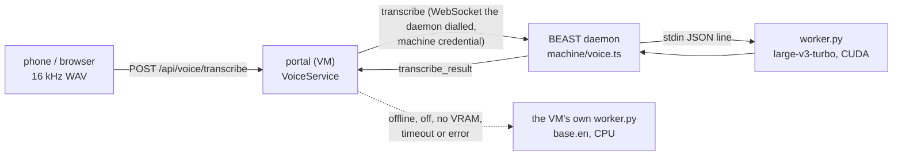

# Voice

Two ways to talk to agents, in every message box (the orchestrator chat, session views; the mic
also sits in the new-agent prompt and a standing agent's charter):

- **Dictation** (the mic, the default): speech becomes text in the box for the user to check and edit.
  It is sent only when the user presses Send, unless "Send automatically after dictation" is on.
- **Voice mode** (the Voice / wave button): hands-free, for the car. It listens, sends what the user
  said when they pause, reads the reply aloud, and listens again, until they say "stop" or tap the
  screen.

## Dictation

- **Desktop**: click the mic to start and click again (or **Done**) to stop, or hold it and let go.
  In a text box, **Ctrl+M** does the same (hold to talk, tap to toggle); **Esc** discards.
- **Phone**: tap to start, tap to stop.
- **Stops by itself** after the pause setting (default 1.8 s of silence once speech has started),
  and gives up after 10 s with no speech. A held mic ignores that and waits for the release.
- While recording, the bar shows a live dot, the elapsed time, a level meter, the engine, and
  Done / discard. Clips stop at 5 minutes.

## Voice mode

One tap on **Voice** opens a full-screen view with one big word: **Listening** (green), **Thinking**
(amber: transcribing, then waiting for the reply), **Speaking** (blue). The orb follows the mic
level. Short tones mark each step: a rising pair when it starts listening, a tick when a message is
sent, a soft tick every 8 s while the agent thinks, a falling pair at the end.

The loop (`web/src/voice/voiceMode.ts`):

1. Listen. The end-of-speech detector (below) finishes the utterance after the pause setting.
2. Transcribe with local Whisper. Empty: listen again. "Stop", "cancel", "that's all", "voice mode
   off" and the like (`isStopCommand`, `shared/speech.ts`): end voice mode.
3. Send it (no review step in this mode) and wait for that turn's `result` event. The reply is its
   last assistant message: the orchestrator's answer, or an agent's final message (`turnReply`).
4. Read it aloud, then listen again.

- **Barge-in**: while a reply plays the mic stays open; the user talking over it (8 dB louder than the
  normal start threshold, since the speaker's own echo leaks in) stops the playback, and what they
  say is taken as the next message. Settings can turn it off.
- While the agent thinks it keeps listening: "stop" works, and anything else is sent as a follow-up.
- Tap anywhere, Esc, 5 minutes without speech, or the mic being taken by a call ends it.

**iPhone.** Built for Safari and the Home Screen app:
- audio is unlocked inside the tap that starts voice mode (the AudioContext is created there, and
  an empty utterance unlocks speech synthesis);
- one mic stream and one AudioContext for the whole session, so the play-and-record audio session
  stays up and the mic is not re-opened (or re-prompted) between turns;
- replies play through that same context;
- the Wake Lock API keeps the screen on, and is taken again when the page comes back to the front.

**Reading replies** (`shared/speech.ts`, `web/src/voice/player.ts`). `speakableText` turns markdown
into speech:
- headings and bullets become sentences, links read as their text and bare URLs as "link";
- code blocks and tables become "Code block omitted." / "Table omitted.";
- hashes, UUIDs and long ids are dropped, paths read as their file name;
- past 1500 characters it stops at a sentence and says "The rest is on screen."

`speechChunks` sends the first sentence on its own and the second chunk small, so audio starts
while the rest is still being made. All chunks are requested at once and scheduled back to back.
Local Kokoro is the default; the browser's `speechSynthesis` is the fallback (and the choice in
Settings).

## Engines

| | engine | where |
|---|---|---|
| speech to text | faster-whisper `large-v3-turbo`, int8_float16 on the GPU (CPU fallback) | `server/voice/worker.py`, `POST /api/voice/transcribe` |
| text to speech | Kokoro-82M (`kokoro-v1.0.onnx`) on onnxruntime-gpu (CUDA), voice `af_heart` | `server/voice/tts_worker.py`, `POST /api/voice/tts` |
| fallbacks | the browser's `SpeechRecognition` / `speechSynthesis` | used when the local engine is not installed, or chosen in Settings |

Each engine is one Python worker, started on demand and ended after `voice.idleMinutes` (20)
without use, which frees its VRAM for the Unity editors. Recording start warms Whisper, and voice
mode warms both (`POST /api/voice/warm {tts}`), so the model loads while the user talks. Audio and text
go over the worker's stdin and are never written to disk, unless `voice.keepAudio` (debug) keeps
clips in `data/voice-debug/`. A GPU load that fails runs on the CPU.

**Recording** uses Web Audio, not MediaRecorder: the page captures PCM, downsamples it to 16 kHz
mono and uploads a WAV. Whisper wants exactly that, so the server needs no ffmpeg and never meets
Safari's mp4 or Chrome's webm.

**Whisper's vocabulary**: faster-whisper `hotwords`, which go into every 30 s window (an
`initial_prompt` only steers the first one). `buildVoicePrompt` (`shared/voice.ts`) builds it per
request:
- a fixed list of FF and portal words;
- `voice.vocabulary` from config;
- sandbox ids and machine ids;
- the newest spec numbers in the base clone;
- standing agent names and recent agent titles.

It is cut to ~600 characters. Timestamps stay on (without them a 45 s test clip lost a sentence at
the 30 s window boundary), and `vad_filter` cuts silence, where Whisper otherwise invents text.

## Whisper on a worker's GPU (w615)

**TL;DR:** the portal VM has no GPU, so its CPU Whisper (`base.en`) is slow and less accurate. A worker machine with a
GPU (BEAST) can run `large-v3-turbo` for it. The machine's daemon keeps the model loaded on its GPU, and the portal
sends it the clip over the daemon's existing link and gets the text back. If that machine is offline, its Whisper is
off, out of VRAM, slow or failing, the VM's own CPU Whisper answers as before. Off by default on every machine; one
installer flag turns it on for BEAST.

lothsahn asked for it on 2026-10-07: "voice commands to the portal can get handled by a dedicated process on beast. The
portal should send over the audio data from the web, beast can run whisper on its gpu using the large model it was
using, and send the text back to the portal. If beast is down, the portal can fall back to doing local cpu whisper."
He settled where it lives: "It should be part of the worker harness and configurable. It'll be off by default and
we'll turn it on for beast. It should live in the same folder as the rest of the worker stuff."



**The model.** The same one voice ran on BEAST before the portal moved: faster-whisper `large-v3-turbo`, int8_float16
on the GPU, with the same `server/voice/worker.py` (the "Engines" table; measured below). The daemon reuses the
portal's `PyWorker` and `setupVoice`, so it is one code path, not a second engine.

**Where it runs.** Inside the daemon (`machine/voice.ts`), as a child Python process, not a service of its own: it
starts and stops with the daemon, needs no install step of its own beyond the folder, and is reached through the link
the daemon already has. It is not an agent and not a Unity editor, so no agent or editor limit counts it. Its files
live in the worker root: `<root>/voice` (`F:\ffw\voice` on BEAST): uv's Python, the venv with faster-whisper and the
CUDA 12 wheels, the model, `setup.log`. The daemon installs or updates them in the background when they are missing or
stale (the same stamps as the portal's), and the uninstall deletes them with the root. The daemon's process ends the
worker when it ends (the worker exits when its stdin closes), so a daemon restart leaves nothing behind.

**Turning it on.** `daemon.json` → `voice` (`machine/voice.ts`, `DaemonVoiceSettings`):

| key | default | |
|---|---|---|
| `enabled` | `false` | off on every machine unless set |
| `model` | `large-v3-turbo` | a faster-whisper model name |
| `device` | `cuda` | GPU only: a worker's CPU belongs to its agents and builds, and the VM is the CPU fallback |
| `computeType` | `int8_float16` on the GPU | |
| `toolsDir` | `<root>/voice` | |
| `minFreeVramMiB` | 3072 | it loads the model only with this much VRAM free (more than `yieldBelowMiB` plus the model, so an unload is not followed by a reload) |
| `yieldBelowMiB` | 1024 | an idle loaded model is unloaded when free VRAM falls under this |
| `idleMinutes` | 0 | 0: kept loaded; otherwise unloaded after this long unused |

The installer sets it: `install.ps1 -VoiceWhisper large-v3-turbo` (`worker.ts install --voice-whisper <model>`;
`off` turns it off). A re-run or an update without the flag keeps what `daemon.json` has. On a machine already
installed, w613's update turns it on in place (it restarts the daemon):

```powershell
& ([scriptblock]::Create((irm https://raw.githubusercontent.com/Final-Factory/ff-factory/main/scripts/worker/install.ps1))) -Update -Root F:fw -VoiceWhisper large-v3-turbo
```

The daemon log then says `voice: large-v3-turbo loaded on cuda, ~1160 MiB VRAM`.

**VRAM and Unity.** BEAST's 16 GB is shared with up to two Unity editors. The model takes about 1.1 GB (measured
below). The daemon checks the GPU's free memory (its 15 s `stats` probe, `nvidia-smi`) before it loads, and gives the
memory back when an editor needs it:
- loading needs `minFreeVramMiB` free; if not, the request is refused at once ("not enough free VRAM") and the portal
  uses its CPU;
- a loaded model that is idle is unloaded when free VRAM drops under `yieldBelowMiB`; the next clip loads it again if
  there is room, else the CPU answers;
- a clip being transcribed is never cut off.
Placement sees it: the daemon reports the model's state and its VRAM in its `voice` status, and the dispatcher's line
for the machine (`list_sandboxes`, `system_status`) says "Whisper holds ~1.1 GB VRAM".

**The link.** Two new messages on the portal↔daemon WebSocket (`server/machineProtocol.ts`): the portal sends
`transcribe` (`id`, the WAV in base64, the vocabulary prompt, the language) and the daemon answers `transcribe_result`
(text, timings, model, device, or an error). The daemon dials the portal and authenticates with its machine credential,
so there is no new port, nothing listens on BEAST, and only the portal can send it a clip. A daemon advertises the
engine in its `hello` and a `voice` status message; the portal sends `transcribe` only to a daemon that did, so an older
daemon never sees one, and an older portal ignores both. The protocol number stays (the w605 rule: a change both sides
ignore safely records a new fingerprint).

**Formats.** The browser already records PCM through Web Audio and uploads a 16 kHz mono WAV ("Recording", below), on
iPhone Safari and Android Chrome alike, so neither side meets webm/opus or mp4/aac and nothing is transcoded. A clip is
at most `MAX_DICTATION_SECONDS` (300 s): 9.6 MB of WAV, 12.8 MB in base64, under the link's 16 MB frame limit; the
daemon refuses a bigger one.

**Fallback.** The portal (`VoiceService.transcribe`) picks a machine whose daemon is connected and says its Whisper is
ready, idle or loading (config `voice.remote.machines` limits and orders the choice; empty: any). It falls back to its
own CPU worker when:
- no machine offers it (offline, `enabled: false`, installing, failed), or its VRAM is short;
- the machine answers with an error;
- it does not answer within the timeout: `voice.remote.timeoutSeconds` plus `voice.remote.perAudioSecond` for each
  second of audio, plus `voice.remote.loadSeconds` when the model was not loaded yet. The defaults come from the
  measurements below.
**A machine that goes away** (lothsahn: later clips must go straight to the CPU, with no wait every time):
- it disconnects cleanly: the portal drops it at once (`detach`), and a clip in flight falls back at once;
- it sleeps, loses its network or crashes without closing the socket: each clip goes with a ping ahead of it, and with
  no pong or message within 2 s (`VOICE_PING_MS`; BEAST to the VM measured 31 ms) that clip falls back and the machine is
  skipped until anything is heard from it. The heartbeat drops the link itself after 45-65 s;
- a clip times out on a live link (its Whisper hung): the machine is skipped for 2 minutes (`VOICE_RETRY_MS`) or until
  it re-offers its Whisper (a `voice` status change or a new hello); then one clip tries it again;
- its Whisper is unloaded for the editors' VRAM: its `voice` status says `vramShort` within a stats tick (15 s), and the
  portal skips it without sending; a clip that arrives in between is refused by the daemon at once.

The VM's own worker is the one w570 runs: `base.en` on 2 threads, ~235 MB, unloaded after 20 minutes idle. While a
remote engine is ready, a recording warms only the remote one, so the VM loads its model only when it is needed.

**Which engine answered.** Every result carries `engine` (`remote` or `local`), the `machine`, the device and the model,
and `fallback` (why the remote engine was not used). The bar shows the engine while recording ("Whisper · beast GPU" or
"Whisper · portal CPU"), and Settings → Voice input shows the last transcription: which engine, how long, and the
fallback reason. The portal logs one line per clip with the engine and timings, never the audio or the text; the
daemon logs only loads, unloads and errors.

**Config on the portal.** `config.json` → `voice.remote`: `enabled` (default `true`: use a machine that offers it),
`machines` (default `[]`: any), `timeoutSeconds` (3), `perAudioSecond` (0.05), `loadSeconds` (20). The VM's own CPU
engine keeps its settings (`voice.enabled`, `model`, `device`, ...). With `voice.enabled` off on the portal, the remote
engine still works; it just has no fallback. Nothing on the portal needs switching on: a deploy routes to any machine
that offers it, and a machine offers it once its daemon.json says so.

**The timeout, from the measurements.** BEAST answers a 12.5 s clip in 0.20-0.33 s and a 45.5 s clip in 0.61-0.95 s
(below): about 0.02 s per second of audio. The wait before the fallback is 3 s plus 0.05 s per second of audio (3.6 s for
a 12.5 s clip, 18 s for a 5-minute one): ten times the measured time plus room for the tailnet, so a GPU busy with an
editor still answers, while a hung one costs a few seconds at most. A machine whose model is not loaded gets 20 s more
(a load takes 2.3 s with its files cached and 12-15 s cold). A machine that is offline, short of VRAM or off costs
nothing: the portal goes straight to its CPU.

### Measured (BEAST, 2026-10-07)

On BEAST (RTX 4080 SUPER, i9-14900KF), large-v3-turbo int8_float16 from `F:\ffw\voice`, a 12.5 s clip of synthetic
speech (Windows SAPI, 16 kHz mono), Whisper's real vocabulary prompt; the portal's VoiceService and MachineManager talking
to a Daemon with voice on over a WebSocket on the same PC (`scripts/voice-e2e.ts`; no Unity editor running):

| | measured |
|---|---|
| install (venv, faster-whisper and CUDA wheels, model) | 60 s; 3.6 GB on disk (model 1.6 GB, uv cache 1.9 GB) |
| daemon start to model loaded (files in the OS cache) | 2.4-2.7 s, 3 runs |
| a 12.5 s clip through the link, GPU | 0.20-0.33 s total (model 0.20-0.32 s), 15 runs in three sessions |
| VRAM | +1158 to 1162 MiB (2801 to 3959 MiB in use) |
| RAM, worker process | 656 MiB working set |
| the fallback after the daemon stops (base.en, CPU, 2 threads, AVX only: the VM's limits) | 0.9-2.2 s (the first of each includes its ~1 s load), 9 runs, `engine: local` |

Not measured here: the tailnet hop from the VM to BEAST (adds the upload of ~0.5 MB for 12.5 s and a round trip; a
guess: 0.1-0.5 s), and the VM's own CPU, slower per core than BEAST's (a guess, w570: about 3x). The portal's log line
per clip gives both once it is deployed.

## End-of-speech detection

`shared/vad.ts`, pure and shared by dictation and voice mode. Energy, not a model:
- each 20 ms frame is high-passed at 150 Hz (road rumble, engine hum), measured in dB, and compared
  with an **adaptive noise floor**: the minimum of the smoothed energy over the last 4 s. Speech
  always has gaps between words that fall back to the floor, so the floor follows the background (a
  quiet room, a car at speed), not the voice;
- speech starts when 140 ms of the last 300 ms are 9 dB over the floor;
- it ends after the pause setting with the ~130 ms-smoothed level under floor + 5 dB;
- under 300 ms of voice (a cough, a door) is dropped;
- digital silence (a mic warming up, a muted track) never feeds the floor, and nothing can start in
  the first 600 ms of real signal, while the browser's gain control and noise suppression settle.
- In voice mode, 500 ms of audio before the onset is kept, so the first word is not clipped.

Measured (TTS speech, synthetic car noise: brown rumble, a wandering ~30 Hz engine with harmonics,
tyre hiss, passing-truck swells, indicator clicks, road bumps; 3 noise seeds each):
- no false starts, misses or split utterances from 15 dB down to 0 dB SNR, including a 45 s clip
  with its natural pauses. At −3 dB SNR (noise louder than the voice, before any phone noise
  suppression) that clip splits in places.
- Ends land within 0.1 s of the pause setting.
- Noise alone (three levels) gives "no speech" at 10 s.
- Noise that jumps 17 dB mid-wait reads as one short false utterance (Whisper returns nothing for
  it, so nothing is sent), then adapts.
- In Edge with the fake-mic WAVs, dictation stops 1.6–1.8 s after the last word.

Tuning aid: `localStorage['ffsb.voice.debug'] = '1'` logs the detector's energy, floor and events
to the console.

## Settings

Per device, in Settings (the bell) → Voice input:

| setting | default |
|---|---|
| Engine (dictation) | Automatic: local Whisper, else the browser |
| Send automatically after dictation | off |
| Stop dictation by itself when I stop talking | on |
| Pause that ends speech | 1.8 s (1.0 / 1.5 / 1.8 / 2.5 / 3.5) |
| Read replies with | Automatic: local Kokoro, else the browser's voice |
| Voice | the server's `voice.ttsVoice` (`af_heart`); a shortlist of US/UK Kokoro voices |
| Speed | Normal (0.9× to 1.5×) |
| Talking over a reply interrupts it | on |

Server side, `config.json` → `voice` (`server/config.ts`):
- `enabled`, `model`, `device`, `computeType`, `language`;
- `idleMinutes` (20), `cpuThreads`, `autoInstall`, `keepAudio`, `vocabulary`, `uvPath`, `toolsDir`;
- `tts` (on), `ttsVoice` (`af_heart`), `ttsDevice` (`auto`).

## Install

On a worker machine (w615) the daemon installs its own copy, speech-to-text only, under `<root>/voice` (above). On the
portal: `npm run voice-setup` is idempotent; `-- --force` reinstalls. It puts everything under
`voice.toolsDir` (default `data/tools/whisper`, ~5.6 GB). No admin, nothing system-wide; uv comes
from PATH or is downloaded into the folder.

- `venv/`: a uv-managed Python 3.12 with `server/voice/requirements.txt` (faster-whisper plus the
  CUDA 12 cuBLAS/cuDNN wheels, so no CUDA toolkit), and the Whisper model.
- `tts-venv/`: `server/voice/requirements-tts.txt`: Kokoro on onnxruntime-gpu with its CUDA 13
  wheels. It is a separate venv because onnxruntime-gpu cannot share one with the CPU onnxruntime
  that faster-whisper needs; the CPU package is excluded there. The Kokoro model comes from the
  kokoro-onnx GitHub release.
- `installed.json` stamps each part (requirements hash + model) as soon as it is done, so a
  text-to-speech failure never costs a working Whisper.

The server runs the same setup in the background at startup when a stamp is missing or stale
(`voice.autoInstall`), so an app update that changes the requirements or a model reinstalls without
holding up the restart. Meanwhile the status is `installing` and the browser engines are used.
Progress is in `data/tools/whisper/setup.log`. Settings shows both engines' status, and an install
button after a failure.

## Measured on the development PC (RTX 4080 SUPER, 2026-09-23)

| | GPU | CPU |
|---|---|---|
| Whisper, 6.5 s clip | 0.14-0.31 s | 5.5 s |
| Whisper, 12.5 s clip (w615, through the daemon link) | 0.20-0.33 s | |
| Whisper, 45.5 s clip | 0.61-0.95 s | 12.4 s |
| Whisper load | 2.4-2.6 s with files cached; 12-15 s cold; 36 s once, the first load after a fresh install | 10.5 s |
| Kokoro, one short sentence | 0.13-0.2 s | 1.4 s |
| Kokoro, 250 characters (17 s of audio) | 1.0 s | ~5 s |
| Kokoro load | 0.9-3.8 s | 2 s |
| VRAM | Whisper ~1.1 GB, Kokoro ~0.9 GB, freed on unload | none |
| RAM (Whisper worker) | ~620 MB working set | similar |

In the browser (Edge, fake mic, mocked agent):
- the transcript is back 0.4-0.5 s after end-of-speech;
- a reply's first audio starts 0.2 s after the reply arrives;
- barge-in cuts playback ~0.4 s after the voice starts (the onset window plus one audio batch).

## On the portal VM (no GPU, 2 vCPUs, 4 GB)

The portal VM ([portal-on-ffbox-host.md](portal-on-ffbox-host.md), section 2.6) starts with voice off
(`config.vm.example.json`). `sudo fffctl configure --voice base.en` turns dictation on: it sets
`voice.enabled`, `model`, `device: "cpu"`, `cpuThreads` to the VM's `nproc`, `autoInstall`, and `tts: false`
(Kokoro stays off: replies are read by the browser), then restarts the portal (w570). The server then installs
uv, Python, faster-whisper and the model under `data/tools/whisper` in the background. With `device: "cpu"`
the CUDA wheels are left out (`requirementsFor`, `server/voiceSetup.ts`), about 1 GB less. `--voice off`
turns it off again; nothing else in config.json changes.

Why `base.en`: the old host's `large-v3-turbo` is too slow there. Measured on BEAST's CPU held to the VM's
limits (2 threads on 2 cores, CTranslate2 forced to AVX with `CT2_FORCE_CPU_ISA=AVX`, as the VM's Xeon
E5-2680 v2 has no AVX2), int8, beam 5, the built-in hotwords, a 9.3 s spoken clip (w570, 2026-10-07):

| model | transcription, 9.3 s clip | worker RAM | the clip's words |
|---|---|---|---|
| `tiny.en` | 0.5 s | ~190 MB | right but for "Sandboxes" for "sandbox's" and stray capitals |
| `base.en` | 0.9-1.3 s | ~235 MB | right but for "Sandboxes" for "sandbox's" |
| `small.en` | 2.4-2.8 s | ~420 MB | exact |
| `distil-small.en` | 3.3 s | ~345 MB | not checked |
| `large-v3-turbo` | 9.5 s | ~1 GB | not checked |

The VM's cores are slower than BEAST's i9-14900KF (a guess: about 3x per core), so expect roughly 3x
these times there; the measured VM latency is in w570's report. `small.en` is the next step up if `base.en`
mishears too often.
